> 同步自飞书：2026-07-28（由 docx 转 Markdown）

LTC营销风控_厂端授信管理、参数配置、不予授信、模型计算和调整申请.PRD

| LTC项目2026 | 三一集团有限公司 |  | 责任部门 |  |
|---|---|---|---|---|
| LTC项目2026 | 三一集团有限公司 |  | 文件页数 | 85 |
| LTC项目2026 | 三一集团有限公司 |  | 生效日期 |  |
| 文件编码 |  | 待定 | 文件版本 | V1.0 |

产品需求说明书PRD

此文件属三一集团有限公司版权所有，未经书面许可，不得以任何方式复制和外传。

# **文档修订记录**

|  |  |  |  |  |
|:---|:---|:---|:---|:---|
| 版本 | 更新日期 | 文档修订人 | 更新内容及更新理由 | 备注 |
| V0.1 | 2026/06/04 | KPMG/Steven Liu | 起草客户主数据表新增字段、厂端授信模型版本和参数配置设计 |  |
| V0.3 | 2026/06/10 | KPMG/Steven Liu | 更新厂端授信不予授信规则设计和额度调整申请数据模型设计 |  |
| V0.5 | 2026/06/13 | KPMG/Steven Liu | 更新厂端授信限额额度管理的整体数据模型和表结构设计 | 包含基于6/11沈总反馈,先不按重点尽调分进行自动调整厂端授信额度 |
| V0.8 | 2026/06/18 | KPMG/Steven Liu | 完成厂端授信管理模型计算设计 |  |
| V1.0 | 2026/06/23 | KPMG/Steven Liu | 完成厂端授信管理整体PRD设计 | 已整合设计[厂端授信额度动态运用](https://rs2flu7c17.work.sany.com.cn/docx/doxk5dmYrrk0VgXT4MIrXzHPgzg)管理的数据结构表设计和表单显示 |
| V1.0 | 2026/06/23 | KPMG/Sany | 业务组内评审通过 | 1.对于初始化计算额度如需审批需业务调研 2.未来BPP内可能有条件判断审批待业务调研 |

# **术语说明**

*对文档中出现新的或不常见的名词、概念或简略语给出定义和解释（含产品和技术）。*

|  |  |
|:--:|:--:|
| 名词 | 解释 |
| 厂端授信 | 以工厂端三一为核心主体，对出口贸易的客户进行的信用额度授予、评估、监控和调整的一整套管理机制。厂端授信限额额度是以客户管理维度的，是对客户赊销交易场景在外部融资、中信保（信保）授信之后的一种补充授信手段。融资顺序是优先外部融资、其次信保赊销，厂端授信最后补充。 |
| 客户编码（SAP客户代码） | CRM中对三一客户的唯一识别码，在客户管理模块管理，作为客户主数据编码，一源多用到SAP等系统。也是SAP客户ID。 |
| 客户主数据 | CRM【客户主数据】模块维护的客户编码记录是唯一的，而【客户管理】中维护的记录存在多条同”客户编码”记录，用于配置不同”客户区域“权限管理（D365后台批处理会按不同客户区域复制出客户重复记录）。如需要取客户表上字段信息，建议采用“客户主数据表”上的客户编码搜索获取客户字段信息。PRD中提到【客户】数据一般指【客户主数据表】中客户数据。引用（读和写）客户数据使用【客户主数据表】。 |
| 客户信用评分 | 采用100分制度，通过收集相关客户资信的内外部定量指标和定性指标，结合客户信用评分卡中对客户资信基础指标值设定范围区间及对应权重分值，累计后得到客户信用分。 |
| 客户类型 | 海外版CRM的客户管理模块中【客户类型】包括：公司客户、个人客户。 |
| 客户类别 | 海外版CRM的客户管理模块中【客户类别】包括：三一终端客户、经销商终端客户，正式经销商、意向经销商、经销商大客户、三一大客户、政府、子公司、合资公司、国内子公司、待准入三一大客户等。经销商包括正式经销商、意向经销商，其余都是直销客户。 |
| 大客户级别 | 海外版CRM的【大客户管理】模块中【大客户级别】指直销客户包括S, A, B (S最大)。 |
| 经销商分级 | 需增加该分级字段到CRM客户管理模块中，分钻石、铂金、白银、认证、意向。 |
| 直销客户分级 | 直销客户分级包括S,A,B,C,I (S/A/B是大客户)，I是个人客户，C是其余的普通客户。 |
| 客户分类（成交条件样板库和厂端授信） | 直销客户分级包括S,A,B,C,I (S/A/B是大客户)，I是个人客户，C是其余的普通客户。D1-D5代表经销商客户，D1/D2/D3/D4/D5 - 经销商D1-钻石、D2-铂金、D3-白银、D4-认证、D5-意向。 |
| 客户等级（成交条件样板库和厂端授信） | 客户等级标签，也有叫渠道分级，主要用于成交条件样板库配置，客户等级标准采用A0-A4（A0最高）：根据信用分映射客户等级：A0≥80分；A1≥70分；A2≥60分；A3≥50分；A4＜50分；（其中阀值分会随着业务发展会有调整）。如果经销商采用评分卡，经销商也采用相同信用分映射等级。 |
| 产品分类（成交条件） | 成交条件样板库配置使用到产品分类，但是该产品分类在现有CRM不存在，是基于【产品线】向上归集的一个分类，但不是现有CRM的【一级产品分类】（或叫产品大类）和【二级产品分类】（或叫产品子类，对应产品线）。在成交样板库PRD中新增该【成交条件产品分类】编码表及其和【产品线】关系表。 |
| BPP | BPP是三一内部的审批工作流平台，相关评估或申请单审批流程都在BPP平台。CRM会和BPP集成，发送相关申请单请求，然后接受相关审批结果状态。 |
| <u>风险</u>敞口 /超基线敞口 | 风险敞口指在合同交易金额因赊销付款类型导致有部分或全部交易资金暴露在风险中、是没被保护的那部分资金，是没有被授信覆盖的。~~2026.7.6 风险敞口拟修改为安全交易基线（厂端授信额度）~~。2026.7.14（占用额度-安全交易基线（厂端授信额度）） |

1.  

# **模块及功能点划分**

2.  

**业务-应用矩阵**

|  |  |  |  |  |  |  |  |
|:---|:---|:---|:---|:---|:---|:---|:---|
| **业务模块** | **业务方案点** | **业务方案描述（L5~L6）定义到业务活动** | **功能描述（从业务角度描述大致的功能需求）** | **应用架构1级** | **应用架构2级** | **应用架构2.5级** | **应用架构3级** |
| 授信管理 | 厂端授信 | 设计 | 厂端授信业务设计 | 营销风控 | 厂端授信 | 厂端授信额度管理流程 | 厂端授信参数配置 |
| 授信管理 | 厂端授信 | 设计 |  | 营销风控 | 厂端授信 | 厂端授信额度管理流程 | 不予授信规则控制 |
| 授信管理 | 厂端授信 | 计算 | 厂端授信限额计算 | 营销风控 | 厂端授信 | 厂端授信额度管理流程 | 厂端授信额度生成计算 |
| 授信管理 | 厂端授信 | 计算 | 厂端授信限额审批 | 营销风控 | 厂端授信 | 厂端授信额度管理流程 | 厂端授信额度动态调整 |

**应用模块**

|  |  |  |
|:---|:---|:---|
| **模块名称（L2.5）** | **功能点名称（L3）（系统需求名称）** | **功能点简要描述** |
| 厂端授信额度管理流程 | 厂端授信参数配置 | 提供对厂端授信需要相关基础关系数据配置 |
| 厂端授信额度管理流程 | 不予授信规则控制 | 对不予授信规则的控制管理 |
| 厂端授信额度管理流程 | 厂端授信额度生成计算 | 提供厂端授信额度限额的模型计算和审批流程 |
| 厂端授信额度管理流程 | 厂端授信额度动态调整 | 提供厂端授信限额的调整流程 |
| 授信额度动态运用流程 | 厂端授信额度管理台账（在授信额度动态运用PRD需复用） | 提供厂端授信管理台账功能 |

1.  

# **功能说明**

2.  1.  

##   **厂端授信额度管理流程**

1.  1.  

###     **业务流程图**

1.  

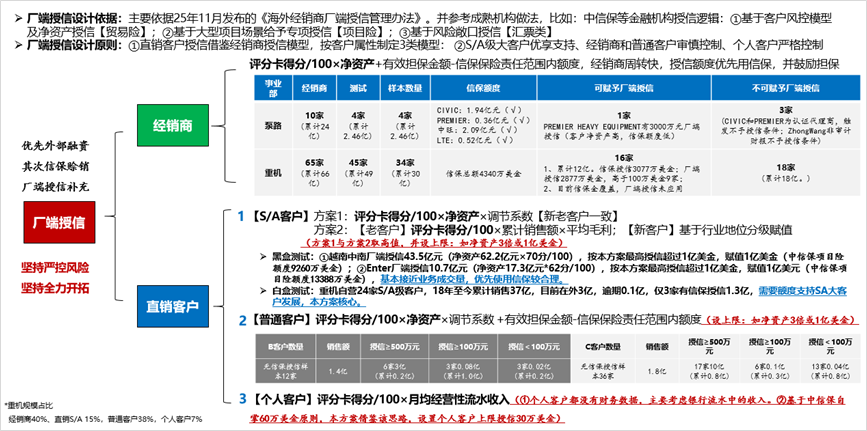

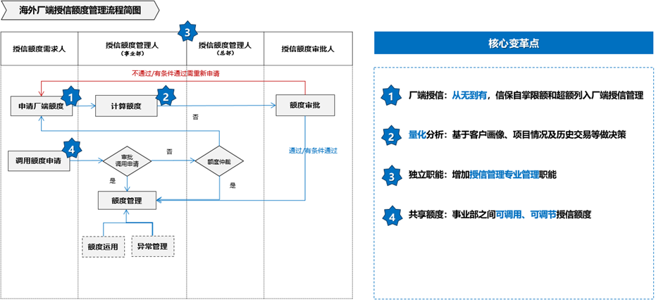

厂端授信业务流程图

1.  

### **功能流程图**

2.  

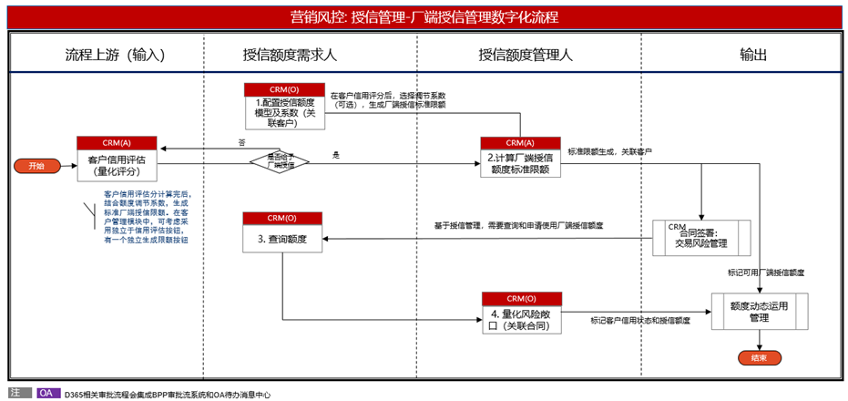

厂端授信管理流程图

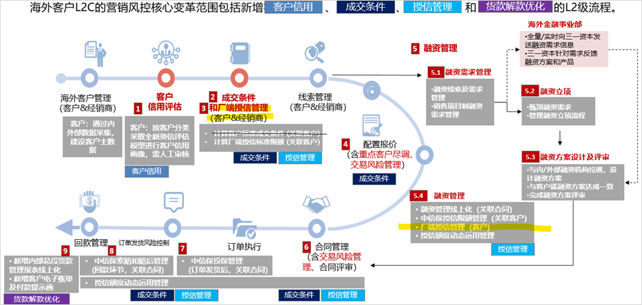

总体流程架构图 - 厂端授信管理按客户维度管理

（在客户信用评估完成后，可以启动对客户的厂端授信限额生成）

1.  

### **厂端授信额度管理**

2.  1.  

####   **关键界面原型及业务规则**

1.  

<!-- -->

1.  

> 以工厂端三一为核心主体，对出口贸易的客户进行的信用额度授予、评估、监控和调整的一整套管理机制。厂端授信限额额度是以客户管理维度的，是对客户赊销交易场景在外部融资、中信保（信保）授信之后的一种补充授信手段。融资顺序是优先外部融资、其次信保赊销，厂端授信是最后补充。

2.  
3.  

> 厂端授信额度管理包括厂端授信计算模型相关参数配置、按客户分类的历史基准额度配置、计算模型版本管理、厂端授信不予授信控制、模型计算和厂端授信额度人工调整申请等功能。

4.  
5.  

> 厂端授信额度模型计算依赖前置条件：

6.  

- 

> 客户信用评估生效，和相关新增字段信息维护准确和完整包括：【客户信用评分】、【经销商分级】、【客户等级】、【重点尽调】、【黑名单客户】。

- 
- 

> 在客户主数据表增加两个标签字段【黑名单客户】、【不予授信客户】，并准确维护相关历史数据标签。

- 
- 

> 完成相关厂端授信计算模型参数配置和历史基准额度数据导入。

- 

1.  

> 在客户主数据管理表，如果在客户画像PRD开发未增加，需增加两个标签字段：【黑名单客户】、【不予授信客户】。其余相关客户标签字段在客户信用评估模块和重点尽调模块都已先行增加和维护（详细参考表设计章节的“复用和新增客户表字段”说明）。

2.  

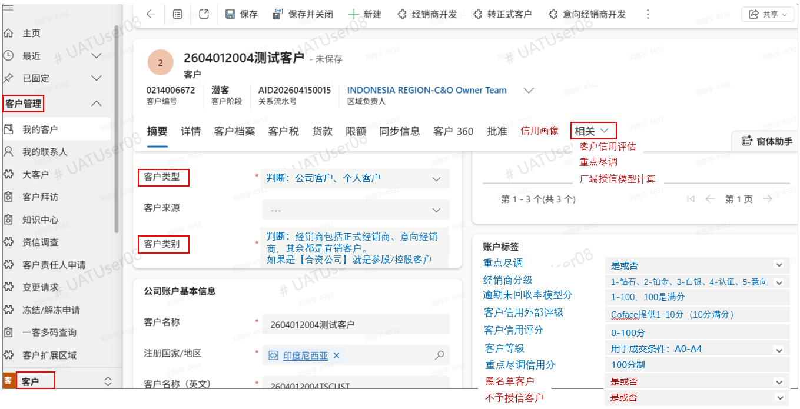

图1- 【客户主数据表】增加客户标签字段 – 黑名单客户、不予授信客户，以上是拿客户管理模块作为示例

1.  

> 营销风控管理的模块菜单导航：【风控】\> 【厂端授信管理】 \>【授信参数配置】 、【授信模型版本】、【授信模型计算】、【额度调整申请】、【额度管理台账】

2.  

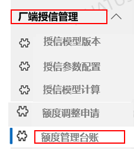

1.  

##### 厂端【授信模型版本】

2.  

为了支持厂端授信计算模型存在改进和演绎，需要记录客户厂端授信额度是基于哪个模型版本计算得到的，故此有厂端授信模型计算版本维护。

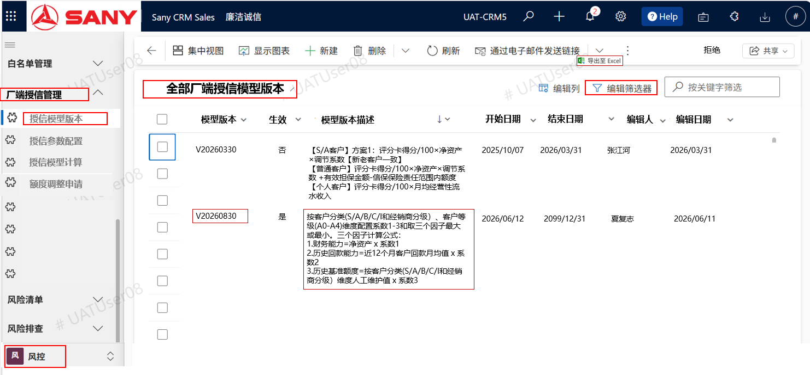

图2- 【授信模型版本】模块，提供查询，新增、编辑等功能

1.  

##### 厂端【授信参数配置】

2.  

支持授信计算模型参数配置和按客户分类维度配置历史基准额度数据。并支持在没有客户等级数据情况下，模型采用的默认系数配置（采用客户等级=ALL）。

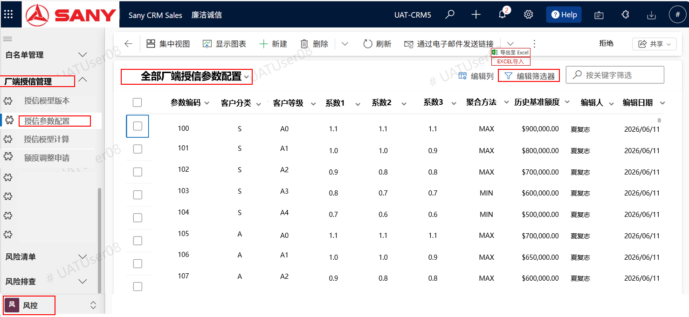

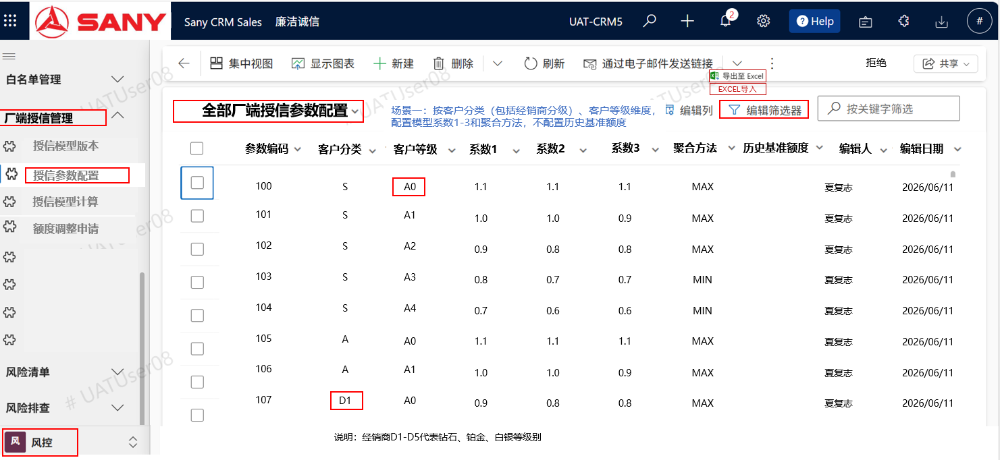

图3- 【授信参数配置】模块，场景一：配置计算模型参数

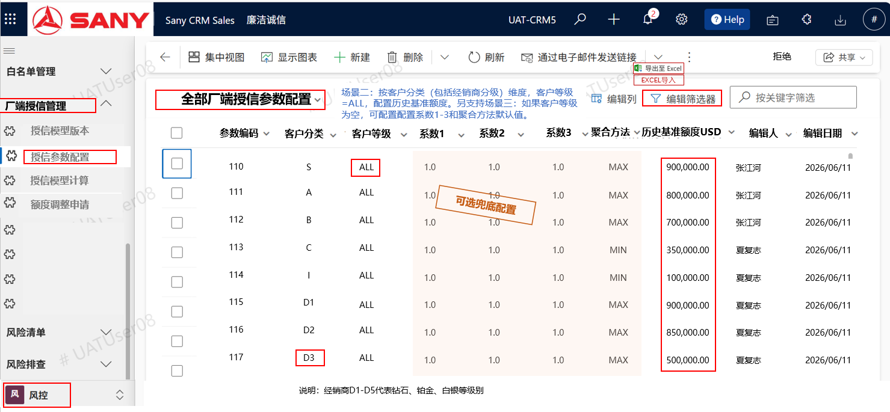

图4 - 【授信参数配置】模块，场景二：按客户分类维度配置历史基准额度USD，另可选支持客户等级为空情况下，赋予计算模型的默认参数值。

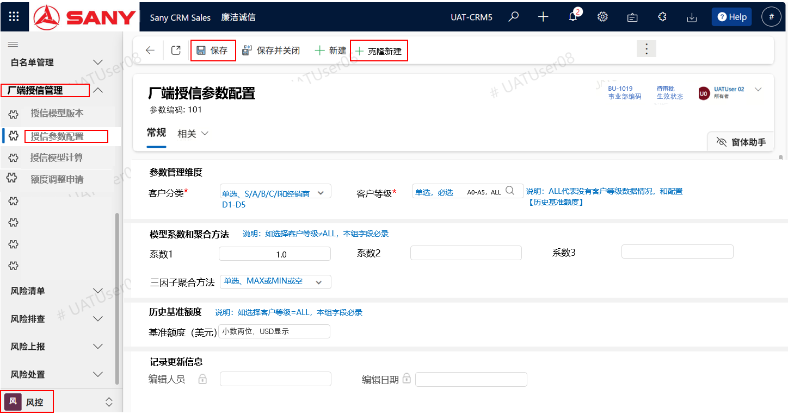

图5 - 【授信参数配置】模块，详情页面

相关数据配置示例和说明参考如下表格描述。

| 表头字段 | 客户分类 | 客户等级 | 系数1 | 系数2 | 系数3 | 三因子 聚合方法 | 历史基准额度/历史Benchmark(年度更新） |
|---|---|---|---|---|---|---|---|
| 数据字典,或示例数据 | 直销客户分S,A,B,C,I (S/A/B是大客户)； 经销商分D1钻石、D2铂金、D3白银、D4认证、D5意向。 | A0-A4：客户等级标准采用A0-A4（A0最高），基于客户信用分映射计算获得。 ALL代表在【客户等级】没有数据情况下的一种兜底配置。另用于配置历史基准维度值。 | 0.6 | 1.1 | 0.8 | MAX, MIN | 200,000.00 |
| 场景一：配置模型参数 | 单选 | 单选，A0-A4 | 填入 | 填入 | 填入 | 单选 | 空 |
| 场景二：配置历史基准额度（可选在没有客户等级数据情况下，模型采用的默认系数） | 单选 | ALL | 可填 | 可填 | 可填 | 可选 | 人工导入，年度更新，USD/元 |

表6 - 【授信参数配置】说明和示例

1.  

##### 厂端不予授信规则判断

2.  

厂端不予授信规则判断整合进入【授信模型计算】前判断，允许人机协同判断不予授信条件。

1.  

##### 厂端【授信模型计算】

2.  

通过业务侧或风控侧业务人员对相关客户触发厂端授信模型计算，并能发布生效的厂端授信限额额度。其主要包括流程步骤：不予授信校验、模型计算（初始计算，并按逾期等规则调整）和生效启用。

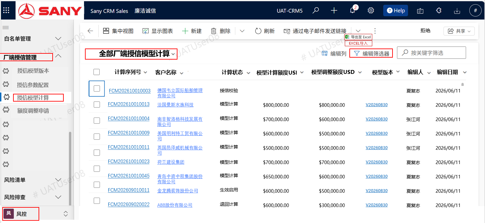

图7 - 【授信模型计算】模块菜单入口和查询页面

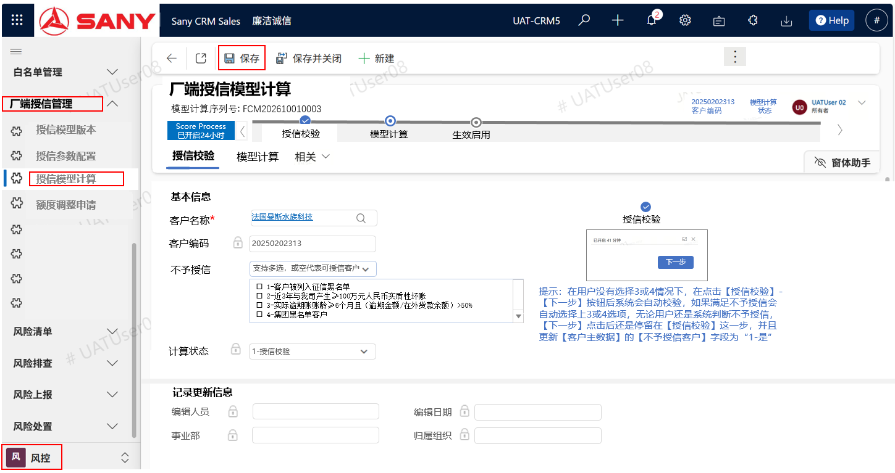

图8 - 【授信模型计算】模块详情页面 – 授信检验页签

允许业务人工判断不予授信条件，但是在人工没有选择任何不予授信条件下，在点击【下一步】模型计算前，系统会自动化判断是其中3或4不予授信条件。相关不予授信条件结果会综合结果更新到【客户主数据表的不予授信客户】标签字段。

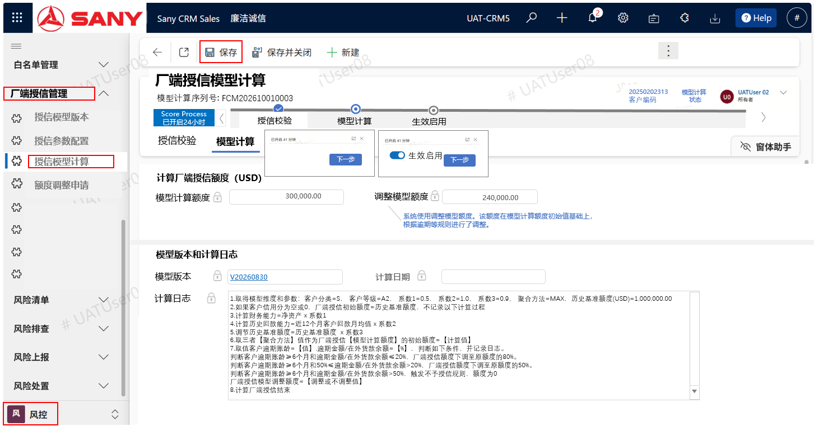

图9 - 【授信模型计算】模块详情页面 – 模型计算页签

1.  

##### 厂端【额度调整申请】

2.  

厂端授信限额额度调整申请主要步骤包括申请、审批中和通过。如果审批被拒绝，相关步骤返回到申请第一步。额度调整申请功能设计主要应用于三个场景：

- 

> 客户资信相关指标数据质量不高，导致系统模型计算额度不合理。

- 
- 

> 授信计算模型采取统计学总有偏差概率，对部分特殊场景有偏差需要人工调整。

- 
- 

> 因存在合理业务需求或业务变化（比如采取增信措施等），需要人工申请调整额度。

- 

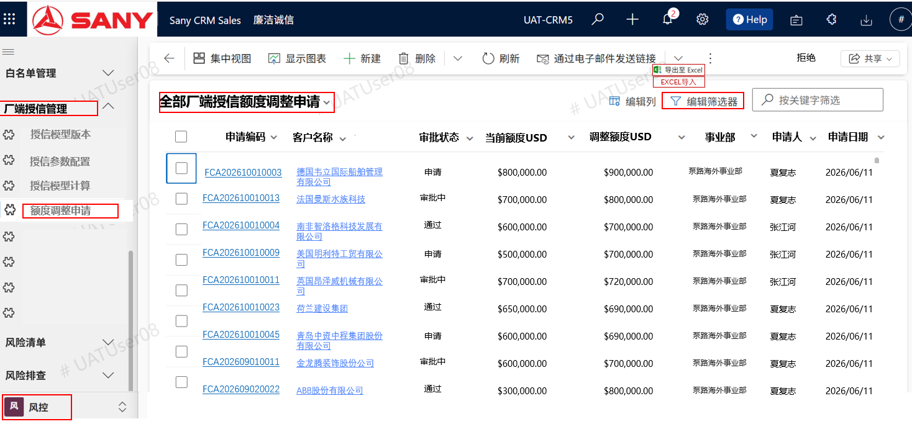

图10-厂端【额度调整申请】模块 – 查询、新增

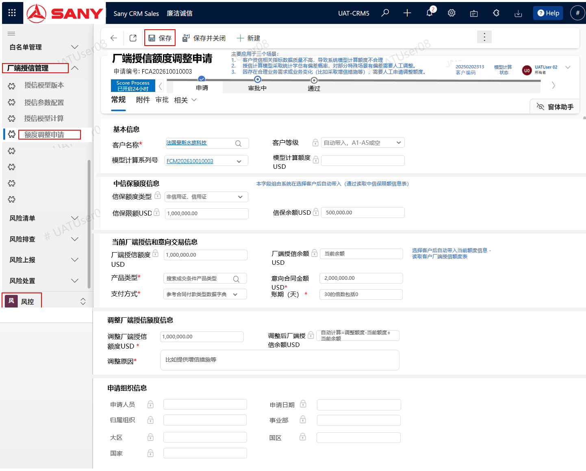

图11-厂端【额度调整申请】模块 – 详情-【常规】申请页签

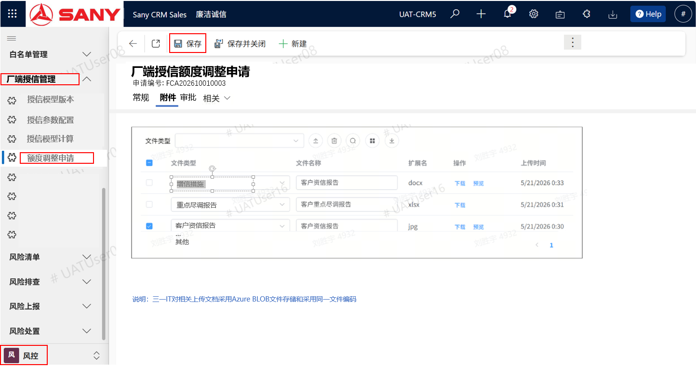

图12-厂端【额度调整申请】模块 – 详情-【附件】申请页签

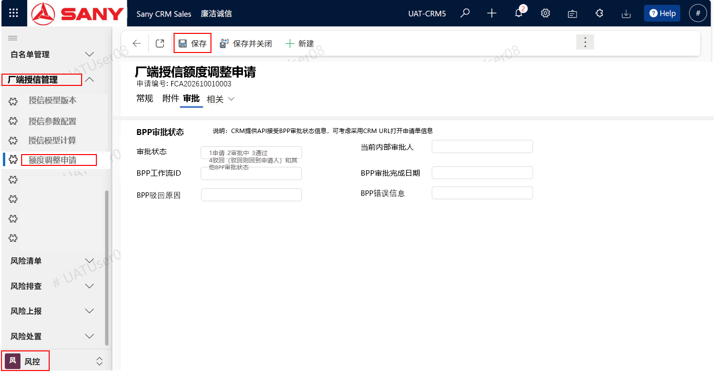

图12-厂端【额度调整申请】模块 – 详情-【审批】页签

1.  

##### 厂端【额度管理台账】

2.  

厂端授信额度动态运用台账管理由“[授信额度动态运用流程](https://rs2flu7c17.work.sany.com.cn/docx/doxk5dmYrrk0VgXT4MIrXzHPgzg)”相关PRD完成整体设计，本PRD只涵盖相关台账管理的表结构设计和台账的页面管理，其他相关业务流程环节对接的接口设计和交易风险管理嵌入都不在本PRD涵盖。

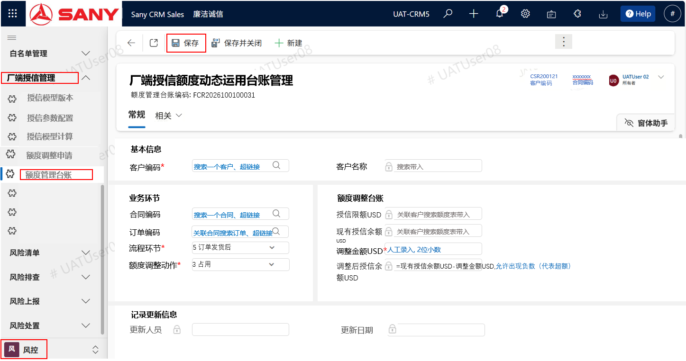

图13-厂端【额度管理台账】模块 – 详情页面

1.  

####   **厂端授信模型版本配置**

2.  

##### （1）功能按钮设计

| 功能点 | 逻辑说明 | 类型 | 备注 |
|---|---|---|---|
| 查询 | 【授信模型版本】查询页面，支持模型版本维护记录的查询、新增、编辑和删除功能；模板导出和导入功能。 进入查询清单页面，可以通过【编辑筛选器】搜索找到相关版本记录。 | 功能 |  |
| 新建／编辑 | 支持【新建】或【编辑】模型版本记录信息部分，或查询记录详细。 | 按钮 |  |
| 保存 | 可点击【保存】按钮保存记录信息，默认状态生效保存。。 | 按钮 |  |

##### （2）表单字段设计

| 表单结构 | 表单区域分类 | 字段描述（同表结构中字段描述） | 可编辑 | 字段规则（参考“表设计”中规则，本处进行相关页面控制逻辑补充） |
|---|---|---|---|---|
| 厂端授信模型版本表 | 常规 | 模型版本 | 否 | 系统自动编号V+YYYYMMDD |
| 厂端授信模型版本表 | 常规 | 是否生效 | 是 | 人工单选，默认新增保存时就生效 |
| 厂端授信模型版本表 | 常规 | 模型描述 | 是 | 人工录入，参考表设计中解释 |
| 厂端授信模型版本表 | 常规 | 开始日期 | 是 | 默认系统当日，人工录入 |
| 厂端授信模型版本表 | 常规 | 结束日期 | 是 | 默认9999/12/31，人工录入 |
| 厂端授信模型版本表 | 常规 | 编辑人 | 否 | 取D365默认实体字段CreatedBy 、CreatedByName、ModifiedBy、ModifiedByName |
| 厂端授信模型版本表 | 常规 | 编辑时间 | 否 | 取D365默认实体字段CreatedBy 、CreatedByName、ModifiedBy、ModifiedByName |

1.  

#### **厂端授信参数配置**

2.  

##### （1）功能按钮设计

| 功能点 | 逻辑说明 | 类型 | 备注 |
|---|---|---|---|
| 前置维护 | 完成【客户主数据】模块新增字段的历史数据维护包括【客户等级】、【经销商分级】等。 完成【客户信用评估】并信用分生效。 | 功能 |  |
| 查询 | 厂端授信【模型参数配置】查询页面，支持参数配置记录查询、新增、编辑和删除；模板导出和导入功能。 进入查询清单页面，可以通过【编辑筛选器】搜索找到相关申请记录。 | 功能 |  |
| 批处理导入 | 通过厂端授信【模型参数配置】页面，支持数据模板导出和批量导入功能 | 功能 |  |
| 新建／编辑 | 支持【新建】或【编辑】厂端授信模型参数配置记录信息部分，或查询记录详细。 支持【+克隆新建】功能。 支持场景一：按客户分类（包括经销商分级）、客户等级维度，配置模型系数1、系数２、系数3和聚合方法，不配置历史基准额度。 支持场景二：按客户分类（包括经销商分级）维度，客户等级=ALL，配置历史基准额度。 支持场景三：如果相关客户主数据的客户等级数据并未维护或存在历史数据为空情况，可通过按客户分类（包括经销商分级）维度，客户等级=ALL，配置系数1、系数２、系数３和聚合方法的模型计算的兜底默认值。 | 按钮 |  |
| 保存 | 可点击【保存】按钮保存记录信息，在保存前进行规则校验。如果客户等级ALL，历史基准额度不允许输入，或放默认值为０。如果客户等级＝ALL，历史基准额度必须大于1000。 如果存在按【客户分类】、【客户等级】相同维度的配置记录，给出不予保存的阻断流程的警告信息提示”存在有重复记录，需核查！“。 | 按钮 | 数据有效性校验 |

##### （2）表单字段设计

| 表单结构 | 表单区域分类 | 字段描述（同表结构中字段描述） | 可编辑 | 字段规则（参考“表设计”中规则，本处进行相关页面控制逻辑补充） |
|---|---|---|---|---|
| 厂端授信模型参数配置表 | 常规 | 厂端授信参数编码 | 否 | 唯一码，系统自动生成唯一值，不可编辑 |
| 厂端授信模型参数配置表 | 常规 | 客户分类 | 是 | 人工选择 |
| 厂端授信模型参数配置表 | 常规 | 客户等级 | 是 | 人工选择 |
| 厂端授信模型参数配置表 | 常规 | 系数1 | 是 | 人工录入或模版导入 |
| 厂端授信模型参数配置表 | 常规 | 系数2 | 是 | 人工录入或模版导入 |
| 厂端授信模型参数配置表 | 常规 | 系数3 | 是 | 人工录入或模版导入 |
| 厂端授信模型参数配置表 | 常规 | 聚合方法 | 是 | 人工选择或模版导入 |
| 厂端授信模型参数配置表 | 常规 | 历史基准额度 | 是 | 人工录入或模版导入 |
| 厂端授信模型参数配置表 | 常规 | 编辑人 | 否 | 取D365默认实体字段CreatedBy 、CreatedByName、ModifiedBy、ModifiedByName |
| 厂端授信模型参数配置表 | 常规 | 编辑时间 | 否 | 取D365默认实体字段CreatedBy 、CreatedByName、ModifiedBy、ModifiedByName |

1.  

#### **厂端不予授信规则**

2.  

##### （1）功能按钮设计

| 功能点 | 逻辑说明 | 类型 | 备注 |
|---|---|---|---|
| 模块关联 | 整合到厂端【授信模型计算】模块中，在模型计算前校验判断 | 整合 |  |
| 不予授信 | 允许业务人工判断是否不予厂端授信，对于#3或#4，系统会自动化判断，如果存在不予授信，人工判断结果会被覆盖。厂端授信额度会归0。 取数逻辑： #3：取【风控】【货款管理】【月度在外货款】模块中相关客户的收款统计记录，如果存在【最长逾期账龄天】> 6*30天 AND 【逾期货款】/【在外货款余额】> 50% ，则认为是不予授信。 #4：取客户主数据表的【黑名单客户】=1是，则认为是不予授信。 | 功能 |  |

##### （2）表单字段设计

融入到厂端【授信模型计算】模块页面。

| 表单结构 | 表单区域分类 | 字段描述（同表结构中字段描述） | 可编辑 | 字段规则（参考“表设计”中规则，本处进行相关页面控制逻辑补充） |
|---|---|---|---|---|
| 厂端授信模型计算表 | 常规 | 不予授信客户 | 是 | 数据字典：有4种场景： 1-客户被列入征信黑名单 2-近3年与我司产生≥100万元人民币实质性坏账 3-实际逾期账账龄≥6个月且（逾期金额/在外货款余额）>50% 4-集团黑名单客户 |
| 厂端授信模型计算表 | 常规 | 不予授信客户 | 是 | 复选框， 如果都不选，代表允许授信的客户。 对于数据字典中场景采取人机协同判断： 1,2：由人工选择 3：系统判断优先于人工未选择：通过CRM中货款管理中的【月度在外货款】菜单中数据，判断【最长逾期账龄天】、【逾期金额人民币】、【在外货款余额人民币】字段值得出是否授信 4：系统判断优先于人工未选择：通过【客户主数据】【黑名单客户】字段判断 如果3,或4满足不予授信，本字段不允许用户编辑，默认不予授信，不允许再授信模型计算了。 |

1.  

#### **厂端授信模型计算**

2.  

##### （1）功能按钮设计

| 功能点 | 逻辑说明 | 类型 | 备注 |
|---|---|---|---|
| 模块关联 | 1、供客户管理、客户管理主数据模块通过“相关”功能关联打开【厂端授信模型计算】模块。 | 功能 |  |
| 前置维护 | 完成【客户管理】模块新增字段的历史数据维护包括【黑名单客户】、【不予授信客户】等。 完成【厂端授信模型版本配置】、【厂端授信参数配置】相关数据配置。 | 功能 |  |
| 查询 | 【厂端授信模型计算】模块查询页面，支持模型计算记录查询、新增、编辑和删除记录；模板导出和导入功能。 进入查询清单页面，可以通过【编辑筛选器】搜索找到相关历史计算记录。 对于查询视图，可以从“全部授信模型计算视图”拓展到 “生效启用”视图。 | 功能 |  |
| 授信校验 | 第一步搜索选择客户，如果D365能触发不予授信判断逻辑代码，如#3和#4不予授信条件满足，系统采取先默认选择，然后允许人工判断是否满足不予授信条件进行编辑选择。 如果在用户没有选择#3或#4不予授信条件情况下，在点击【授信校验】-【下一步】或【保存】、【保存并关闭】按钮后系统会自动校验，如果满足不予授信会自动选择上3或4选项，无论用户还是系统判断不予授信，【下一步】点击后还是停留在【授信校验】这一步，并且更新【客户主数据】的【不予授信客户】字段为“1-是”。 | 功能 |  |
| 保存 | 可点击【保存】按钮保存记录信息。 如果存在相同客户维度的“计算状态不等于生效启用”的模型计算记录，给出不予保存的阻断流程的警告信息提示”存在有重复记录，需核查！“。 | 按钮 | 重复校验 |
| 模型计算 | 选择模型计算最新有效版本（【是否生效】=1和在有效期内），保存到【模型版本】字段。 如果客户信用分评估不存在，根据客户维度信息，对【模型计算额度】赋值采用【历史基准额度】值。 如果客户信用分评估存在，系统进行厂端授信模型计算初始限额额度（详细“模型计算逻辑”参考以下章节），保存到【模型计算额度】字段。 然后，系统基于历史逾期等数据，对初始化额度进行一定比例往下调整，保存到【模型调整额度】字段。 并记录模型计算过程日志，保存到【计算日志】字段。 选择生效启用选项，点击【下一步】生效，或者不启用，退回到【授信校验】步骤。 如果选择【下一步】生效启用，需要把“厂端授信模型计算表”中初始化授信额度【调整模型额度USD】，需要保存到“厂端授信额度表”的【厂端授信额度USD】、【厂端授信余额USD】字段，还包括其他保存字段，并使其记录生效。 如果选择【下一步】生效启用，最后一步需把相关初始化额度的台账记录，保存到【厂端授信额度动态调整管理台账表】，流程环节=1厂端授信模型计算。 | 功能 |  |
| 计算状态 | 新建记录：默认1-授信校验 点击授信校验的【下一步】后：2-模型计算 点击【模型计算】和选择【生效启用】的【下一步】后：3-生效启用 如果未选择【生效启用】的【下一步】，：4退回计算 或 1-授信校验，业务可以重新发起模型计算 | 状态 | 状态数据字典、 1 授信校验 2模型计算 3 生效启用 4 退回计算 |

##### （2）表单字段设计

| 表单结构 | 表单区域分类 | 字段描述（同表结构中字段描述） | 可编辑 | 字段规则（参考“表设计”中规则，本处进行相关页面控制逻辑补充） |
|---|---|---|---|---|
| 厂端授信模型计算表 | 授信校验 | 模型计算序列号 | 否 | 唯一码，系统自动生成唯一值，不可编辑 |
| 厂端授信模型计算表 | 授信校验 | 客户编码 | 是 | 通过搜索获得 |
| 厂端授信模型计算表 | 授信校验 | 客户名称 | 否 | 通过搜索客户主数据表带入 |
| 厂端授信模型计算表 | 授信校验 | 不予授信客户 | 是 | 人工选择和部分系统判断 |
| 厂端授信模型计算表 | 授信校验 | 计算状态 | 否 | 系统更新 |
| 厂端授信模型计算表 | 授信校验 | 归属组织 | 否 | 基于systemuser系统用户关联相关表和【组织】字段获取，具体参考“D365用户表和组织说明”章节 |
| 厂端授信模型计算表 | 授信校验 | 归属组织名称 | 否 | 同上 |
| 厂端授信模型计算表 | 授信校验 | 事业部 | 否 | 同上 |
| 厂端授信模型计算表 | 授信校验 | 事业部名称 | 否 | 同上 |
| 厂端授信模型计算表 | 模型计算 | 模型计算额度USD | 否 | 模型计算完成后写入 |
|  |  | 调整模型额度USD | 否 | 模型计算完成后写入 |
|  |  | 计算日期 | 否 | 模型计算完成后写入 |
|  |  | 模型版本 | 否 | 模型计算完成后写入 |
|  |  | 计算日志 | 否 | 对模型计算每步过程形成累计日志，并保存到数据表中 |
| 厂端授信额度表 | 非页面显示 | 客户编码 | 否 | 模型计算完成后和点击生效启用【下一步】后，如果本表客户记录不存在，会新增一条记录，并是否生效=1生效。如果已存在，代表不是第一次模型计算，那么该模型计算额度需要通过【额度调整申请】审批后才能生效使用，系统不自动更新厂端授信额度。 |
|  |  | 客户名称 | 否 | 同上 |
|  |  | 厂端授信额度USD | 否 | 同上 |
|  |  | 厂端授信余额USD | 否 | 同上 |
|  |  | 模型计算序列号 | 否 | 同上 |
|  |  | 是否生效 | 否 | 默认-生效 |
|  |  | 生效日期 | 否 | 默认-系统时间 |
|  |  |  |  |  |

##### （3）模型计算逻辑

本章节主要阐述厂端授信额度模型计算的顺序和步骤。

###### （一）计算模型设计 

厂端授信限额额度模型计算可参考[业务需求文档](https://rs2flu7c17.work.sany.com.cn/docx/doxk59AANQ3bw7X0FIXjBumV5be)的【模型设计】章节，其简要核心计算步骤如下：

- 

> 财务能力=净资产 x 系数1

- 
- 

> 历史回款能力=过去12个月客户回款月均值 x 系数2

- 
- 

> 历史历史基准额度 =历史基准额度（按客户分类配置历史基准额度值/年度更新）x 系数3

- 
- 

> 根据【厂端授信参数配置表】中的【聚合方法】（MAX或MIN），厂端授信额度 = 取三者对应方法的最大或最小值。

- 
- 

> 初始赋额规则：客户无资信结果时，厂端授信额度依据客户分类的【历史基准额度】值赋予。

- 

###### （二）获取客户维度和模型参数信息

| 分类 | 字段 | CRM取数逻辑 | 补充说明 |
|---|---|---|---|
| 客户维度 | 客户分类 | 关联选择的客户，通过【客户主数据】或【大客户管理】模块中【大客户级别】指直销客户包括S, A, B (S最大)。通过客户主数据的【客户类型】包括：公司客户、个人客户，可以判断是否为I是个人客户。排除经销商后，其余C为普通客户。 此外判断是否经销商：通过客户主数据中【客户类别】包括：三一终端客户、经销商终端客户，正式经销商、意向经销商、经销商大客户、三一大客户、政府、子公司、合资公司、国内子公司、待准入三一大客户等。经销商包括正式经销商、意向经销商，其余都是直销客户。如果是经销商，通过【经销商分级】字段获取钻石、铂金、白银、认证、意向，然后映射到D1-D5。 说明：以上逻辑可以考虑复用“成交条件样板库”中相同逻辑 | 直销客户分S,A,B,C,I (S/A/B是大客户)、I个人客户，其余C为普通客户； 经销商分D1钻石、D2铂金、D3白银、D4认证、D5意向。 |
| 客户维度 | 客户等级 | 关联选择的客户，取客户主数据表中的【客户等级】。 如果【客户等级】值为空，【客户等级】=ALL。 | A0-A4，有不存在值-空 |
| 计算参数 | 系数1 | 通过【客户分类】和【客户等级】作为搜索条件，基于厂端授信模型参数配置表获得【系数1】字段值。如果未取到，系统给与一个默认值，并停止计算。 | 如果未取到，系数1=0 |
| 计算参数 | 系数2 | 同上 | 如果未取到，系数2=0 |
| 计算参数 | 系数3 | 同上 | 如果未取到，系数3=0 |
| 计算参数 | 聚合方法 | 同上 | 如果未取到，聚合方法=MIN |
| 基准额度 | 历史基准额度 USD | 通过【客户分类】取值和【客户等级】=ALL作为搜索条件，基于厂端授信模型参数配置表获得【历史基准额度】字段值。 如果未取到，系统给与一个默认值，并停止计算。 | 如果未取到，基准额度=0 |

###### （三）获取模型计算三因子信息

|  |  |  |  |
|:---|:---|:---|:---|
| 分类 | 字段 | 模型计算公式 | 补充相关因子CRM取数逻辑 |
| 计算三因子 | 财务能力 USD | 财务能力=净资产 x 系数1 | 净资产：通过客户关联的【客户信用标签表】的【复核指标】字段值（匹配条件: 匹配选择客户 AND【有效状态】=1 AND 【指标编码】= NetAssets），已采用USD。 |
| 计算三因子 | 历史回款能力 USD | 历史回款能力=过去12个月客户回款月均值 x 系数2 | 历史回款能力：取【风控】【货款管理】【月度在外货款】模块的【本月实际回款金额】，该字段是RMB，须通过【货币】主数据表通过美元汇率转换到USD，然后根据【生成版本】字段（YYYYMM格式）取12个月范围，把【本月实际回款金额】转化USD货币后累计后除于12（业务需求文档中有类似表达逻辑）。 |
| 计算三因子 | 历史基准额度 USD | 历史基准额度（按客户分类配置历史基准额度值/年度更新）x 系数3 | 【历史基准额度】参考前取值描述 |

###### （四）厂端授信初始化额度模型计算

1.  

> 根据【厂端授信参数配置表】中的【聚合方法】（MAX或MIN），厂端授信初始化额度 = 取三者对应方法的最大或最小值。

2.  
3.  

> 如果客户无信用评估结果时（【客户信用标签表】记录未匹配到，或客户主数据的【客户信用评分】为空或0, 或判断【信用评估有效状态】=0 或空），厂端授信初始化额度依据客户分类的【历史基准额度】值赋予。

4.  
5.  

> 把厂端授信初始化额度值保存到【厂端授信模型计算表】【模型计算额度USD】字段。

6.  

###### （五）厂端授信初始化计算后额度调整

对于基于重点尽调场景进行额度调整，该规则暂不实现：~~如对客户开展重点尽调（调查满分100分），若调查得分高于80分，厂端授信额度可上调至原额度的110%；若得分低于60分，厂端授信额度下调至原额度的90%。~~

对于存在实质性逾期的客户，需要考虑相关授信额度的调整，参考如下：

如果授信额度有效期内已经存在实质性**逾期账龄**≥6个月：

- 

> **逾期金额/在外货款余额**≤20%，厂端授信额度下调至原额度的80%。

- 
- 

> 50%≤逾期金额/在外货款余额\>20%，厂端授信额度下调至原额度的50%。

- 
- 

> 逾期金额/在外货款余额\>50%，触发不予授信规则，额度为0

- 

相关【逾期账龄】、【逾期金额】和【在外货款余额】的取数逻辑如下：

|  |  |  |
|:---|:---|:---|
| 分类 | 字段 | 取数逻辑 |
| 因逾期调整 | 逾期账龄 | 取【风控】【货款管理】【月度在外货款】模块中相关客户的收款统计记录，的【最长逾期账龄天】字段，采用【最长逾期账龄天】\> 6\*30天作为等同判断条件 |
| 因逾期调整 | 逾期金额 | 取【风控】【货款管理】【月度在外货款】模块中【逾期货款】（USD货币） |
| 因逾期调整 | 在外货款余额 | 取【风控】【货款管理】【月度在外货款】模块中【在外货款余额】（USD货币） |

把厂端授信调整额度值保存到【厂端授信模型计算表】【调整模型额度USD】字段。如果是不予授信的，【模型计算额度USD】和【调整模型额度USD】字段值都赋予0。

###### （六）保存数据表字段和日志字段

- 

> 交叉参考表设计中表结构中规则说明和前表单字段设计中规则说明，保存【厂端授信模型计算表】各字段数据。

- 
- 

> 需要把计算过程的取值参数和日志保存到【计算日志】字段中，便于管理判断相关数据质量和模型版本及调整应用。

- 1.  

####   **厂端授信额度调整申请**

1.  

##### （1）功能按钮设计

| 功能点 | 逻辑说明 | 类型 | 备注 |
|---|---|---|---|
| 模块关联 | 1、供客户管理、合同等业务环节基于【客户编码】关联，通过【相关】菜单可以调出【厂端授信额度调整申请】记录 | 功能 |  |
| 前置维护 | 完成【授信模型计算】的授信额度初始化和初始调整。 | 功能 |  |
| 查询 | 厂端【额度调整申请】查询页面，支持申请记录查询、新增、编辑和删除记录；模板导出和导入功能。 进入查询清单页面，可以通过【编辑筛选器】搜索找到相关申请记录。 对于查询视图，可以从“全部视图”拓展到未审批、已审批视图。 | 功能 |  |
| 申请 | 选择【客户名称】和【模型计算系列号】（默认是最新生效的序列号，另搜索视图最好显示序列号、计算额度、计算日期和版本等信息，便于用户选择），带出【客户等级】、【模型计算额度USD】=取厂端授信模型计算表中的【调整模型额度USD】字段值。 参考表设计章节的【厂端授信额度申请单表】中的取数逻辑，系统自动带入【中信保额度信息】、【当前厂端授信和意向交易信息】和【申请组织信息】。 【意向交易信息】和【调整厂端授信额度信息】相关字段集需要人工录入相关申请信息。 支持相关【附件】上传。 | 功能 |  |
| 审批/拒绝 | 对接BPP发起相关审批动作，建议传CRM的申请单URL，审批人可以在BPP直接打开CRM申请单信息，然后判断审批或拒绝。 如果被拒绝或驳回，需退回到申请状态。 如果审批通过，需要把“厂端授信额度申请单表”中调整授信额度和余额比如【调整厂端授信额度】、【调整后厂端授信余额】等字段值，需要保存到“厂端授信额度表”的【厂端授信额度USD】、【厂端授信余额USD】字段，还包括其他保存字段，并使其记录生效。 如果审批通过，最后一步需把相关初始化额度的台账记录，保存到【厂端授信额度动态调整管理台账表】。流程环节=2厂端授信限额额度申请。 |  |  |
| 新建／编辑 /删除 | 支持【新建】或【编辑】申请记录信息部分，或查询记录详细。 如果在“申请”状态，相关记录允许删除。 | 按钮 |  |
| 附件 | 需要上传相关额度调整申请材料 附件文件分类：增信措施、重点尽调、客户资信、在手订单、其他等 | 功能 |  |
| 保存 | 可点击【保存】按钮保存记录信息，在保存前进行规则校验。比如要求如果本申请单的当前【厂端授信额度USD】是0或空，要求提醒选择“厂端授信模型计算表”的序列号（如果存在的）。 如果存在相同客户维度的在途申请记录（状态不是通过的），给出不予保存的阻断流程的警告信息提示”存在有重复记录，需核查！“。 | 按钮 | 数据有效性校验 |
| 审批状态 | 新建记录：默认1-申请 点击【申请】下一步后：2-审批中 从BPP获得【审批通过】后：3-通过 从BPP获得【拒绝或驳回】后：4-驳回等相关数据字典，业务可重新编辑修订申请单 | 状态 | 状态数据字典 1申请 2审批中 3通过 4驳回（驳回则回到申请人） |

##### （2）表单字段设计

| 表单结构 | 表单区域分类 | 字段描述（同表结构中字段描述） | 可编辑 | 字段规则（参考“表设计”中规则，本处进行相关页面控制逻辑补充） |
|---|---|---|---|---|
| 厂端授信额度申请单表 | 常规 意向合同 | 申请编号 | 否 | 唯一码，系统自动生成唯一值，不可编辑 |
| 厂端授信额度申请单表 | 常规 意向合同 | 客户编码 | 是 | 通过搜索获得 |
| 厂端授信额度申请单表 | 常规 意向合同 | 客户名称 | 否 | 通过搜索客户带入 |
| 厂端授信额度申请单表 | 常规 意向合同 | 客户等级 | 否 | 通过搜索客户带入 |
| 厂端授信额度申请单表 | 常规 意向合同 | 模型计算序列号 | 否 | 通过选择相关计算记录 |
| 厂端授信额度申请单表 | 常规 意向合同 | 模型计算额度USD | 否 | 通过搜索计算序列号带入相关模型计算的授信额度值 |
| 厂端授信额度申请单表 | 常规 意向合同 | 信保额度类型 | 否 | 通过关联客户，查询中信保限额信息表获得 |
| 厂端授信额度申请单表 | 常规 意向合同 | 信保额度USD | 否 | 通过关联客户，查询中信保限额信息表获得 |
| 厂端授信额度申请单表 | 常规 意向合同 | 信保余额USD | 否 | 通过关联客户，查询中信保限额信息表获得 |
| 厂端授信额度申请单表 | 常规 意向合同 | 厂端授信额度USD | 否 | 通过关联客户，查询客户厂端授信额度信息表获得 |
| 厂端授信额度申请单表 | 常规 意向合同 | 厂端授信余额USD | 否 | 通过关联客户，查询客户厂端授信额度信息表获得 |
| 厂端授信额度申请单表 | 常规 意向合同 | 产品类型 | 是 | 人工选择 |
| 厂端授信额度申请单表 | 常规 意向合同 | 意向合同金额 | 是 | 人工录入 |
| 厂端授信额度申请单表 |  | 支付方式 | 是 | 人工选择 |
|  |  | 账期（天） | 是 | 人工录入 |
|  | 调整额度 | 调整厂端授信额度 | 是 | 人工录入 |
|  |  | 调整后厂端授信余额 | 否 | 系统自动调整显示和 |
|  |  | 调整原因 | 是 | 人工录入 |
|  | 申请组织 | 申请人 | 否 | 按系统操作用户写入 |
|  |  | 申请日期 | 否 | 系统日期 |
|  |  | 申请组织 | 否 | 由系统用户带入 |
|  |  | 申请组织名称 | 否 | 由系统用户带入 |
|  |  | 事业部 | 否 | 由系统用户带入 |
|  |  | 事业部名称 | 否 | 由系统用户带入 |
|  |  | 大区 | 否 | 由系统用户带入 |
|  |  | 大区名称 | 否 | 由系统用户带入 |
|  |  | 国区 | 否 | 由系统用户带入 |
|  |  | 国区名称 | 否 | 由系统用户带入 |
|  |  | 国家 | 否 | 由系统用户带入 |
|  |  | 国家名称 | 否 | 由系统用户带入 |
|  | 状态 | 审批状态 | 否 | 由系统写入 |
|  | BPP审批信息 | BPP审批状态 | 否 | BPP工作流状态写入D365接口 |
|  |  | 当前审批人 | 否 | BPP工作流状态写入D365接口 |
|  |  | BPP工作流ID | 否 | BPP工作流状态写入D365接口 |
|  |  | BPP错误信息 | 否 | BPP工作流状态写入D365接口 |
|  |  | BPP驳回原因 | 否 | BPP工作流状态写入D365接口 |
|  |  | BPP审批完成日期 | 否 | BPP工作流状态写入D365接口 |

1.  

### **角色权限设计**

2.  

| 角色 | 数据范围（本人/本部门/下级部门） | 可执行操作 |
|---|---|---|
| 授信额度需求人 （事业部营销人员） | 本人 | 发起厂端授信额度计算、额度调整申请 |
| 授信额度需求人 （事业部海外营销管理部管理人员/事业部风控人员） | 本部门及下级部门 | 发起厂端授信额度计算、额度调整申请 |
| 授信额度管理人 （海外经营总部融资风控部负责人/风控人员） | 全集团 | 配置厂端授信模型参数、审核额度调整申请 |

1.  

### **表设计**

2.  

#### （1）表清单

缩写：厂端授信 = Factory-side Credit Authorization = FCA。

| 数据对象 | 表名 | 表名（英文名） | 类型 | 录入角色 | 使用场景 | 数据管理部门 |
|---|---|---|---|---|---|---|
| 客户 | 客户管理表和客户主数据表 | account, mcs_customermasterdata | 复用 | 子公司营销 | 客户信息管理，其中相关数据维护 | 事业部 |
|  |  |  | 新增 | 在客户主数据表新增字段：【黑名单客户】、【不予授信客户】 | 在客户主数据表新增字段：【黑名单客户】、【不予授信客户】 | 在客户主数据表新增字段：【黑名单客户】、【不予授信客户】 |
| 厂端授信 | 厂端授信模型版本表 | mcs_fca_mdlversion | 新增 | 总部风控人员 | 在系统上线部署前，配置相关信息 | 总部风控部门 |
| 厂端授信 | 厂端授信模型参数配置表 | mcs_fca_mdlconfig ER关系 N：1成交条件产品分类表 | 新增 | 总部风控人员 | 在系统上线部署前，配置相关信息 | 总部风控部门 |
| 厂端授信 | 厂端授信额度表 | mcs_fca_quota ER关系 1：1 客户主数据表.客户编码 | 新增 | 子公司营销 | 由系统自动更新，业务如在使用过程发现问题，需上报 | 事业部 |
|  | 厂端授信模型计算表 | mcs_fca_proc ER关系 N：1 客户主数据表.客户编码 ER关系 N：1厂端授信模型版本表 | 新增 | 子公司营销 | 由系统自动更新，业务如在使用过程发现问题，需上报 | 事业部 |
|  | 厂端授信额度申请单表 | mcs_fca_quotaapp ER关系 N：1 客户主数据表.客户编码 ER关系 N：1厂端授信模型计算表 ER关系 N：1厂端授信额度表 | 新增 | 子公司营销 | 厂端授信额度在合理要求下可以调整申请，需通过特殊审批 | 事业部 |
|  | 厂端授信额度申请单附件表 | mcs_fca_files ER关系 N：1厂端授信额度申请单表 | 新增 | 子公司营销 | 厂端授信额度调整申请需关联的附件文件 | 事业部 |
|  | 厂端授信额度动态调整管理台账表 | mcs_fca_records ER关系N:1 厂端授信额度表 | 新增 | 子公司营销 | 相关业务流程环节触发相关额度调整台账记录 | 事业部 |

#### （2）物理表设计

##### 2.1 复用和新增客户表字段

复用客户表字段如下，这些多数字段在客户信用评估模块增加了。在客户主数据表新增字段：【黑名单客户】、【不予授信客户】 （交叉确认是否已在客户画像PRD开发中已增加）。相关字段也整理到<https://rs2flu7c17.work.sany.com.cn/docx/doxk5a5aNTfLxSlk7P6f74Qi4sh> ，用于和主数据管理团队沟通相关批准工作。

| 字段名 | 字段描述 | 含义 | 产生方式/取数逻辑 | 字段类型 | 长度 | 必填 | 业务规则（含字典） | 数据示例 |
|---|---|---|---|---|---|---|---|---|
| mcs_creditscore | 客户信用评分 |  | 在获得客户信用分计算结果审批后，会更新本字段值 | 数字 |  | 否 |  |  |
| mcs_dealerrank mcs_dealerlevel | 经销商分级 | 复用 | 系统部署前，先采用线下导入数据补充模式 | 文本 | 2 | 否 | 经销商分级（1-钻石、2-铂金、3-白银、4-认证、5-意向），增加在客户表 |  |
| mcs_creditgrade | 客户等级 |  | 在获得客户信用分计算结果审批后，会更新本字段值。 在上线前历史客户数据，建议业务线人工批量维护客户等级数据。但有可能该字段有大量空的问题。 | 文本 | 2 | 否 | 客户等级标签主要用于成交条件样板库配置，客户等级标准采用A0-A4（A0最高）：①【经销商】1-钻石、2-铂金、3-白银、4-认证、5-意向分别为A0-A1-A2-A3-A4。②【评分卡】如有信用分，就用信用分覆盖。A0≥80分；A1≥70分；A2≥60分；A3≥50分；A4＜50分； | A0-A4 |
| 计算字段 | 客户分类 |  | 需根据【大客户级别】【客户类型】【客户类别】【经销商分级】四个字段计算获得。 参考“术语说明”了解这4个字段定义和数据字典。 | 文本 | 2 | 否 | 【客户分类】数据字典：直销客户分级包括S,A,B,C,I (S/A/B是大客户)，I是个人客户，C是其余的普通客户。海外版CRM的【大客户管理】模块中【大客户级别】指直销客户包括S, A, B (S最大)。【客户类型】包括：公司客户、个人客户。经销商采用D1/D2/D3/D4/D5，客户主数据字段的【经销商分级】代表经销商，可以编码映射D1-钻石、D2-铂金、D3-白银、D4-认证、D5-意向。 |  |
| mcs_isdd | 重点尽调 |  | 用于判断是否需要重点尽调，在重点尽调流程部分程序判断，但最终人工判断。用于重点尽调模块和客户画像应用 | 数字 | 1 | 否 | 1是0否 |  |
| mcs_ddscore | 重点尽调信用分 |  | 通过重点尽调审批后更新到客户主数据表，用于重点尽调模块、客户画像应用和厂端授信。该字段在客户重点尽调PRD增加。 | 整数 |  | 否 | 0-100分（100最高） |  |
| mcs_creditvalid | 信用评估有效状态 |  | 默认空 | 数字 | 1 | 否 | 1-有效 0-失效 空-未评估，在客户信用评估审批通过后是1有效状态，在BPP审批完成日期超过一年后，有效状态变为0无效 |  |
| mcs_blacklist | 黑名单客户 |  | 默认空，人工维护，用于厂端不予授信满足条件之一 | 数字 | 1 | 否 | 1-是 0-否 |  |
| mcs_creditreject | 不予授信客户 |  | 默认空，人工维护+部分自动化判断，用于厂端不予授信表标签（部分自动化条件+整体人工判断） | 数字 | 1 | 否 | 1-是 0-否 |  |
|  |  |  |  |  |  |  |  |  |

##### 2.2 厂端授信模型版本表

| 字段名 | 字段描述 | 含义 | 产生方式/取数逻辑 | 字段类型 | 长度 | 必填 | 业务规则（含字典） | 数据示例 |
|---|---|---|---|---|---|---|---|---|
| mcs_versionid | 模型版本 |  | 系统自动编号V+YYYYMMDD | 文本 | 10 | 是 | 关键字PK |  |
| mcs_isactive | 是否生效 |  | 人工单选，默认新增时就生效 | 单选 |  | 是 | 1是0否 |  |
| ｍcs_modeldesc | 模型描述 |  | 人工录入，比如V20260901版本的模型是： 按客户分类(S/A/B/C/I和经销商分级）、客户等级(A0-A4)维度配置系数1-3和取三个因子最大或最小： 1.财务能力=净资产 x 系数1 2.历史回款能力=近12个月客户回款月均值 x 系数2 3.历史基准额度=按客户分类(S/A/B/C/I和经销商分级）维度人工维护值 x 系数3 | 多行文本（默认8行） | 2000 | 是 |  |  |
| mcs_validfrom | 开始日期 |  | 人工选择 | 日期 |  | 是 | 默认系统当日 |  |
| mcs_validend | 结束日期 |  | 人工选择 | 日期 |  | 是 | 默认9999/12/31 |  |
| modifiedby | 编辑人 |  | 系统记录修改记录的账号用户 | 文本 | 30 | 是 |  |  |
| modifiedon | 编辑时间 |  | 修改记录系统日期时间 | 日期 |  | 是 |  |  |

##### 2.3 厂端授信模型参数配置表

| 字段名 | 字段描述 | 含义 | 产生方式/取数逻辑 | 字段类型 | 长度 | 必填 | 业务规则（含字典） | 数据示例 |
|---|---|---|---|---|---|---|---|---|
| mcs_argid | 厂端授信参数编码 |  | 系统产生唯一码 | 文本 | 10 | 是 | 唯一记录编码 |  |
| mcs_buyergrade | 客户分类 |  | 单选，直销客户分级包括S,A,B,C,I (S/A/B是大客户)，I是个人客户，C是其余的普通客户。D1-D5代表经销商客户，D1/D2/D3/D4/D5 - 经销商D1-钻石、D2-铂金、D3-白银、D4-认证、D5-意向。 | 文本/单选 | 5 | 是 | S/A/B/C/I – 大客户/普通/个人 D1/D2/D3/D4/D5 - 经销商D1-钻石、D2-铂金、D3-白银、D4-认证、D5-意向 | S/A |
| mcs_creditgrade | 客户等级 |  | 单选，数据字典：A0,A1,A2,A3, A4 和ALL。 ALL代表所有，用于配置在没有【客户等级】情况下的默认系数，另用于配置历史基准额度。 业务逻辑参考：客户等级标签主要用于成交条件样板库配置，客户等级标准采用A0-A4（A0最高）：【评分卡】如有信用分，就用信用分覆盖。A0≥80分；A1≥70分；A2≥60分；A3≥50分；A4＜50分；(其阀值分映射关系以客户信用评估和画像PRD为准，伴随模型优化会有调整) | 文本/单选 | 5 | 是 | 映射到【客户】【客户等级】字段，通过客户信用评估阶段会更新该值。但部分客户或历史普通等客户并非发起信用评。但该新增字段值为空存在，需要业务在上线前在【客户等级】采用ALL默认值系数（比如系数1=1，系数2=1，系数3=1）。 | A0-A4 |
| mcs_adjust1 | 系数1 |  | 提示：授信模型计算因子： 财务能力=净资产 x 系数1 | 小数2位 |  | 否 |  |  |
| mcs_adjust2 | 系数2 |  | 提示：授信模型计算因子：历史回款能力=近12个月客户回款月均值 x 系数2 | 小数2位 |  | 否 |  |  |
| mcs_adjust3 | 系数3 |  | 提示：授信模型计算因子：按客户分类(S/A/B/C/I和经销商分级）维度人工维护值 x 系数3 | 小数2位 |  | 否 |  |  |
| mcs_aggfunc | 聚合方法 |  | 下拉选择，单选。对于1.财务能力 2.历史回款能力 3.历史基准额度三个模型因子采取的聚合方法，比如取三者最大或三者最小。 | LIST/文本 | 20 | 否 | 数据字典： MAX MIN | MAX |
| mcs_countryname | 历史基准额度 |  | 历史厂端授信额度基线，按年度人工更新，其背后是由厂端授信模型产生 | 小数2位 美元 单位元 |  | 否 | 历史基准额度只和【客户分类】维度有关，和【客户等级】无关，可采用【客户等级】=ALL |  |
| modifiedby | 编辑人 |  | 系统记录修改记录的账号用户 | 文本 | 30 | 是 |  |  |
| modifiedon | 编辑时间 |  | 修改记录系统日期时间 | 日期 |  | 是 |  |  |

##### 2.4 厂端授信额度表

| 字段名 | 字段描述 | 含义 | 产生方式/取数逻辑 | 字段类型 | 长度 | 必填 | 业务规则（含字典） | 数据示例 |
|---|---|---|---|---|---|---|---|---|
| mcs_accountid | 客户编码 |  | Lookup搜索，从客户管理模块/客户主数据带入，关联客户主数据表．客户编码 | 列表/文本 | 20 | 是 | 客户编码关键字（关联客户表） ER: 1:1 客户管理主数据表 |  |
| mcs_custname | 客户名称 |  | 从客户管理模块/客户主数据带入，关联客户主数据表．客户名称带入 | 列表/文本 | 500 | 是 |  |  |
| mcs_sellergrant | 厂端授信额度USD |  | 正式生效额度，对于两种场景： 第一种：是第一次系统计算和调整获得【初始系统授信额度】，在计算生效后用【厂端授信模型计算表】的【调整模型额度USD】字段值更新本字段值。 第二种：获得第一次正式厂端授信额度后，还需要人工调整，发起审批后获得正式额度。 | 数字，2位小数 |  | 是 | 货币USD， 金额单位：元 |  |
| mcs_sellerbalance | 厂端授信余额USD |  | 第一次 系统计算和调整获得【初始系统授信额度】，在计算生效后用【厂端授信模型计算表】的【调整模型额度USD】字段值更新本字段值。 后续 通过业务环节会调节余下额度： 正式厂端授信额度在出运发货、收款等环节会被扣减和释放等操作。 | 数字，2位小数 |  | 是 | 货币USD， 金额单位：元 |  |
| mcs_doid | 模型计算序列号 |  | 关联“厂端授信模型计算表”的模型计算序列号字段。 当模型计算完成后， 判断厂端授信额度表的客户厂端授信记录不存在，增加该记录并更新本序列号字段；是否生效=否；生效日期=空。 当厂端授信额度或调整申请审批后 ，需更新本表授信额度、余额、是否生效=是、生效日期、模型计算序列号字段。 | 数字 | 10 | 是 | 关联厂端授信模型计算表 |  |
| mcs_isactive | 是否生效 |  | 人工单选，默认新增时就生效 | 单选 |  | 是 | 1是0否 |  |
| mcs_validfrom | 生效日期 |  | 系统自动更新，一般在授信额度审批后，连同厂端授信额度和余额更新 | 日期 |  | 否 | 默认系统当日 |  |
|  |  |  |  |  |  |  |  |  |

以下字段设计已整合到厂端授信申请表。

| 模型计算、调整模型授信额度由系统自动化计算产生 | 模型计算、调整模型授信额度由系统自动化计算产生 | 模型计算、调整模型授信额度由系统自动化计算产生 | 模型计算、调整模型授信额度由系统自动化计算产生 | 模型计算、调整模型授信额度由系统自动化计算产生 | 模型计算、调整模型授信额度由系统自动化计算产生 | 模型计算、调整模型授信额度由系统自动化计算产生 | 模型计算、调整模型授信额度由系统自动化计算产生 | 模型计算、调整模型授信额度由系统自动化计算产生 |
|---|---|---|---|---|---|---|---|---|
| mcs_modelgrant | 模型计算授信额度 | 初始 | 第一步计算：根据厂端授信额度模型计算获得授信额度 | 数字，2位小数 |  | 是 | 货币USD， 金额单位：元 |  |
| mcs_initigrant | 调整模型授信额度 | 系统调整后 | 第二部计算调整：并结合重点尽调、逾期数据自动预调节后的初始化金额（USD） | 数字，2位小数 |  | 是 | 货币USD， 金额单位：元 |  |
| （二）当前、调整厂端授信额度用于记录相关额度申请或调整申请管理过程使用（用于比较调整前、调整后的相关金额比较显示） | （二）当前、调整厂端授信额度用于记录相关额度申请或调整申请管理过程使用（用于比较调整前、调整后的相关金额比较显示） | （二）当前、调整厂端授信额度用于记录相关额度申请或调整申请管理过程使用（用于比较调整前、调整后的相关金额比较显示） | （二）当前、调整厂端授信额度用于记录相关额度申请或调整申请管理过程使用（用于比较调整前、调整后的相关金额比较显示） | （二）当前、调整厂端授信额度用于记录相关额度申请或调整申请管理过程使用（用于比较调整前、调整后的相关金额比较显示） | （二）当前、调整厂端授信额度用于记录相关额度申请或调整申请管理过程使用（用于比较调整前、调整后的相关金额比较显示） | （二）当前、调整厂端授信额度用于记录相关额度申请或调整申请管理过程使用（用于比较调整前、调整后的相关金额比较显示） | （二）当前、调整厂端授信额度用于记录相关额度申请或调整申请管理过程使用（用于比较调整前、调整后的相关金额比较显示） | （二）当前、调整厂端授信额度用于记录相关额度申请或调整申请管理过程使用（用于比较调整前、调整后的相关金额比较显示） |
| mcs_asisgrant | 当前厂端授信额度 |  | 当前厂端授信额度（申请调整前） ，对于两种场景： 第一种：是第一次系统计算和调整获得【初始系统授信额度】 第二种：获得第一次正式厂端授信额度后, 经人工调整后的当前生效额度，发起审批后获得正式额度。 | 数字，2位小数 |  | 是 | 货币USD， 金额单位：元 |  |
| mcs_tobegrant | 调整厂端授信额度 |  | 人工申请需调整的厂端授信额度， 对于两种场景： 第一种：是第一次系统计算和调整获得【初始系统授信额度】，可以人工调整，需发起审批后获得正式额度。 第二种：获得第一次正式厂端授信额度后，还需要人工调整，发起审批后获得正式额度。 | 数字，2位小数 |  | 是 | 货币USD， 金额单位：元 |  |

##### 2.5 厂端授信模型计算表

| 字段名 | 字段描述 | 含义 | 产生方式/取数逻辑 | 字段类型 | 长度 | 必填 | 业务规则（含字典） | 数据示例 |
|---|---|---|---|---|---|---|---|---|
| mcs_doid | 模型计算序列号 |  | 系统生成数字系列号 CRM系统生成唯一码，前缀字符FCM+日期YYYYMMDD+4位序列号 FCM=Factory-side credit modeling | 文本 | 20 | 是 | 关键字PK | FCM202610010003 |
| mcs_accountid | 客户编码 |  | 从客户管理模块带入，关联客户主数据表．客户编码 | 文本 | 20 | 是 | 客户编码关键字（关联客户表） |  |
| mcs_custname | 客户名称 |  | 从客户管理模块带入，关联客户主数据表．客户名称带入 | 文本 | 500 | 是 |  |  |
| mcs_creditreject | 不予授信客户 |  | 复选框， 如果都不选，代表允许授信的客户。 对于数据字典中场景采取人机协同判断： 1,2：由人工选择 3：通过CRM中货款管理中的【月度在外货款】菜单中数据，判断【最长逾期账龄天】、【逾期金额人民币】、【在外货款余额人民币】字段值得出是否授信 4：通过【客户主数据】【黑名单客户】字段判断 如果3,或4满足不予授信，本字段不允许用户编辑，默认不予授信，不允许再授信模型计算了。 | 数字 |  | 否 | 数据字典：有4种场景： 1-客户被列入征信黑名单 2-近3年与我司产生≥100万元人民币实质性坏账 3-实际逾期账账龄≥6个月且（逾期金额/在外货款余额）>50% 4-集团黑名单客户 |  |
| mcs_modelgrant | 模型计算额度USD | 初始 | 第一步计算：根据厂端授信额度模型计算获得授信额度 | 数字，2位小数 |  | 否 | 货币USD， 金额单位：元 | 默认0 |
| mcs_initigrant | 调整模型额度USD | 系统调整后 | 第二部计算调整：并结合重点尽调、逾期数据自动预调节后的初始化金额（USD） | 数字，2位小数 |  | 否 | 货币USD， 金额单位：元 | 默认0 |
| mcs_validfrom | 计算日期 |  | 系统自动更新 | 时间 |  | 否 | 默认系统当日时间 |  |
| mcs_status | 计算状态 |  | 从计算到生效，如果没有生效，允许重新计算。 当点击完成【生效】状态，需把【调整模型额度USD】、【模型计算序列号】值更新到厂端授信额度表相关字段 | 数字 | 1 | 是 | 1 授信校验 2模型计算 3 生效启用 4 退回计算 | 默认1 |
| mcs_versionid | 模型版本 |  | 关联：取“厂端授信模型版本表”中模型版本编号（是前系统自动编号V+YYYYMMDD），满足条件“是否生效=1”且在有效日期范围内的版本记录。 | 文本 | 10 | 否 | 点模型版本URL，可跳转打开到厂端授信模型版本详细页面 |  |
| ｍcs_modeldesc | 模型描述 |  | 取“厂端授信模型版本表”中厂端授信“模型描述”字段，取数逻辑同“版本编号”字段 | 多行文本（默认8行） | 2000 | 是 |  |  |
| mcs_doproc | 计算日志 |  | 记录模型日志，记录模版如下，把相关计算过程值，判断条件和额度调整值按每步记录下来，参考以下“厂端授信额度计算日志模版” | 多行文本（默认8行） | 3000 | 否 |  |  |
| mcs_orgid | 归属组织 |  | 基于systemuser系统用户关联相关表和【组织】字段获取，具体参考“D365用户表和组织说明”章节 | 文本 | 20 | 否 | 不显示 |  |
| mcs_orgname | 归属组织名称 |  | 通过组织编码带入，显示字段 | 文本 | 100 | 否 | 显示 |  |
| mcs_buid | 事业部 |  | 基于systemuser系统用户关联相关表和【组织】字段获取，具体参考“D365用户表和组织说明”章节 | 文本 | 20 | 否 | 不显示 |  |
| mcs_buid | 事业部名称 |  | 通过编码带入，显示字段 | 文本 | 100 | 否 | 显示 |  |

**【货款管理】【月度在外货款】菜单取数补充说明：**

- 

> 最长逾期账龄：取所有订单的还款/支付计划中的分期记录的逾期最长账龄的值

- 
- 

> 逾期期数：取所有订单的还款/支付计划中的分期记录存在逾期的记录数量

- 
- 

> 逾期时长（月）：这个字段没有用

- 

##### 2.6 厂端授信额度计算日志模版

厂端授信计算模块按以下1-9步骤记录计算过程日志：

1.  

> 1.取得模型维度和参数：客户分类=S， 客户等级=A2， 系数1=0.5， 系数2=1.0， 系数3=0.9， 聚合方法=MAX，历史基准额度(USD)=1,000,000.00

2.  
3.  

> 2.如果客户信用分为空或0，厂端授信初始额度=历史基准额度，不记录以下计算过程

4.  
5.  

> 3.计算财务能力=净资产 x 系数1

6.  
7.  

> 4.计算历史回款能力=近12个月客户回款月均值 x 系数2

8.  
9.  

> 5.调节历史基准额度=历史基准额度 x 系数3

10. 
11. 

> 6.取三者【聚合方法】值作为厂端授信【模型计算额度】的初始额度=【计算值】

12. 
13. 

> ~~判断客户重点尽调场景，如果【客户主数据表.重点尽调值】为是情况下取重点尽调分=【客户表字段取值】，重点尽调分高于80分，授信额度调整为110%，低于60分，调整为90%，其他不调整。厂端授信额度=【调整或不调整值】~~

14. 

2026.6.11 沈总反馈先不按重点尽调分进行自动调整厂端授信额度。后续建议改为人工判断通过厂端授信额度调整申请走特批流程。

1.  

> 7.取值客户逾期账龄=【值】,逾期金额/在外货款余额=【%】，判断如下条件，并记录日志。

2.  

判断客户逾期账龄≥6个月和逾期金额/在外货款余额≤20%，厂端授信额度下调至原额度的80%。

判断客户逾期账龄≥6个月和50%≤逾期金额/在外货款余额\>20%，厂端授信额度下调至原额度的50%。

判断客户逾期账龄≥6个月和逾期金额/在外货款余额\>50%，触发不予授信规则，额度为0

厂端授信模型调整额度=【调整或不调整值】

1.  

> 8.计算厂端授信结束

2.  

##### 2.7 厂端授信额度申请单表

| 字段名 | 字段描述 | 含义 | 产生方式/取数逻辑 | 字段类型 | 长度 | 必填 | 业务规则（含字典） | 数据示例 |
|---|---|---|---|---|---|---|---|---|
| mcs_grantid | 申请编号 |  | CRM系统生成唯一申请码，前缀字符FCA+日期YYYYMMDD+4位序列号 FCA=Factory-side credit authorization | 文本 | 20 | 是 | 申请单号是关键字PK。 | FCA202610010003 |
| mcs_accountid | 客户编码 | 客户 | Lookup搜索，从客户管理模块带入，关联客户主数据表．客户编码。 关联厂端授信额度表，带入相关厂端授信额度和余额等字段信息 | 列表/文本 | 20 | 是 | 客户编码关键字（关联客户表） |  |
| mcs_custname | 客户名称 | 客户 | 搜索带入，从客户管理模块带入，关联客户主数据表．客户名称带入 | 文本 | 500 | 是 |  |  |
| mcs_creditgrade | 客户等级 | 客户 | 搜索客户带入，在获得客户信用分计算结果审批后，会更新本字段值。或者是人工上传该字段数据。 | 文本 | 2 | 否 | 客户等级标签主要用于成交条件样板库配置，客户等级标准采用A0-A4（A0最高）。如有客户信用分，就基于信用分映射规则获得。 | A0-A4 |
| mcs_doid | 模型计算序列号 | 计算 | Lookup搜索，选择“厂端授信模型计算表”的序列号，需满足选择的客户编号的计算记录，另默认选项是最新生效的记录，允许不选。 但是条件必选 ：要求如果本申请单的【厂端授信额度】是0或空，要求必须选择“厂端授信模型计算表”的序列号。 | 列表/数字 | 10 | 否 | 只能选最新的模型计算记录或不选 | 202610010003 |
| mcs_initigrant | 模型计算额度USD | 计算 | 通过关联“厂端授信模型计算表”带入【调整模型额度】字段值，否则是0。 该字段主要用于厂端授信模型计算生效后，后面采取重新计算后得到新模型计算额度，需人工判断是否需要刷新授信额度。 | 数字，2位小数 |  | 是 | 货币USD， 金额单位：元 |  |
| 取数中信保限额信息（中信保限额信息表mcs_zxb_approvedquota），相关表数据从中信保额度申请信息查询接口T+1批处理获取（每晚刷新）。 | 取数中信保限额信息（中信保限额信息表mcs_zxb_approvedquota），相关表数据从中信保额度申请信息查询接口T+1批处理获取（每晚刷新）。 | 取数中信保限额信息（中信保限额信息表mcs_zxb_approvedquota），相关表数据从中信保额度申请信息查询接口T+1批处理获取（每晚刷新）。 | 取数中信保限额信息（中信保限额信息表mcs_zxb_approvedquota），相关表数据从中信保额度申请信息查询接口T+1批处理获取（每晚刷新）。 | 取数中信保限额信息（中信保限额信息表mcs_zxb_approvedquota），相关表数据从中信保额度申请信息查询接口T+1批处理获取（每晚刷新）。 | 取数中信保限额信息（中信保限额信息表mcs_zxb_approvedquota），相关表数据从中信保额度申请信息查询接口T+1批处理获取（每晚刷新）。 | 取数中信保限额信息（中信保限额信息表mcs_zxb_approvedquota），相关表数据从中信保额度申请信息查询接口T+1批处理获取（每晚刷新）。 | 取数中信保限额信息（中信保限额信息表mcs_zxb_approvedquota），相关表数据从中信保额度申请信息查询接口T+1批处理获取（每晚刷新）。 | 取数中信保限额信息（中信保限额信息表mcs_zxb_approvedquota），相关表数据从中信保额度申请信息查询接口T+1批处理获取（每晚刷新）。 |
| mcs_applygenre | 信保额度类型 |  | 按中信保买方代码匹配CRM客户主数据的客户编码查询，并且满足【限额状态】=1有效情况下，取【限额申请类型】。如果值是1,2,3,7为非信用证、其余为信用证。如果同时存在非信用证和信用证场景，采用逗号组合显示。 限额申请类型 1.非信用证（无担保）2.非信用证（企业担保）3.非信用证（备用信用证/银行保函）4.普通信用证5.保兑信用证7.非信用证（信用证扩展承保买方风险）8.普通信用证（信用证扩展承保买方风险） | 文本 | 20 | 否 | 20-非信用证 21-信用证 | 非信用证/信用证 |
| mcs_quotasum | 信保额度USD |  | 按中信保买方代码匹配CRM客户主数据的客户编码查询，并且满足【限额状态】=1有效情况下，取【限额金额（USD）】字段值,如多条记录采取汇总累计。 | 数字，2位小数 |  | 是 | 货币USD， 金额单位：元 |  |
| mcs_quotabalance | 信保余额USD |  | 按中信保买方代码匹配CRM客户主数据的客户编码查询，并且满足【限额状态】=1有效情况下，取【限额余额】。如多条记录采取汇总累计。 | 数字，2位小数 |  | 是 | 货币USD， 金额单位：元 |  |
| 当前厂端授信额度信息（申请调整前）： | 当前厂端授信额度信息（申请调整前）： | 当前厂端授信额度信息（申请调整前）： | 当前厂端授信额度信息（申请调整前）： | 当前厂端授信额度信息（申请调整前）： | 当前厂端授信额度信息（申请调整前）： | 当前厂端授信额度信息（申请调整前）： | 当前厂端授信额度信息（申请调整前）： | 当前厂端授信额度信息（申请调整前）： |
| mcs_sellergrant | 厂端授信额度USD | 客户/授信额度表/计算 | 通过【客户编码】关联厂端授信额度表，带入相关厂端授信额度和余额等字段信息。 如果厂端授信额度表记录不存在（代表第一次额度计算授信场景），本字段赋值【调整模型额度】 | 数字，2位小数 |  | 是 | 货币USD， 金额单位：元 |  |
| mcs_sellerbalance | 厂端授信余额USD | 客户/授信额度表/计算 | 通过【客户编码】关联厂端授信额度表，带入相关厂端授信额度和余额等字段信息。 如果厂端授信额度表记录不存在（代表第一次额度计算授信场景），本字段赋值【调整模型额度】 | 数字，2位小数 |  | 是 | 货币USD， 金额单位：元 |  |
| mcs_typename | 产品类型 |  | 选择，根据【基础数据】【成交条件产品分类】表选择产品分类名称 | 文本 | 60 | 否 |  |  |
| mcs_contractamt | 意向合同金额 |  | 人工录入 | 数字，2位小数 |  | 否 | 货币USD， 金额单位：元 |  |
| mcs_paymode | 支付方式 |  | 人工选择 | 数字 |  | 否 | 参考采用同合同支付类型字段数据字典：付款类型（全款、赊销、信用证、内部融资、外部融资-不负/负回购责任、融资租赁等） |  |
| mcs_payterm | 账期（天） |  | 人工录入 | 数字 |  | 否 | 30的倍数校验 |  |
| 调整厂端授信限额额度 | 调整厂端授信限额额度 | 调整厂端授信限额额度 | 调整厂端授信限额额度 | 调整厂端授信限额额度 | 调整厂端授信限额额度 | 调整厂端授信限额额度 | 调整厂端授信限额额度 | 调整厂端授信限额额度 |
| mcs_tobegrant | 调整厂端授信额度 |  | 人工申请需调整的厂端授信额度，对于两种场景： 第一种：是第一次系统计算和调整获得【初始系统授信额度】，允许人工再次调整，但需发起审批后获得调整额度。 第二种：获得第一次正式厂端授信额度后，还需要人工调整，发起审批后获得正式额度。 | 数字，2位小数 |  | 是 | 货币USD， 金额单位：元 |  |
| mcs_tobebalance | 调整后厂端授信余额 |  | 在保存时计算字段=调整厂端授信额度 - 厂端授信额度 + 厂端授信余额 | 数字，2位小数 |  | 是 | 货币USD， 金额单位：元 |  |
| mcs_remark | 调整原因 |  | 人工录入调整原因，包括增信措施增加，提供担保 | 文本 | 1000 | 是 |  |  |
| modifiedby | 申请人 | 复用 | 采用系统字段，默认赋值，系统登录用户姓名 | 文本 | 是 | 45 |  | 张威 |
| modifiedon | 申请日期 | 复用 | 采用系统字段，CRM自动赋值申请时间到秒 | 日期 | 是 |  | 中信保采用统一格式：YYYY-MM-DD HH:MM:SS |  |
| mcs_orgid | 申请组织 |  | 基于systemuser系统用户关联相关表和【组织】字段获取，具体参考“D365用户表和组织说明”章节 | 文本 | 否 | 20 | 不显示 |  |
| mcs_orgname | 申请组织名称 |  | 通过组织编码带入，显示字段 | 文本 | 否 | 100 | 显示 |  |
| mcs_buid | 事业部 |  | 基于systemuser系统用户关联相关表和【组织】字段获取，具体参考“D365用户表和组织说明”章节 | 文本 | 否 | 20 | 不显示 |  |
| mcs_buid | 事业部名称 |  | 通过编码带入，显示字段 | 文本 | 否 | 100 | 显示 |  |
| mcs_regionid | 大区 |  | 基于systemuser系统用户关联相关表和【组织】字段获取，具体参考“D365用户表和组织说明”章节 | 文本 | 否 | 20 | 不显示 |  |
| mcs_regionid | 大区名称 |  | 通过编码带入，显示字段 | 文本 | 否 | 100 | 显示 |  |
| mcs_countryregionid | 国区 |  | 基于systemuser系统用户关联相关表和【组织】字段获取，具体参考“D365用户表和组织说明”章节 | 文本 | 否 | 20 | 不显示 |  |
| mcs_countryregionid | 国区名称 |  | 通过编码带入，显示字段 | 文本 | 否 | 100 | 显示 |  |
| mcs_countrycode | 国家 |  | 基于systemuser系统用户关联相关表和【组织】字段获取，具体参考“D365用户表和组织说明”章节 | 文本 | 否 | 20 | 不显示 |  |
| mcs_countrycode | 国家名称 |  | 通过编码带入，显示字段 | 文本 | 否 | 100 | 显示 |  |
| mcs_bppstatus | 审批状态 |  | 申请单状态和审批过程状态从BPP接口获取，约定双方的数据字典，对接BPP进行额度管理审批，业务提出如待提交/驳回/流程中/通过，如果是待提交、驳回则回到申请人； 如果是流程中则是审批节点 | 文本 | 30 | 否 | 1申请 2审批中 3通过 4驳回（驳回则回到申请人） 以下是BPP曾用过审批状态 20:Pending Approval 11: Rejected 30: Approved 10: Recalled 5: Submit Failed Default: N/A |  |
| mcs_bppapprver | 当前审批人 |  | BPP接口获取 | 文本 | 100 | 否 |  |  |
| mcs_bppid | BPP工作流ID |  | BPP接口获取 | 文本 | 50 | 否 |  |  |
| mcs_bpperrormsg | BPP错误信息 |  | BPP接口获取 | 文本 | 1000 | 否 |  |  |
| mcs_bpprejectreason | BPP驳回原因 |  | BPP接口获取 | 文本 | 1000 | 否 |  |  |
| mcs_approvedate | BPP审批完成日期 |  | BPP接口获取 | 日期 |  | 否 |  |  |

##### 2.8 厂端授信额度申请单附件表

| 字段名 | 字段描述 | 含义 | 产生方式/取数逻辑 | 类型 | 必填 | 长度 | 业务规则（含字典） | 数据示例 |
|---|---|---|---|---|---|---|---|---|
| mcs_grantid | 申请编号 |  | 关联厂端授信额度申请单表的申请编码 ER关系：N:1 | 文本 | 是 | 20 | 申请编码和文件统一编码组合PK |  |
| mcs_filetype | 文件分类 |  | 人工选择 | 数字 | 是 | 2 | 1增信措施 2重点尽调报告 3客户资信报告 4在手订单材料 99-其他 | 99 |
| mcs_filename | 文件名称 |  | 解析上传文件获取 | 文字 | 否 | 200 |  |  |
| mcs_fileid | 文件统一编号 |  | 三一统一AzureBLOB文件块存储和统一编号 | 文本 | 是 | 60 |  |  |
| mcs_filedate | 文件上传日期 |  | 文件上传日期 | 日期 | 是 |  |  |  |

##### 2.9 厂端授信额度动态调整管理台账表

| 字段名 | 字段描述 | 含义 | 产生方式/取数逻辑 | 字段类型 | 长度 | 必填 | 业务规则（含字典） | 数据示例 |
|---|---|---|---|---|---|---|---|---|
| mcs_recordid | 台账编号 |  | CRM系统生成唯一码，前缀字符FCR +YYYYMMDD+5位序列号 FCR=Factory-side credit record | 文本 | 20 | 是 | 台账编码号是关键字PK。 | FCR2026100100031 |
| mcs_accountid | 客户编码 |  | 人工或接口传入。人工Lookup搜索，从客户管理模块/客户主数据带入，关联客户主数据表．客户编码 | 列表/文本 | 20 | 是 | 客户编码（关联客户表） ER: N:1 客户管理主数据表或客户管理表 |  |
| mcs_custname | 客户名称 |  | 从客户管理模块/客户主数据带入，关联客户主数据表．客户名称带入 | 列表/文本 | 500 | 是 |  |  |
| mcs_contractid | 合同编码 |  | 人工或接口传入。人工Lookup搜索合同 | 列表/文本 | 20 | 否 | 从合同阶段开始（【流程环节】>=3），要求必选合同，然后才能选订单 |  |
| mcs_orderid | 订单编码 |  | 人工或接口传入。Lookup搜索合同下的执行订单（先由前合同编码过滤） | 列表/文本 | 20 | 否 | 在订单发货及后续环节必选 |  |
| mcs_proccess | 流程环节 |  | 人工选择或接口传入 | 整数 | 3位 | 是 | 1厂端授信模型计算 2厂端授信限额额度申请 3厂端授信限额归零调整 4交合同评审 5合同变更信用类别 6合同取消 7订单执行验收 8订单变更信用类别 9 回款解款 10订单退货 11订单取消 12其他 其他-是保留字段。 1-2由客户厂端授信管理PRD覆盖相关台账记录 3-8 由授信额度动态运用管理PRD覆盖管理 |  |
| mcs_adjust | 额度调整动作 |  | 人工选择或接口传入 API接口会有以下交叉校验： 1初始化-只限于厂端授信模型计算模块和厂端授信额度申请模块使用 2预占（提交合同评审） 3占用（订单发货后） 4释放（对应业务环节4合同取消、6回款解款 7 订单退货 8订单取消） | 整数 | 3位 | 是 | 数据字典： 1初始化 2预占 3占用 4释放 |  |
| mcs_sellergrant | 授信限额USD |  | 通过【客户编码】作为搜索条件，搜索“厂端授信额度表”获得【厂端授信额度USD】字段值 | 数字，2位小数 |  | 是 | 货币USD， 金额单位：元 |  |
| mcs_asisbalance | 现有授信余额USD |  | 通过【客户编码】作为搜索条件，搜索“厂端授信额度表”获得【厂端授信余额USD】字段值 | 数字，2位小数 |  | 是 | 货币USD， 金额单位：元 |  |
| mcs_adjustamt | 调整金额USD |  | 人工填写或接口传入，调整金额USD必须是>=0 对于厂端授信模型计算的初始化额度台账，调整金额=0 | 数字，2位小数 |  | 是 | 货币USD， 金额单位：元 |  |
| mcs_tobebalance | 调整后授信余额USD |  | =现有授信余额USD-调整金额USD，允许出现负数，表示超额了 | 数字，2位小数 |  | 是 | 货币USD， 金额单位：元 |  |
| modifiedby | 记录修改人 |  | 系统用户，或接口传入的系统用户名 | 文本 | 50 | 是 |  |  |
| modifiedon | 记录修改时间 |  | 系统日期 | 日期时间 |  | 是 |  |  |

##### 2.10 D365用户表和组织说明

Sany CRM Admin 用户账号关系说明和相关组织取数逻辑如下：

- 

> 【用户设置】【账户管理】【System Users】子菜单: 包括系统账号信息

- 
- 

> 【用户设置】【账户管理】【用户账号】子菜单：包括用户账号和角色定义信息，关联【系统账号】和直属汇报【组织】，从该组织可以通过【组织】模块，基于本身直属【组织】关联字段包括归属【事业部】、【大区】含子公司、【国家】，另可以找到上一级【组织】。

- 
- 

> 【用户设置】【账户管理】【人员信息】子菜单：和【用户账号】关联，能关联到【国家】、【国区】和直属【组织】信息。

- 
- 

> 【组织】模块子菜单：相关表是mcs_org, 但在Sales Admin菜单中并未显示。其中维护了本组织和上一级组织的组织树，相关层级组织能在【大区】模块中找到。【大区】模块主要包括区域组织(region)和子公司组织两种类型。

- 

| 组织和区域 | 组织说明 | 主数据编码维护 | 取数逻辑 | 表名称 |
|---|---|---|---|---|
| 事业部 | 三一事业部组织，按相关销售产品大类和产品线来划分，比如泵路海外营销事业部、重机海外营销事业部 | 参考Sales CRM Admin > 【用户设置】【用户中心管理】【事业部】 | 由系统用户关联用户账号，再关联相关字段逻辑找到 | mcs_bu |
| 大区 | 区域分类有子公司、国区。如果是国区分类就是按洲等大的跨国家来划分大区/直营区（比如直营平台公司）；如果是子公司，比如三一印度重机子公司（一般是自营公司） | 参考Sales CRM Admin > 【用户设置】【用户中心管理】【大区】 备注：如果需要大区事业部，参考mcs_regionbu | 由系统用户关联用户账号，再关联相关字段逻辑找到 | mcs_region |
| 作战组织 | 一般指子公司或系统用户挂接的直属组织 | 参考【组织】表，菜单未放开显示 | 由系统用户关联用户账号，再关联相关字段逻辑找到 | mcs_org |
| 国家 | 国家N:1子公司 | 参考Sales CRM Admin > 【基本数据】【基础数据】【国家】 相关关系： 参考Sales CRM Admin > 【基本数据】【组织变革主数据】【大区与国家关系】-包括大区、国家、国区关系 | 由系统用户关联用户账号，再关联相关字段逻辑找到 | mcs_country mcs_regioncountryrelation |
| 国区 | 国区包括多个国家 | 参考Sales CRM Admin > 【基本数据】【组织变革主数据】【国区】 参考Sales CRM Admin > 【基本数据】【组织变革主数据】【大区与国家关系】-包括大区、国家、国区关系 | 由系统用户关联用户账号，再关联相关字段逻辑找到 | mcs_nationalregion mcs_regioncountryrelation |

##### 2.11 D365表技术元数据设计说明

- 

> D365建表默认会自带技术元数据字段，开发人员可结合业务需求，在系统页面是否显示相关字段。这些技术元数据字段包括：新建记录人员CreatedBy(默认赋值systemuser)、新建记录时间CreatedOn（默认赋值systemtime）、ModifiedBy修改记录人员 (默认赋值systemuser)、ModifiedOn修改记录时间（默认赋值systemtime）、表记录ownerid和owneridname等，另D365默认关键模型表都会自带字段：“记录有效状态”statecode(inactive, active)。

- 
- 

> 此外，客户主数据表mcs_customermasterdata和客户表account的系统关联字段是account.mcs_customermasterdata = mcs_customermasterdata.new_customermasterdata_id， account.accountid是客户表的序列号，account.accountnumber是客户编码，另在客户主数据表同样有客户编码字段，其两者表结构和字段基本相同。在2026.5.28日前理解，如果增加客户字段，需要在客户表和客户主数据表同时增加，另数据录入在客户管理模块，需要把新字段增加到数据同步到客户主数据表的插件中。在2026.5.28理解，仅需在客户主数据表增加，未来客户管理会显示相关字段。开发团队需在D365代码开发层面和三一IT架构师牛同达老师确认相关现有CRM数据模型细节和客户主数据数据治理规范。

- 
- 

> PRD中表结构定义是在承接业务需求到业务分析阶段的转换成果，对D365技术设计阶段的数据库物理设计是主要输入之一，但需结合实际产品和业务功能进行交叉确认，以符合物理数据库设计模型正确性。

- 

##### 2.12 D365表货币

客户Sany Sales CRM 配置的【货币】参考数据中，有货币换算的汇率，这是本地货币 L 兑换美元的汇率 R。如果把本地货币兑换美元：= L / R。如果需要把美元 U 转换为本地货币：= U × R。

1.  

### **接口设计**

2.  

##### （1）接口清单：

|  |  |  |  |
|:---|:---|:---|:---|
| **名称** | **发送方/调用方** | **接收方/API服务方** | **备注** |
| 厂端授信额度调整申请　 | D365 | BPP | BPP提供API接口-申请审批（内部），D365调用BPP接口推进相关三一内部审批工作流 |
| BPP审批状态更新 | BPP | D365 | D365提供API接口接收BPP审批节点状态和信息，包括审批状态、当前审批人、审批日期、拒绝原因等信息 |
|  |  |  |  |

1.  

##### 接口详细设计

2.  

BPP相关接口：

|  |  |
|:---|:---|
| 接口名称 | BPP申请单－厂端授信额度调整申请单 |
| 接口编号 | 　 |
| 消息协议 | HTTP/WebService/MQ/FTP/RFC |
| 消息格式 | XML/BLOB/TEXT/JSON |
| 请求方式 | 　 |
| 请求url | 　 |
| 接口功能描述 | 向BPP发起内部申请审批工作流 |
| 数据流向 | D365-\>BPP |
| 数据说明 | 申请表单数据，推荐传入D365申请单URL给BPP，在BPP审批时打开D365 URL的申请单查看相关申请单信息，然后进行审批判断 |

请求参数列表：

|                               |      |        |          |
|:-----------------------------:|:----:|:------:|:--------:|
|           字段描述            | 类型 |  必填  | 字节长度 |
|       额度调整申请编号        | 文本 | **是** |    10    |
|              URL              | 文本 | **是** |   200    |
|           客户名称            | 文本 | **是** |   500    |
|    厂端授信额度USD（当前）    | 小数 | **是** | 小数2位  |
| 调整厂端授信额度USD（调整后） | 小数 | **是** | 小数2位  |
|            申请人             | 文本 |        |    50    |
|           申请日期            | 日期 |   是   |          |

响应参数：

|         |              |        |          |
|:-------:|:------------:|:------:|:--------:|
|  参数   |     描述     |  类型  | 字节长度 |
|   \-    | 服务调用反馈 | Object |          |
| status  |   调用标识   |  文本  |    20    |
| message |   调用结果   |  文本  |   2000   |

|              |                            |
|:-------------|:---------------------------|
| 接口名称     | BPP审批状态更新            |
| 接口编号     | 　                         |
| 消息协议     | HTTP/WebService/MQ/FTP/RFC |
| 消息格式     | XML/BLOB/TEXT/JSON         |
| 请求方式     | 　                         |
| 请求url      | 　                         |
| 接口功能描述 | BPP发送审批流完成状态      |
| 数据流向     | BPP -＞ D365               |
| 数据说明     | 审批状态                   |

请求参数列表：

|                  |      |      |          |
|:----------------:|:----:|:----:|:--------:|
|     字段描述     | 类型 | 必填 | 字节长度 |
| 额度调整申请编号 | 文本 |  是  |    20    |
|   BPP审批状态    | 文本 |  是  |    30    |
|    当前审批人    | 文本 |  是  |   100    |
|   BPP工作流ID    | 文本 |  是  |    50    |
|   BPP错误信息    | 文本 |  否  |   1000   |
|   BPP驳回原因    | 文本 |  否  |   1000   |
| BPP审批完成日期  | 日期 |  否  |          |

响应参数：

|         |              |        |          |
|:-------:|:------------:|:------:|:--------:|
|  参数   |     描述     |  类型  | 字节长度 |
|   \-    | 服务调用反馈 | Object |          |
| status  |   调用标识   |  文本  |    20    |
| message |   调用结果   |  文本  |   2000   |

1.  

# **附录（一）业务需求输入和集成文档**

2.  

|  |  |  |  |
|:---|:---|:---|:---|
| 序号 | 分类 | 文档说明 | 文档路径 |
| 1 | 业务详细需求 | LTC PMO项目管理共享目录，保存所有营销风控详细业务需求文档，由各业务负责人负责。如有变更，需修订变革记录和标记变更位置。 | <https://rs2flu7c17.work.sany.com.cn/drive/folder/THemfCklCl9p3SdiOVrkIElY5xf?from=space_personal_filelist&fromShareWithMeNew=1> |
| 2 | L3模块需求 | 厂端授信额度管理 | <https://rs2flu7c17.work.sany.com.cn/drive/folder/NJonfdjailzYVXdgkCkkQsia57d?from=space_personal_filelist> |
| 3 | 下游L3模块需求 | 授信额度动态运用流程 | <https://rs2flu7c17.work.sany.com.cn/docx/doxk5dmYrrk0VgXT4MIrXzHPgzg> |

# 4.**附录（二）授信额度管理维度交叉参考**

中信保采用客户（买方）/银行、保单号、限额类型和支付方式维度来管理限额、余额及其生效状态。厂端授信管理可参考，采用客户管理维度管理相关限额额度和余额。

## 4.1 授信管理维度矩阵

中信保额度管理关联客户维度，或独立于客户的银行维度，其限额和余额管理按客户/银行， 限额类型和支付方式维度来管理。和厂端授信管理以客户为维度存在差异。而内外部融资管理是绑定合同维度。

- 

> 一个客户可以有多种授信管理类型（内外部融资、中信保和厂端授信）。

- 
- 

> 一个合同只能选一种授信管理类型，但可以通过合同变更更改授信管理类型。

- 
- 

> 授信类型优先级选择：在合同可以给个授信优先级业务提示：优先采用融资、其次是中信保（目前赊销情况下对泵路占约90%）、最后是厂端授信 --- 这个是由营销业务和管理结合交易实际来决策的。

- 

| 序号 | 授信管理类型 | 最细颗粒度的管理维度 | 参考相关余额管理表结构及PRD文档 | 限额余额调整 |
|---|---|---|---|---|
| 1 | 内外部融资 | 合同 | LTC营销风控_外部融资额度管理.PRD 融资管理表 mcs_fsm_data （取【授信金额】采用货币，需货币转换到USD或合同管理的本地币种。【融资金额USD】就不需要转换），如多条需取最新一条有效记录（是否有效=1是和记录更新时间是最新的）。 | N/A |
| 2 | 中信保 | 客户或银行、限额类型、支付方式 | LTC营销风控_中信保数据T+1批处理.PRD 中信保限额信息表：mcs_zxb_approvedquota （采用USD），需按客户/银行、限额类型、支付方式、限额状态=有效的四个字段作为查询条件获取相关有效限额和余额USD。 以客户维度： 以信用证开证行维度： 备注：包括另一个管理维度是保单号，但是一定期间固定一个保单号，在跨团队沟通时可忽略 | 限额余额管理由中信保的信保通系统和人工审核管理，三一通过T+1批处理任务同步其已审批的限额信息查询表数据 |
| 3 | 厂端授信 | 客户 | 本厂端授信管理PRD LTC营销风控_厂端授信管理、参数配置、不予授信、模型计算和调整申请.PRD ， 厂端授信额度表mcs_fca_quota （采用USD） | LTC营销风控_授信额度动态运用和厂端授信.PRD |

## 4.2 中信保限额余额管理数据示例

|  |  |  |  |  |  |  |  |  |
|:---|:---|:---|:---|:---|:---|:---|:---|:---|
| **序号** | **买方或银行** | **保险单号（短期出口）** | **中信保限额类型** | **限额支付方式** | **申请限额USD** | **审批限额金额USD** | **限额余额US** | **限额状态** |
| 1 | 客户A | SCH063997-262600 | 1.非信用证（无担保） | 4 OA | 200,000.00 | 180,000.00 | 80,000.00 | 0 无效 |
| 2 | 客户A | SCH063997-262601 | 1.非信用证（无担保） | 3 DA | 100,000.00 | 100,000.00 | 30,000.00 | 1 有效 |
| 　3 | 客户A | SCH063997-262602 | 1.非信用证（无担保） | 2 DP | 130,000.00 | 130,000.00 | 70,000.00 | 2 预批 |
| 4 | 客户A | SCH063997-262603 | 2.非信用证（企业担保） | 4 OA | 110,000.00 | 110,000.00 | 60,000.00 | 2 预批 |
| 5 | 客户A | SCH063997-262604 | 2.非信用证（企业担保） | 3 DA | 110,010.00 | 110,010.00 | 60,010.00 | 0 无效 |
| 6 | 客户A | SCH063997-262605 | 2.非信用证（企业担保） | 2 DP | 110,020.00 | 110,020.00 | 60,020.00 | 1 有效 |
| 7 | 客户A | SCH063997-262606 | 3.非信用证（备用信用证/银行保函） | 4 OA | 190,000.00 | 170,000.00 | 85,000.00 | 1 有效 |
| 8 | 客户A | SCH063997-262607 | 3.非信用证（备用信用证/银行保函） | 3 DA | 189,995.00 | 169,995.00 | 84,995.00 | 1 有效 |
| 9 | 客户A | SCH063997-262608 | 3.非信用证（备用信用证/银行保函） | 2 DP | 189,990.00 | 169,990.00 | 84,990.00 | 1 有效 |
| 10 | 开证行银行A | SCH063997-262609 | 4.信用证（普通） | 1 LC | 180,000.00 | 180,000.00 | 20,000.00 | 1 有效 |
| 11 | 开证行银行A | SCH063997-262610 | 5.保兑信用证 （保兑） | 1 LC | 150,000.00 | 140,000.00 | 100,000.00 | 1 有效 |

1.  

# **附录（三）交易风险管理-合同厂端授信额度管理应用参考**

2.  

对于合同管理模块，如果需要引用厂端授信额度管理，建议需要增加相关字段管控，比如厂端授信可用余额【信用余额】-由关联客户查询带入，本合同需使用的厂端授信额度【信用额度】-默认是合同金额-首付款，另需要判断【是否超限】标记。这些字段组合可用于相关授信额度控制和相关审批等动作。

5.1 **合同增加授信管理应用的字段参考：**

- 

> 信用余额（当前）

- 
- 

> 信用额度（合同使用的信用额度）

- 
- 

> 是否超限（超限额标记）

- 
- 

> \*转订单时：字段信息带入和分解到订单

- 

5.2 **如何获得相关授信类型的可用【信用余额】、合同使用的【信用额度】？**

- 

> 选择内外部融资：关联合同获得可用余额

- 
- 

> 选择中信保余额：选择获得，以下维度信息需要展现在合同 - 客户或银行、限额类型、支付方式

- 
- 

> 选择厂端授信：关联客户获得可用余额

- 

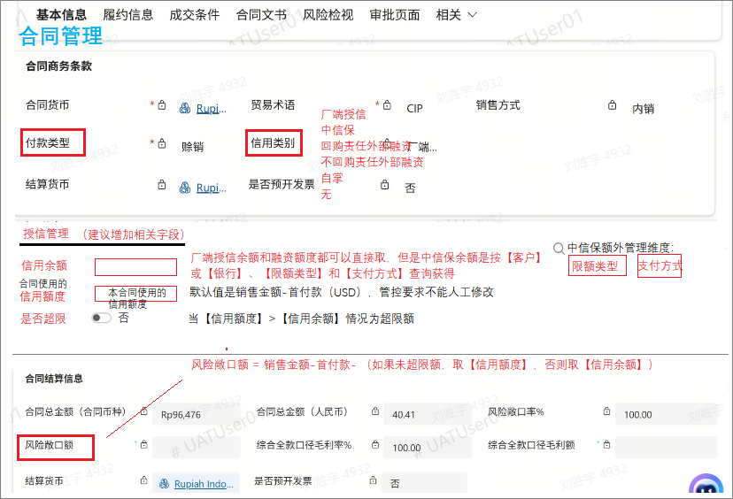
