> 同步自飞书：2026-07-28（由 docx 转 Markdown）

|  | 三一集团有限公司 |  | 责任部门 |  |
|---|---|---|---|---|
|  | 三一集团有限公司 |  | 文件页数 |  |
|  | 三一集团有限公司 |  | 生效日期 |  |
| 文件编码 |  |  | 文件版本 | V1.0 |

产品需求说明书PRD

**此文件属三一集团有限公司版权所有，未经书面许可，不得以任何方式复制和外传。**

# **变更记录**

|  |  |  |  |  |
|:---|:---|:---|:---|:---|
| 版本 | 更新日期 | 修改人 | 更新内容及更新理由 | 备注 |
| V0.1 | 2026/06/01 | 毕马威 | 创建融资管理PRD |  |
| V0.2 | 2026/6/10 | 毕马威 | 根据需求讨论，确认内容，修改：1、增加BPP审批。2、增加设备台数字段。 |  |
| V0.3 | 2026/6/11 | 毕马威 | 根据需求讨论，确认内容，修改：1、融资信息增加子公司字段 2、融资落实增加 收到融资款时间字段。 |  |
| V0.4 | 2026/6/12 | 毕马威 | 修改：1、PRD 名称修改2、按批注修改 |  |

# **术语说明**

*对文档中出现新的或不常见的名词、概念或简略语给出定义和解释（含产品和技术）。*

|  |  |
|:--:|:--:|
| 名词 | 解释 |
| 客户编码（SAP客户代码） | CRM中对三一客户的唯一识别码，在客户管理模块管理，作为客户主数据编码，一源多用到SAP等系统。也是SAP客户ID。 |
| FSM（融资管理） | 英文 ~~External Financing Limit Management~~Financial Solution Management 简写为 FSM，用于表名和字段名的简化。 |
| IM | 英文 ~~Financing Demand~~Inquires Management 简写为 IM ，用于表名和字段名的简化。 |

1.  

# **模块及功能点划分**

2.  

**业务-应用矩阵**

|  |  |  |  |  |  |  |  |
|:---|:---|:---|:---|:---|:---|:---|:---|
| **业务模块** | **业务方案点** | **业务方案描述（L5~L6）定义到业务活动** | **功能描述（从业务角度描述大致的功能需求）** | **应用架构1级** | **应用架构2级** | **应用架构2.5级** | **应用架构3级** |
| 营销风控 | ~~客户资信~~融资管理模块 | 融资管理 | 融资管理 | 营销风控 | 融资管理模块 | 融资管理 | 融资管理 |
| 营销风控 | ~~客户资信~~融资管理模块 | 融资管理 | 融资资源管理 | 营销风控 | 融资管理模块 | 融资管理 | 融资资源管理 |

**应用模块**

| 模块名称（L2.5） | 功能点名称（L3） （系统需求名称） | 功能点简要描述 |
|---|---|---|
| 融资管理模块 | 融资管理 | 融资管理和融资资源管理的数据录入、编辑等 |

1.  

# **功能说明**

2.  

审批功能说明：BPP 审批流，审批功能已确认，即按需求文档要求或按PRD接口说明，BPP负责流程设计并启用工作流，BPP接收CRM提交的客户等信息，接收数据生成审批实例，节点审批信息即时返回，并在流程实例结束后返回最终的审批结果到CRM。

1.  

## 融资管理功能

2.  

<!-- -->

1.  

### **业务流程图**

2.  

<!-- -->

1.  

### **功能流程图**

2.  

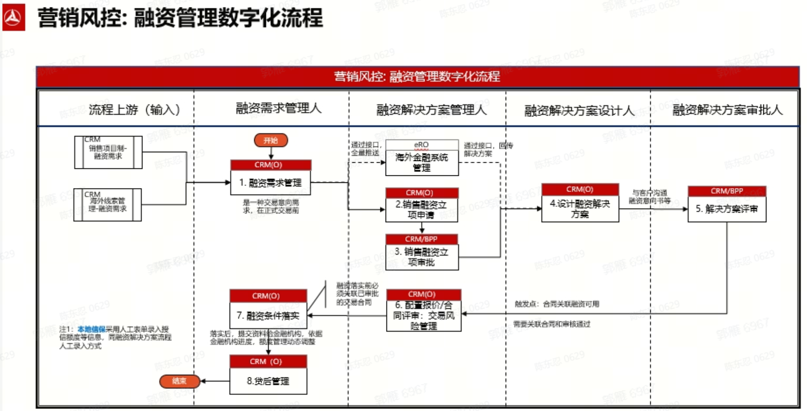

1.  

### 角色权限设计

2.  

|  |  |  |
|:---|:---|:---|
| **角色** | **数据范围（本人/本部门/下级部门）** | **可执行操作** |
| 融资经理 | 所有 | 融资管理（列表查询、查看明细、融资需深求管理、融资解决方案、融资落实），融资资源管理（列表查询、查看明细） |
| 融资需求经理 | 所有 | 融资管理（列表查询、查看明细、新增、编辑） |
| 融资资源管理员 | 所有 | 融资资源管理（列表查询、查看明细、新增、编辑、启用/停用） |

1.  

### 表清单

2.  

| 数据对象 | 表名 | 表名（英文名 | 类型 | 录入角色 | 使用场景 | 数据管理部门 |
|---|---|---|---|---|---|---|
| 融资数据 | 融资管理表 | mcs_fsm_data | 新增 | 营销经理或其它营销人员，融资经理 | 融资需求经理录入融资需求，融资经理录入融资需求管理、融资方案 用于内外部融资授信额度管理，如被合同引用 |  |
| 融资落实数据 | 融资落实表 | mcs_fsm_detail_data | 新增 | 融资经理 | 融资经理录入融资落实数据 |  |
| 融资资源数据 | 融资资源管理表 | mcs_fsm_resource | 新增 | 融资资源管理员 | 融资资源管理员维护相关的融资机构信息 |  |
| 融资管理附件数据 | 融资管理附件表 | mcs_fsm_files | 新增 | 系统自动根据各功能上传附件填入 | 系统自动生成数据 |  |
| 融资审批数据 | 融资审批信息表 | mcs_fsm_approve | 新增 | 系统根据审批接口提交和返回自动填入 | 查看 |  |

1.  

### **表设计**

2.  

D365表技术元数据设计说明

- 

> D365建表默认会自带技术元数据字段，开发人员可结合业务需求，在系统页面显示相关字段。这些技术元数据字段包括：新建记录人员CreatedBy(默认赋值systemuser)、新建记录时间CreatedOn（默认赋值systemtime）、ModifiedBy修改记录人员 (默认赋值systemuser)、ModifiedOn修改记录时间（默认赋值systemtime）、表记录ownerid和owneridname等，另D365默认关键模型表都会自带字段：“记录有效状态”statecode(inactive, active)。

- 
- 

> PRD中表结构定义是在承接业务需求到业务分析阶段的转换成果，对D365技术设计阶段的数据库物理设计是主要输入之一，但需结合实际产品和业务功能进行交叉确认，以符合物理数据库设计模型正确性。

- 
- 

> 表关系 ER 图

- 

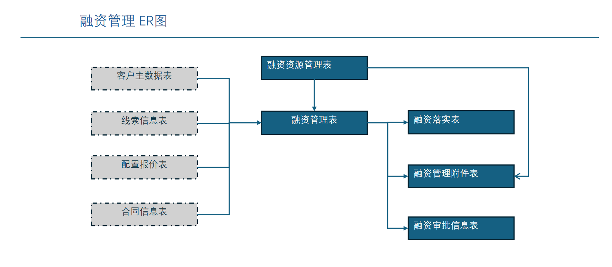

##### 1.融资管理表

mcs_fsm_data

| 字段名 | 字段描述 | 含义 | 产生方式/取数逻辑 | 类型 | 长度 | 必填 | 业务规则（含字典） | 数据示例 |
|---|---|---|---|---|---|---|---|---|
| mcs_fsm_data_id | 主键ID，融资需求编号 |  | 自增主键 系统生成唯一编码，前缀字符FSM+日期YYYYMMDD+4位序列号 | 数字 | 20 | 是 |  |  |
| mcs_fsm_status | 状态字段 |  | 文本 | 20 | 否 | 是 | 融资状态 1 融资需求 2 融资立项 3 融资解决方案 4 融资落实 |  |
| 需求信息 | 需求信息 | 需求信息 | 需求信息 | 需求信息 | 需求信息 | 需求信息 | 需求信息 | 需求信息 |
| mcs_lead_id | 线索编号 |  | 页面选择（线索信息放大镜弹窗） | 文本 | 20 | 否 |  |  |
| mcs_quote_no | 报价单编号 |  | 页面选择（报价信息放大镜弹窗，需要通过选择的线索过滤） | 文本 | 20 | 否 |  |  |
| mcs_contract_id | 合同编号 |  | 页面选择（合同信息放大镜弹窗选择） | 文本 | 20 | 否 |  |  |
| mcs_big_area | 大区 |  | 合同号选择后自动带出，可修改 |  |  | 否 | 大区代码表 |  |
| mcs_country_area | 国区 |  | 通过大区自动带出，可修改 |  |  | 否 | 国区代码表 |  |
| mcs_country | 国家 |  | 通过大区自动带出，可修改 |  |  | 否 | 国家代码表 |  |
| mcs_division | 事业部 |  | 通过大区自动带出，可修改 |  |  | 否 | 事业部代码表 |  |
| mcs_sub_company | 子公司 |  | 页面填入 | 文本 | 20 | 是 |  |  |
| mcs_customer_id | 客户编码 |  | 线索信息选择后自动带出，可修改 | 文本 | 20 | 是 | 关联客户主数据的客户编码 |  |
| mcs_customer_name | 客户名称 |  | 线索信息选择后自动带出，可修改 | 文本 | 200 | 是 |  |  |
| 融资六要素 | 融资六要素 | 融资六要素 | 融资六要素 | 融资六要素 | 融资六要素 | 融资六要素 | 融资六要素 | 融资六要素 |
| mcs_fsm_amount | 融资金额 |  | 合同号选择后自动带出，可修改（线索、报价、合同带入后修改） | 数字 | 20（2位小数） | 必填 |  |  |
| mcs_fsm_currency | 融资币种 |  | 页面录入 | 文本 | 20 | 必填 | 币种代码表 |  |
| mcs_fsm_period | 融资期限 |  | 页面录入 | 数字 | 20 | 必填 |  |  |
| mcs_fsm_payment_ratio | 首付比例 |  | 页面录入 | 数字 | 20（2位小数） | 必填 |  |  |
| mcs_fsm_payment_term | 融资利率 |  | 页面录入 | 数字 | 20（2位小数） | 必填 |  |  |
| mcs_fsm_product_desc | 融资产品 |  | 页面录入 | 文本 | 200 | 必填 |  |  |
| 融资需求管理 | 融资需求管理 | 融资需求管理 | 融资需求管理 | 融资需求管理 | 融资需求管理 | 融资需求管理 | 融资需求管理 | 融资需求管理 |
| mcs_fsm_managment_no | 融资管理编号 |  | 自增主键 系统生成唯一编码，前缀字符FSMM+日期YYYYMMDD+4位序列号 | 文本 | 20 | 必填 |  |  |
| mcs_fsm_device_count | 设备台数 |  | 线索信息选择后自动带出，可修改 | 文本 | 200 | 必填 |  |  |
| mcs_fsm_device_name | 产品名称 |  | 线索信息选择后自动带出，可修改 | 文本 | 200 | 必填 |  |  |
| mcs_fsm_manager | 融资经理 |  | 页面选择，系统用户 | 文本 | 20 | 必填 |  |  |
| mcs_fsm_is_initiated | 是否立项 |  | 页面选择 | 文本 | 10 | 必填 | 是否 1 是 0 否 |  |
| mcs_can_initiated | 是否可以提交立项审批 |  | 系统填入，默认值为 1 是 | 文本 | 10 | 必填 | 是否 1 是 0 否 |  |
| 融资解决方案 | 融资解决方案 | 融资解决方案 | 融资解决方案 | 融资解决方案 | 融资解决方案 | 融资解决方案 | 融资解决方案 | 融资解决方案 |
| mcs_fsm_resource_id | 融资机构编号 |  | 页面选择（融资资源信息放大镜弹窗） | 文本 | 20 | 选填 | 关联融资资源表机构编号 |  |
| mcs_fsm_resource_name | 融资机构名称 |  | 融资机构编号选择后自动带出 | 文本 | 200 | 选填 |  |  |
| mcs_fsm_resource_product | 金融产品名称 |  | 页面选择（下拉选择，将融资机构编号选择后的融资机构金融产品带入选择项） | 文本 | 20 | 必填 | 关联融资资源表机构金融产品字段信息 |  |
| mcs_fsm_credit_amount | 授信金额 |  | 页面录入（取融资金额字段有值时放入，并支持手工修改） | 数字 | 20（2位小数） | 必填 | 是内外部融资额度金额，货币取【融资币种】字段。用于合同审批前阶段引用。 |  |
| mcs_fsm_credit_amount_usd | 融资金额USD |  | 根据授信金额自动转换为USD存入 | 数字 | 20（2位小数） | 必填 |  |  |
| mcs_fsm_interest_discount | 贴息 |  | 页面录入 | 数字 | 20（2位小数） | 必填 |  |  |
| mcs_fsm_fee | 融资费用 |  | 页面录入 | 数字 | 20（2位小数） | 必填 |  |  |
| mcs_fsm_repurchase_conditions | 回购条件 |  | 页面录入 | 文本 | 200 | 必填 |  |  |
| mcs_other_conditions | 其它条件 |  | 页面录入 | 文本 | 200 | 必填 |  |  |
| mcs_can_project | 是否可以提交融资方案审批 |  | 系统填入，默认值为 1 是 | 文本 | 10 | 必填 | 是否 1 是 0 否 |  |
| mcs_is_valid | 是否有效 |  | 系统自动写入，默认值 0 否 | 20 | 必填 |  | 是否 1 是 0 否 |  |
| 附件（用于关联显示，如果实施不需要，可删除） | 附件（用于关联显示，如果实施不需要，可删除） | 附件（用于关联显示，如果实施不需要，可删除） | 附件（用于关联显示，如果实施不需要，可删除） | 附件（用于关联显示，如果实施不需要，可删除） | 附件（用于关联显示，如果实施不需要，可删除） | 附件（用于关联显示，如果实施不需要，可删除） | 附件（用于关联显示，如果实施不需要，可删除） | 附件（用于关联显示，如果实施不需要，可删除） |
| mcs_fsm_att_ids | 上传的文件IDS |  | 上传文件组件 | 文本 | 1000 | 必填 |  |  |

##### 2.融资落实表

mcs_fsm_detail_data

|  |  |  |  |  |  |  |  |  |
|:---|:---|:---|:---|:---|:---|:---|:---|:---|
| **字段名** | **字段描述** | **含义** | **产生方式/取数逻辑** | **类型** | **长度** | **必填** | **业务规则（含字典）** | **数据示例** |
| mcs_fsm_detail_data_id | 融资落实编号 |  | 自增主键 系统生成唯一编码，前缀字符FSMD+日期YYYYMMDD+4位序列号 | 数字 | 20 | 是 |  |  |
| mcs_fsm_data_id | 融资管理表编号 |  | 自动关联赋值N：1关联mcs_fsm_data.mcs_fsm_data_id | 数字 | 20 | 是 | 关联融资管理表编号 |  |
| mcs_order_no | 订单编号 |  | 页面选择（订单信息放大镜选择，须通过主表融资管理表的合同编号进行过滤） | 文本 | 20 | 是 | 关联订单表订单编号 |  |
| mcs_device_no | 融资设备编号 |  | 取合同项下的执行订单的设备编号 | 文本 | 20 | 是 | 关联融资资源表机构编号 |  |
| mcs_amount | 放款金额 |  | 取融资需求，并支持手工修改 | 数字 | 20（2位小数） | 是 |  |  |
| mcs_disbursement_conditions | 放款条件 |  | 取融资解决方案，并支持手工修改 | 文本 | 500 | 是 |  |  |
| mcs_disbursement_date | 收到融资款时间 |  | 页面选择 | 日期时间 |  |  |  |  |

##### 3.融资资源管理表

mcs_fsm_resource

| 字段名 | 字段描述 | 含义 | 产生方式/取数逻辑 | 类型 | 必填 | 长度 | 业务规则（含字典） | 数据示例 |
|---|---|---|---|---|---|---|---|---|
| mcs_fsm_resource_id | 主键ID，融资资源编号 |  | 自增主键 系统生成唯一编码，前缀字符FSMR+日期YYYYMMDD+4位序列号 | 数字 | 是 | 20 |  |  |
| mcs_fsm_institution_type | 机构类型 |  | 页面选择 | 文本 | 是 | 10 | 1 银行 2 保险 9其他 |  |
| mcs_fsm_institution_code | 机构代码 |  | 页面选择或输入 1 如果类型选择提银行，则从银行数据中选择。 2 如果选择的是保险或其它，文本框输入 | 文本 | 是 | 50 |  |  |
| mcs_fsm_institution_name | 机构名称 |  | 页面选择或输入 1 如果类型选择提银行，则从银行数据中选择。 2 如果选择的是保险或其它，文本框输入 | 文本 | 是 | 500 |  |  |
| mcs_fsm_institution_country | 所在国家 |  | 页面选择 | 文本 | 是 | 50 | 国家代码表 |  |
| mcs_fsm_institution_province | 洲省 |  | 页面选择 | 文本 | 是 | 50 | 洲省代码表 |  |
| mcs_fsm_institution_city | 所在城市 |  | 页面选择 | 文本 | 是 | 50 | 城市代码表 |  |
| mcs_fsm_institution_address | 具体地址 |  | 页面输入 | 文本 | 是 | 500 |  |  |
| mcs_fsm_institution_contact | 联系人 |  | 页面输入 | 文本 | 是 | 50 |  |  |
| mcs_fsm_institution_contact_position | 联系人职位 |  | 页面输入 | 文本 | 是 | 50 |  |  |
| mcs_fsm_institution_contact_tel | 联系人电话 |  | 页面输入 | 文本 | 是 | 50 |  |  |
| mcs_fsm_institution_contact_email | 联系人邮箱 |  | 页面输入 | 文本 | 是 | 50 |  |  |
| mcs_fsm_institution_desc | 机构简介 |  | 页面输入 | 文本 | 是 | 500 |  |  |
| mcs_fsm_institution_att | 相关附件 |  | 页面文件上传 | 文本 | 是 | 500 |  |  |
| 产品信息 | 产品信息 | 产品信息 | 产品信息 | 产品信息 | 产品信息 | 产品信息 | 产品信息 | 产品信息 |
| mcs_fsm_institution_products | 机构提供的金融产品名称（多选） |  | 页面选择 1 如果机构类型选择是银行 下拉框值为 1 Non-recourse Accounts ReceivableFactoring, 2 Recourse Accounts Receivable Factoring,3 Purchase Loan Financing, 4 Inventory Financing, 5 Dealer Financing, 6 RetailFactoring, 7 Leasing,8 Consortium,9 Investment Loan,10 wholesale, 11 Others 2 如果机构类型选择为保险 下拉框值为 1 特险、2 项目险、3 投资险、4 贸易险 | 文本 | 是 | 200 | 机构金融产品代码表，银行和保险 |  |
| mcs_fsm_institution_other_product | 机构提供的其他金融产品名称 |  | 如果上面选择OTHERS的话可以在这里编辑具体是什么融资产品名称; | 文本 | 是 | 200 |  |  |
| mcs_fsm_institution_product_remark | 金融产品备注 |  | 自定义，描述金融产品的特性 | 文本 | 是 | 500 |  |  |
| mcs_fsm_status | 状态 |  | 默认停用 | 文本 | 是 | 10 | 是否 1 是 0 否 |  |
| mcs_fsm_rl_status | 是否启用过 |  | 默认否，点击过启用后，值变为 1 是，此后此条数据不可删除。 | 文本 | 是 | 10 | 是否 1 是 0 否 |  |

##### 4.融资管理附件表

mcs_fsm_files

| 字段名 | 字段描述 | 含义 | 产生方式/取数逻辑 | 类型 | 必填 | 长度 | 业务规则（含字典） | 数据示例 |
|---|---|---|---|---|---|---|---|---|
| mcs_fsm_files_id | 主键ID |  | 自增主键 系统生成唯一编码，前缀字符FSMF+日期YYYYMMDD+4位序列号 | 数字 | 是 | 20 |  |  |
| mcs_fsm_data_id | 融资方案编号 |  | 自动关联赋值N：1关联mcs_fsm_data.mcs_fsm_data_id | 数字 | 是 | 20 | 关联融资方案编号 |  |
| mcs_fsm_resource_id | 融资资源编号 |  | 自动关联赋值N：1关联mcs_fsm_resource.mcs_fsm_resource_id |  |  |  | 关联融资源编号 |  |
| mcs_filetype | 附件分类 |  | 人工选择，默认99-其他 | 数字 | 是 | 2 | 1-融资资源 2-融资需求 3-需求管理 4-融资方案 99-其他 |  |
| mcs_filename | 附件名称 |  | 解析上传文件获取 | 文字 | 否 | 200 |  |  |
| mcs_filebyte | 附件信息流 |  | 文件上传 | 文件 | 否 |  |  |  |
| mcs_edifileid | 接口返回状态，获取附件id |  | 接口返回 | 文本 | 否 | 50 | 文件系统返回的文件id。 |  |

##### 5.融资审批信息表

mcs_fsm_approve

| 字段名 | 字段描述 | 含义 | 产生方式/取数逻辑 | 类型 | 必填 | 长度 | 业务规则（含字典） | 数据示例 |
|---|---|---|---|---|---|---|---|---|
| mcs_fsm_approve_id | 工作流编号 |  | 自增主键 系统生成唯一编码，前缀字符FSMA+日期YYYYMMDD+4位序列号 | 数字 | 是 | 20 |  |  |
| mcs_fsm_data_id | 融资管理编号 |  | 自动关联赋值N：1关联mcs_fsm_data.mcs_fsm_data_id | 数字 | 是 | 20 |  |  |
| mcs_approve_type | 审批流类型 |  | 根据审批类型填入 | 文本 | 30 | 否 | 融资审批流类型1 立项审批 2 融资方案审批 |  |
| mcs_submit_time | 提交时间 |  | 提交时间 | 日期时间 |  |  |  |  |
| mcs_submit_person | 提交人 |  | 登陆人员 | 文本 | 30 | 否 |  |  |
| mcs_bppstatus | BPP审批状态 |  | BPP接口获取 | 文本 | 30 | 否 | 20: Pending Approval 11: Rejected 30: Approved 10: Recalled 5: Submit Failed Default: N/A |  |
| mcs_bppapprver | 当前审批人 |  | BPP接口获取 | 文本 | 100 | 否 |  |  |
| mcs_bppid | BPP工作流ID |  | BPP接口获取 | 文本 | 50 | 否 |  |  |
| mcs_bpperrormsg | BPP错误信息 |  | BPP接口获取 | 文本 | 1000 | 否 |  |  |
| mcs_approvedate | BPP审批完成日期 |  | BPP接口获取 | 日期 |  | 否 |  |  |
| mcs_bppcomment | BPP审批意见 |  | BPP接口获取 | 文本 | 1000 | 否 | 包括通过的审批意见和驳回的原因 |  |

1.  

### **页面原型设计及规则**

2.  

<!-- -->

1.  

#### **模块菜单导航**

2.  1.  

> 【风控】\>【融资管理模块】\> 【融资资源管理】 融资资源管理 列表查询页面

1.  
2.  

> 【风控】\>【融资管理模块】\>【融资信息管理】 融资信息管理 列表查询页面

1.  

<!-- -->

1.  

#### **页面原型**

2.  

<!-- -->

1.  

##### **融资资源管理页面**

2.  

<!-- -->

1.  

> 列表查询页面

2.  

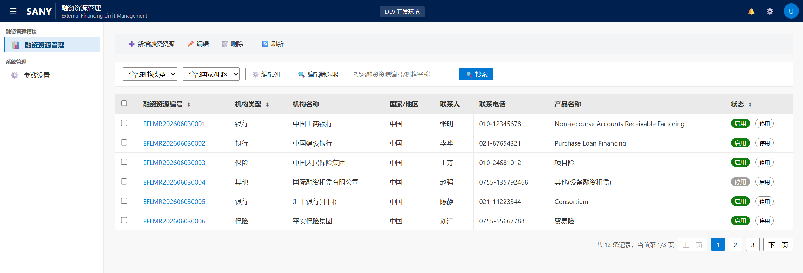

1.  

> 新增页面

2.  

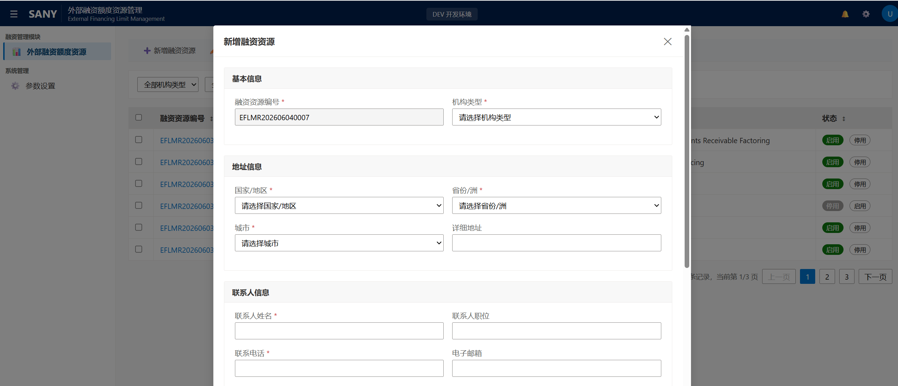

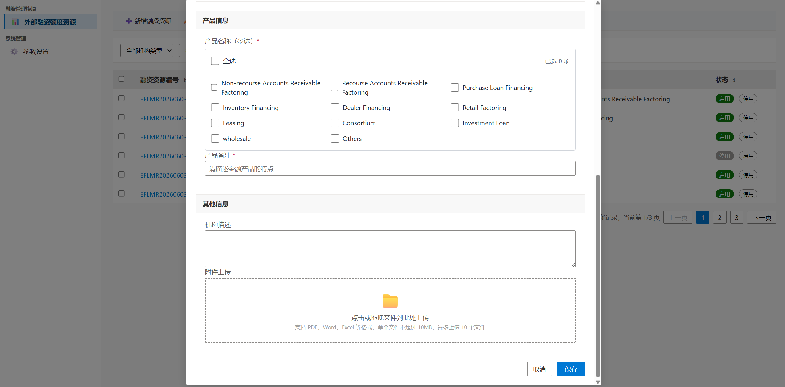

1.  

> 编辑页面

2.  

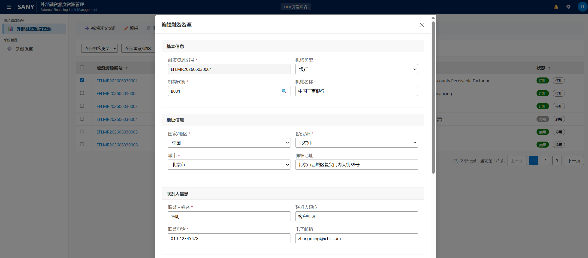

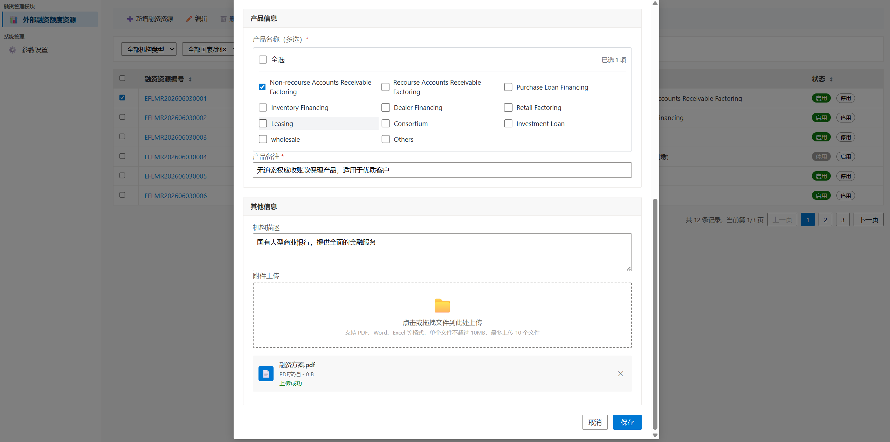

1.  

> 详情页面

2.  

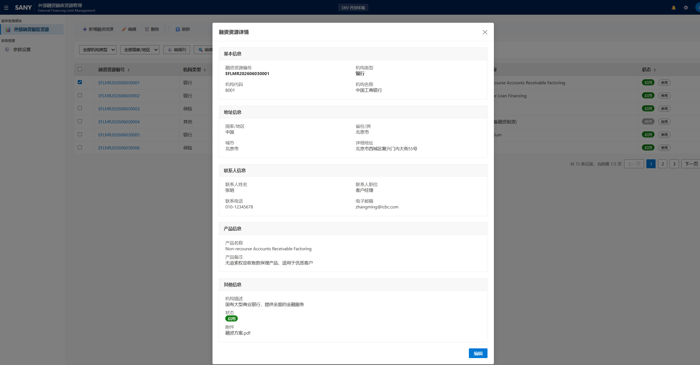

1.  

##### **融资管理页面**

2.  

<!-- -->

1.  

> 列表页面

2.  

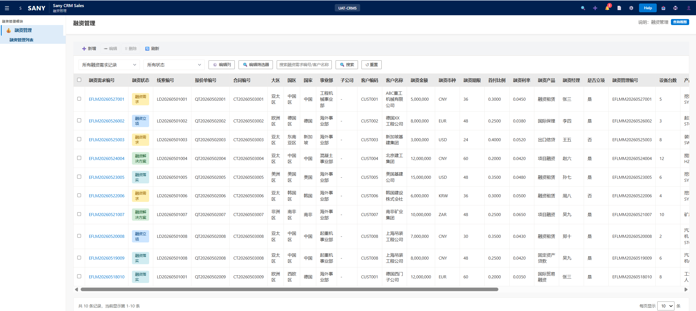

1.  

> 详情页面

2.  

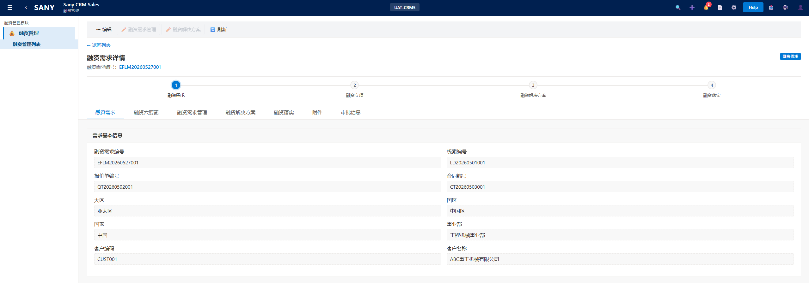

1.  

> 新增页面

2.  

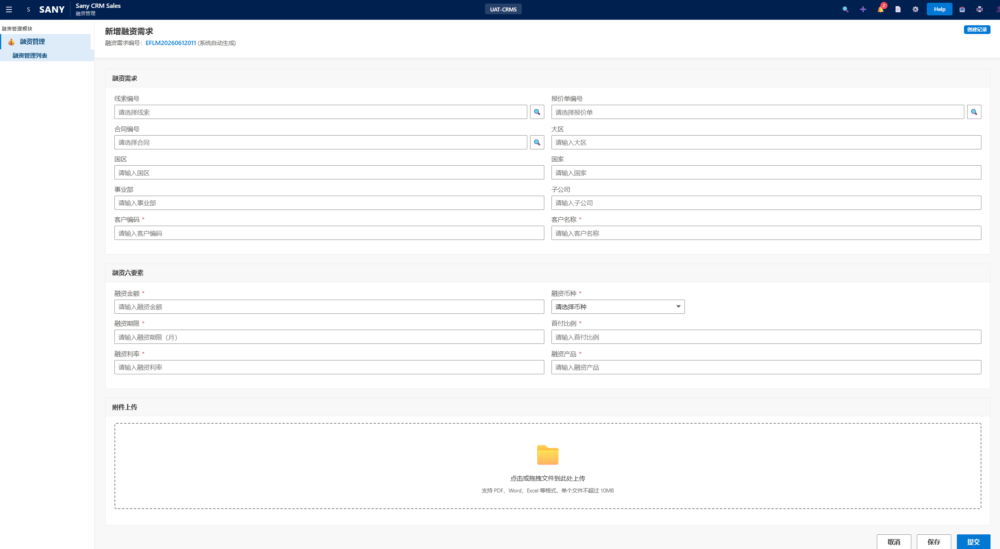

1.  

> 编辑页面

2.  

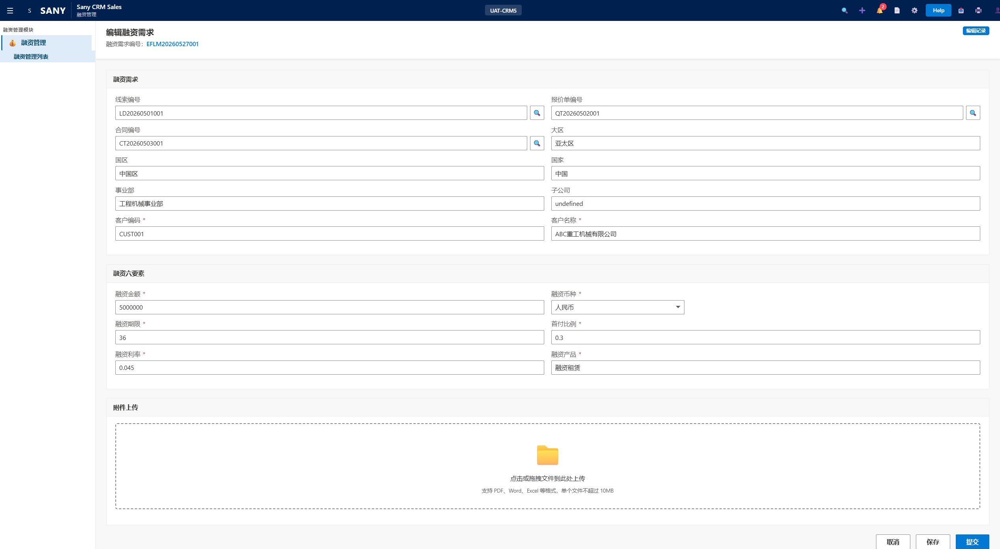

1.  

> 融资需求管理页面

2.  

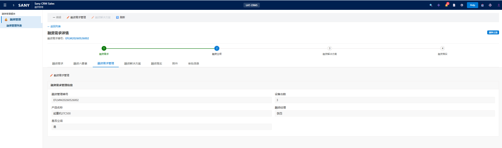

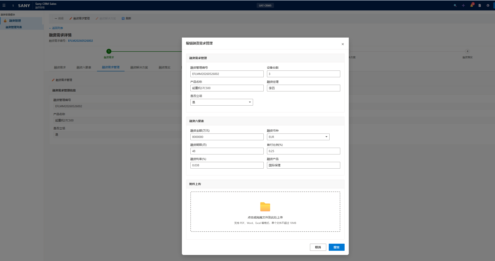

1.  

> 融资解决方案页面

2.  

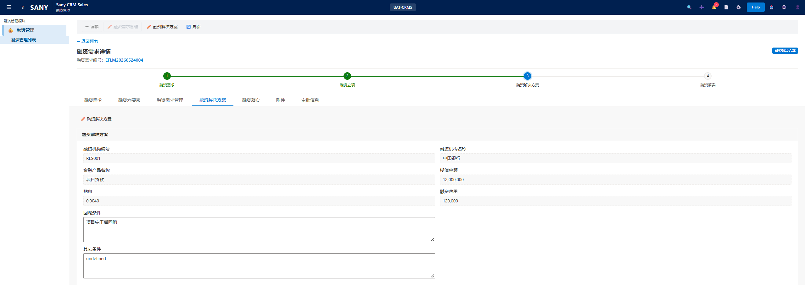

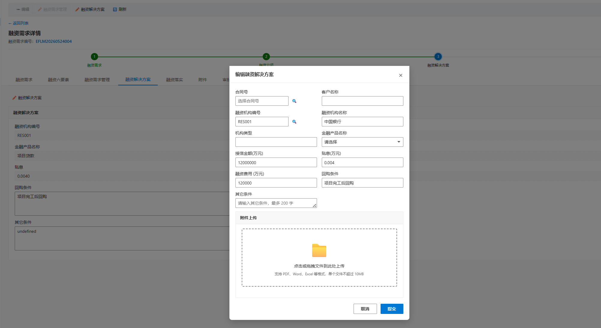

1.  

> 融资落实

2.  

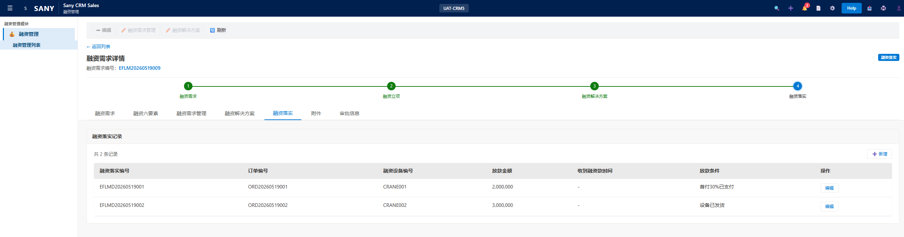

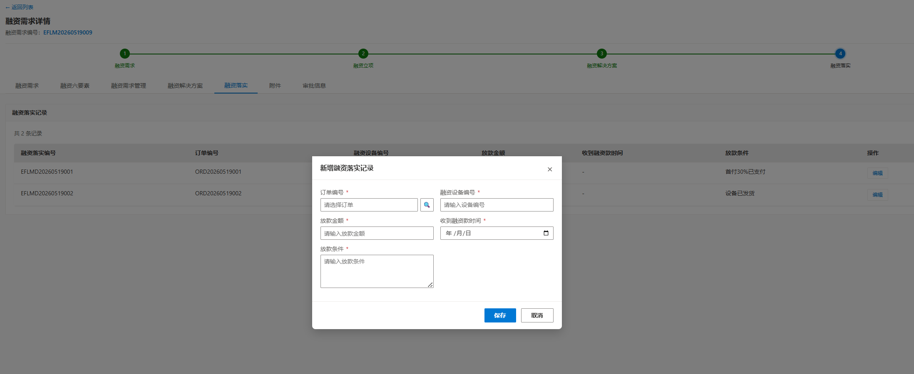

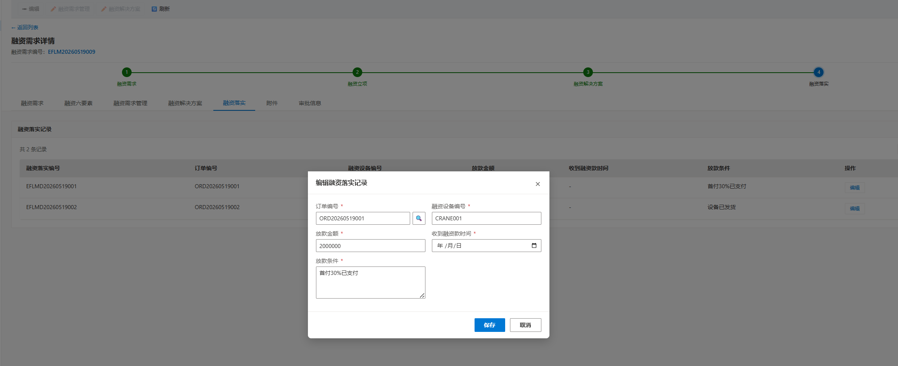

1.  

> 删除

2.  

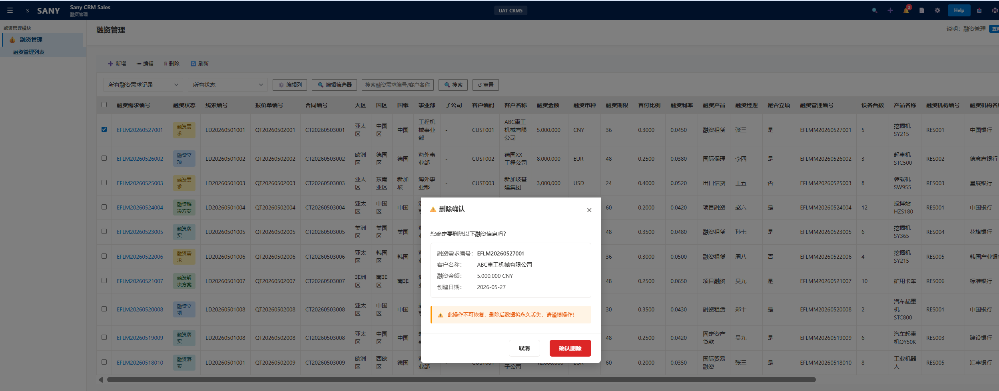

1.  

### **功能按钮设计**

2.  

<!-- -->

1.  

#### 融资资源管理

2.  

| 功能点 | 逻辑说明 | 类型 | 备注 |
|---|---|---|---|
| 新增融资资源 | 1. 点击 融资资源 列表页面 点击 新增 按钮，融资资源管理员角色人员显示 2.点击后，打开 融资资源新增页面。 | 按钮 |  |
| 新增融资资源-保存 | 1. 必填数据校验（必填字段与数据库字段相同），新增重复性校验（机构代码） 2.保存融资资源管理表，状态字段为 0 停用，附件上传文件数据需要写入附件表，类型 为 融资资源 | 功能 |  |
| 编辑融资资源 | 1、当选中一条融资资源数据并且数据状态为停用状态，融资资源管理员角色人员显示 2.点击后 打开 融资资源编辑页面 | 按钮 |  |
| 编辑融资资源-保存 | 1. 必填数据校验（必填字段与数据库字段相同），校验只能是本人创建的数据可以进行保存，状态校验，停用状态才可编辑。 2.保存数据到融资资源管理表，附件上传文件数据需要写入附件表，类型 为 融资资源 | 功能 |  |
| 融资资源状态变更-启用/停用 | 1、点击列表数据上启用/停用按钮，修改相关状态。 2、当是停用改为启用时，启用成功后，需要将是否启用过改为1 是。 |  |  |
| 删除 | 1、当选中一条融资资源数据并且数据是否启用过状态为0 否时并且创建人与登陆账号相同并且融资资源管理员角色人员 2.点击后 逻辑删除该条数据 | 功能 |  |

1.  

#### 融资管理

2.  

| 功能点 | 逻辑说明 | 类型 | 备注 |
|---|---|---|---|
| 新增融资管理 | 1. 点击 融资管理 列表页面 点击 新增 按钮，融资需求经理 角色人员显示 2.点击后，打开 融资管理 新增页面。 | 按钮 |  |
| 新增融资管理-保存 | 1. 必填数据校验（页面线索、报价单号、合同号至少有一个，其它除附件字段外必填），新增重复性校验（线索编号、报价单编号、合同号三者有一个相同存在即重复）。 a.页面如先选择线索，则按线索需要带出的字段带出相关字段，页面如果直接选择合同号，则通过合同号带出线索信息及线索需要带出的字段信息及报价单信息，如果直接选择报价单编号，则带出线索信息及线索需要带出的字段信息。b 如果先选择线索，再选择报价单，报价单弹窗数据需要根据线索过滤。合同号相同处理，如果先有前面线索和报价单数据，则合同弹窗数据需要根据前两项进行过滤。 2.状态 为 融资需求 ，保存数据到融资管理表 3.附件上传文件数据需要写入附件表，类型 为 融资方案 | 功能 |  |
| 新增融资管理-提交 | 1. 必填数据校验（页面线索、报价单号、合同号至少有一个，其它除附件字段外必填），新增重复性校验（线索编号、报价单编号、合同号三者有一个相同存在即重复）。 a.页面如先选择线索，则按线索需要带出的字段带出相关字段，页面如果直接选择合同号，则通过合同号带出线索信息及线索需要带出的字段信息及报价单信息，如果直接选择报价单编号，则带出线索信息及线索需要带出的字段信息。b 如果先选择线索，再选择报价单，报价单弹窗数据需要根据线索过滤。合同号相同处理，如果先有前面线索和报价单数据，则合同弹窗数据需要根据前两项进行过滤。 2.状态 为 融资立项 ，是否可以提交立项审批 值为 1 是，保存融资管理表 3.附件上传文件数据需要写入附件表，类型 为 融资方案 | 功能 |  |
| 编辑融资管理 | 1、当选中一条状态为 融资需求状态的融资管理数据 可点击 2.融资需求经理 角色人员，并且创建人与登陆账号相同时显示 3.点击后 打开 融资管理编辑页面 | 按钮 |  |
| 编辑融资管理-保存 | 1. 必填数据校验（同新增），校验只能是本人创建的数据可以进行保存 2.状态 为 融资需求 ，保存融资管理表 3.附件上传文件数据需要写入附件表，类型 为 融资需求 | 功能 |  |
| 编辑融资管理-提交 | 1. 必填数据校验（同新增），校验只能是本人创建的数据可以进行保存 2.状态 为 融资立项 ，是否可以提交立项审批 值为 1 是，保存融资管理表 3.附件上传文件数据需要写入附件表，类型 为 融资需求 | 功能 |  |
| 删除 | 1、融资需求经理 角色人员显示，当选中一条融资管理数据，并且创建人与登陆账号相同，并且数据的状态为 融资需求 时 可点击 2.点击后 逻辑删除该条数据 | 功能 |  |
| 融资需求管理 | 1、融资经理角色显示，当融资数据状态是 2 融资立项 时，是否可以提交立项审批 值为 1 是 时可点击。页面融资经理取系统登陆人，不可修改。 2、点击后进入 融资需求编辑页面（融资需求和融资六要素字段） | 按钮 |  |
| 融资需求管理-提交 | 1、点击后数据校验（除附件外所有字段必填），合同编号必填。 2、如果 是否立项 为 是，新建一条是融资立项的审批认息，并且调用BPP 融资立项接口，生成工作流。 3、如果 是否立项 为 是 将 是否可以提交立项审批 改为 0 否 4、上传的附件文件保存到附件表，类型为 融资需求 5、保存数据到融资管理表 | 功能 |  |
| 融资立项调用工作流接口 | 调用BPP 融资立项接口，生成一条 融资立项 审批工作流，挂入 融资信息详情表单。 | 功能 |  |
| 接收融资立项工作流接口数据 | 接收融资立项审批工作流信息，对应更新到审批信息表（所有节点更新 审批状态，当前审批人，审批流完成时更新审批完成时间、审批结果、审批意见），当审批完成时，并且审批果是通过时，将融资信息的状态更新为 3 融资解决方案。如果审批完成，并且审批结果是驳回时，将 是否可以立项审批 改为 1 是，融资信息状态不变化。 | 功能 |  |
| 融资解决方案 | 1、融资经理角色显示，当融资数据状态 为 3 融资解决方案时 ，并且 是否可以提交融资方案审批 为 1 是 时，可点击 2、点击后进入 融资解决方案编辑页面（融资解决方案相关字段） | 按钮 |  |
| 融资解决方案-提交 | 1、点击后数据校验（所有页面字段除附件外必填），合同号必填 2、新建一条 融资方案审批 的审批认息，并且调用BPP 融资方案审批 接口，生成工作流。 3、将 是否可以提交融资审批方案 改为 0 否，保存数据到融资管理表 4、上传的附件文件保存到附件表，类型为 融资方案 | 功能 |  |
| 融资方案审批调用工作流接口 | 调用BPP 融资方案审批 接口，生成一条 融资方案审批 审批工作流，挂 融资信息详情表单。 | 按钮 |  |
| 接收融资立项工作流接口数据 | 接收 融资方案审批 工作流信息，对应更新到审批信息表（所有节点更新 审批状态，当前审批人，审批流完成时更新审批完成时间、审批结果、审批意见），当审批流完成时，并且审批结果是通过时，将融资信息的状态更新为 4 融资落实，同时更新 是否有效 字段为 1 是。如果审批完成，审批结果是驳回，将 是否可以提交融资方案审批 字段 改为 1 是，融资信息状态不变化。 | 按钮 |  |
| 融资方案落实-新增 | 1、融资经理角色显示，当融资数据状态 为 4 融资落实 时 ，可点击 2、点击后进入 融资落实 新增 页面，页面订单编号弹窗数据需要根据合同号进行过滤。 | 按钮 |  |
| 融资方案落实-新增-保存 | 1. 数据校验（页面除附件字段外必填），唯一性校验（订单号） 2、保存数据到融资方案落实数据表。 | 功能 |  |
| 融资方案落实-编辑 | 1、融资经理角色显示，当融资数据状态 为 4 融资落实 时 ，可点击 2、点击后进入 融资落实 编辑 页面，页面订单编号弹窗数据需要根据合同号进行过滤。 | 按钮 |  |
| 融资方案落实-编辑-保存 | 1. 数据校验（页面除附件字段外必填），唯一性校验（订单号，存在即更新） 2、保存数据到融资方案落实数据表。 | 功能 |  |

1.  

### **接口设计**

2.  

##### （1）接口清单

|  |  |  |  |
|:---|:---|:---|:---|
| **名称** | **发送方/调用方** | **接收方/API服务方** | **备注** |
| 附件上传 | D365 | 文件服务器 | 文件服务系统 |
| BPP申请单　－融资立项审批 | D365 | BPP | BPP提供API接口-融资立项审批（内部），D365调用BPP接口推进相关三一内部审批工作流 |
| BPP 融资立项审批状态更新 | BPP | D365 | D365提供API接口接收BPP审批节点状态和信息，包括审批状态、当前审批人、审批日期、审批意见，审批结果，审批完成日期等信息 |
| BPP申请单　－融资方案审批 | D365 | BPP | BPP提供API接口-融资方案审批（内部），D365调用BPP接口推进相关三一内部审批工作流 |
| BPP 融资方案审批状态更新 | BPP | D365 | D365提供API接口接收BPP审批节点状态和信息，包括审批状态、当前审批人、审批意见，审批结果，审批完成日期等信息 |

##### （2）接口详细设计

|              |                                      |
|:-------------|:-------------------------------------|
| 接口名称     | BPP申请单－融资立项审批/融资方案审批 |
| 接口编号     | 　                                   |
| 消息协议     | HTTP/WebService/MQ/FTP/RFC           |
| 消息格式     | XML/BLOB/TEXT/JSON                   |
| 请求方式     | 　                                   |
| 请求url      | 融资管理管理数据详情页面             |
| 接口功能描述 | 向BPP发起内部申请审批工作流          |
| 数据流向     | D365-\>BPP                           |
| 数据说明     | 融资立项/融资方案 表单数据           |

请求参数列表：

|              |      |      |          |
|:------------:|:----:|:----:|:--------:|
|   字段描述   | 类型 | 必填 | 字节长度 |
| 融资管理编号 | 文本 |  是  |    50    |
|   客户名称   | 文本 |  是  |   200    |
| 客户SAP编码  | 文本 |  是  |    50    |
|    申请人    | 文本 |  是  |    50    |
|              |      |      |          |

响应参数：

|         |              |        |          |
|:-------:|:------------:|:------:|:--------:|
|  参数   |     描述     |  类型  | 字节长度 |
|   \-    | 服务调用反馈 | Object |          |
| status  |   调用标识   |  文本  |    20    |
| message |   调用结果   |  文本  |   2000   |

|              |                            |
|:-------------|:---------------------------|
| 接口名称     | BPP审批状态更新            |
| 接口编号     | 　                         |
| 消息协议     | HTTP/WebService/MQ/FTP/RFC |
| 消息格式     | XML/BLOB/TEXT/JSON         |
| 请求方式     | 　                         |
| 请求url      | 　                         |
| 接口功能描述 | BPP发送审批流完成状态      |
| 数据流向     | BPP -＞ D365               |
| 数据说明     | 审批状态                   |

请求参数列表：

|                  |      |      |          |                            |
|:----------------:|:----:|:----:|:--------:|:---------------------------|
|     字段描述     | 类型 | 必填 | 字节长度 |                            |
| 融资管理管理编号 | 文本 |  是  |    50    |                            |
|   BPP审批状态    | 文本 |  是  |    30    |                            |
|    当前审批人    | 文本 |  是  |   100    |                            |
|   BPP工作流ID    | 文本 |  是  |    50    |                            |
|   BPP错误信息    | 文本 |  否  |   1000   |                            |
|   BPP驳回原因    | 文本 |  否  |   1000   | 最终驳回原因               |
| BPP审批完成日期  | 日期 |  否  |    50    | 最终审批完成日期           |
|   BPP审批结果    | 文本 |  是  |    50    | 最终审批结果 1 通过 2 驳回 |
|   BPP审批意见    | 文本 |  否  |   1000   | 最终审批意见               |

响应参数：

|         |              |        |          |
|:-------:|:------------:|:------:|:--------:|
|  参数   |     描述     |  类型  | 字节长度 |
|   \-    | 服务调用反馈 | Object |          |
| status  |   调用标识   |  文本  |    20    |
| message |   调用结果   |  文本  |   2000   |

1.  

# **附录一：业务需求输入文档**

2.  

| 序号 | 分类 | 文档说明 | 文档路径 |
|---|---|---|---|
| 1 | 业务详细需求 | LTC PMO项目管理共享目录，保存所有营销风控详细业务需求文档，由各业务负责人负责。如有变更，需修订变革记录和标记变更位置。 | LTC：外部融资模块信息表 |
| 2 | 原型文档 | HTML格式的原型文档，用于业务人员理解和确认，并指导开发。页面风格和样式非最终实现，会随D365风格和样式变化。（本地查阅，需要在本地新建一个.html后缀的文件，把代码贴入保存后，用IE打开） | 融资信息.html 融资资源管理.html |
