> 同步自飞书：2026-07-28（由 docx 转 Markdown）

**LTC营销风控_成交条件基线库配置和成交条件计算.PRD**

| LTC项目2026 | 三一集团有限公司 |  | 责任部门 |  |
|---|---|---|---|---|
| LTC项目2026 | 三一集团有限公司 |  | 文件页数 | 41 |
| LTC项目2026 | 三一集团有限公司 |  | 生效日期 |  |
| 文件编码 |  | 待定 | 文件版本 | V1.1 |

产品需求说明书PRD

**此文件属三一集团有限公司版权所有，未经书面许可，不得以任何方式复制和外传。**

# **文档修订记录**

|  |  |  |  |  |
|:---|:---|:---|:---|:---|
| 版本 | 更新日期 | 修改人 | 更新内容及更新理由 | 备注 |
| V0.1 | 2026/05/18 | 毕马威/Steven Liu | 起草相关术语和基础数据 |  |
| V0.5 | 2026/05/23 | 毕马威/Steven Liu | 完成数据模型和表结构和模型设计 | 5/25:确认相关成交条件配置维度需要保留空不配置和收款计划数据字典 |
| V1.0 | 2026/05/28 | 毕马威/Steven Liu | 完成成交条件基线库和成交条件计算PRD |  |
| V1.0 | 2026/05/29 | 毕马威/Steven Liu | 根据业务评审反馈修订，业务评审通过 | 5/29：付款频次数据字典从目前月付、季付、半年付等修改为30倍数的天数（代表间隔多少天数一次付款） |
| V1.1 | 2026/06/01 | 毕马威/Steven Liu | 根据业务变化更新修订 | 6/1: (1) 业务反馈从基于【产品组】配置改到【产品线】归类到【成交条件产品分类】，(2)另基线库在830上线都不配置客户等级包括泵路事业部（开发时再确认该数据配置情况）。对客户分类的经销商需拆分到D1/D2/D3/D4/D5 - 经销商D1-钻石、D2-铂金、D3-白银、D4-认证、D5-意向。 |
| v1.2 | 2026/07/03 | 毕马威/Steven Liu | 成交条件总体组评审 | 1.业务再决定下用产品线还是成交条件产品新分类作为成交条件配置维度之一。2.对产品等级等数据字典用“ALL”代替“空” 3.“成交条件样板库”改成“成交条件基线库” |

# **术语说明**

*对文档中出现新的或不常见的名词、概念或简略语给出定义和解释（含产品和技术）。*

|  |  |
|:--:|:--:|
| 名词 | 解释 |
| 客户编码（SAP客户代码） | CRM中对三一客户的唯一识别码，在客户管理模块管理，作为客户主数据编码，一源多用到SAP等系统。也是SAP客户ID。 |
| 客户主数据 | CRM【客户主数据】模块维护的客户编码记录是唯一的，而【客户管理】中维护的记录存在多条同”客户编码”记录，用于配置不同”客户区域“权限管理（D365后台批处理会按不同客户区域复制出客户重复记录）。如需要取客户表上字段信息，建议采用“客户主数据表”上的客户编码搜索获取客户字段信息。PRD中提到【客户】数据一般指【客户主数据表】中客户数据。引用读客户数据使用【客户主数据表】，~~而录入客户数据（写）使用【客户］account表~~。 |
| 客户信用评分 | 采用100份制度，通过收集相关客户资信的内外部定量指标和定性指标，结合客户信用评分卡中对客户资信基础指标值设定范围区间及对应权重分值，累计后得到客户信用分。 |
| 客户类型 | 海外版CRM的客户管理模块中【客户类型】包括：公司客户、个人客户。 |
| 客户类别 | 海外版CRM的客户管理模块中【客户类别】包括：三一终端客户、经销商终端客户，正式经销商、意向经销商、经销商大客户、三一大客户、政府、子公司、合资公司、国内子公司、待准入三一大客户等。经销商包括正式经销商、意向经销商，其余都是直销客户。 |
| 大客户级别 | 海外版CRM的【大客户管理】模块中【大客户级别】指直销客户包括S, A, B (S最大)。 |
| 经销商分级 | 需增加该分级字段到CRM客户管理模块中，分钻石、铂金、白银、认证、意向。 |
| 直销客户分级 | 直销客户分级包括S,A,B,C,I (S/A/B是大客户)，I是个人客户，C是其余的普通客户。 |
| 客户等级（成交条件基线库） | 客户等级标签主要用于成交条件基线库配置，客户等级标准采用A0-A4（A0最高）：①【直销】A0≥80分；A1≥70分；A2≥60分；A3≥50分；A4＜50分；②【经销商】钻石、铂金、白银、认证、意向分别为A0-A1-A2-A3-A4。如果采用的评分卡，经销商也采用相同信用分映射等级。 |
| 产品分类（成交条件） | 成交条件基线库配置使用到产品分类，但是该产品分类在现有CRM不存在，是基于【产品线】向上归集的一个分类，但不是现有CRM的【一级产品分类】（或叫产品大类）和【二级产品分类】（CRM或叫产品子类,RPM是产品线）。需新增该【成交条件产品分类】编码表及其和【产品线】关系表。 |
| 成交条件基线库 | 成交条件基线库主要提供在标准交易条件下的首付款、账期、付款频次信息。一般在配置报价和合同业务环节，可以采用高于或等于标准成交条件，否则在合同交易环节需要分级审批。 |
| 成交条件标准 – 首付款 | 首付款：也叫“预付款”，是指在合同签订后、货物交付或服务正式开始前，买方预先支付给卖方的一部分款项。 |
| 成交条件标准 – 账期 | 账期：指的是从完成交付/验收，到实际付款之间间隔的天数，也叫“信用期”或“赊账时间”。 |
| 成交条件标准 – 付款频次 | 付款频次：指的是间隔多长时间段安排一次付款，比如月付、季付、半年付等。 |
| BPP | BPP是三一内部的审批工作流平台，相关评估或申请单审批流程都在BPP平台。CRM会和BPP集成，发送相关申请单请求，然后接受相关审批结果状态。 |

1.  

# **模块及功能点划分**

2.  

**业务-应用矩阵**

|  |  |  |  |  |  |  |  |
|:---|:---|:---|:---|:---|:---|:---|:---|
| **业务模块** | **业务方案点** | **业务方案描述（L5~L6）定义到业务活动** | **功能描述（从业务角度描述大致的功能需求）** | **应用架构1级** | **应用架构2级** | **应用架构2.5级** | **应用架构3级** |
| 客户资信 | 成交条件矩阵 | 配置 |  | 营销风控 | 成交条件 | 成交条件管理流程 | 成交条件基线库配置 |
| 客户资信 | 成交条件矩阵 | 计算 |  | 营销风控 | 成交条件 | 成交条件管理流程 | 成交条件计算 |
|  |  |  |  |  |  |  |  |

**应用模块**

|  |  |  |
|:---|:---|:---|
| **模块名称（L2.5）** | **功能点名称（L3）（系统需求名称）** | **功能点简要描述** |
| 成交条件管理流程 | 成交条件基线库配置 | 提供对成交条件基线库中标准成交条件的配置、可选审核流程管理 |
| 成交条件管理流程 | 成交条件计算 | 提供CRM成交条件搜索功能接口能力，根据客户编码、事业部、子公司、成交条件产品类型编码等入参，返回满足条件的标准成交条件记录（列表）。 |
|  |  |  |

1.  

# **功能说明**

2.  1.  

##   **成交条件管理流程**

1.  1.  

###     **业务流程图**

1.  

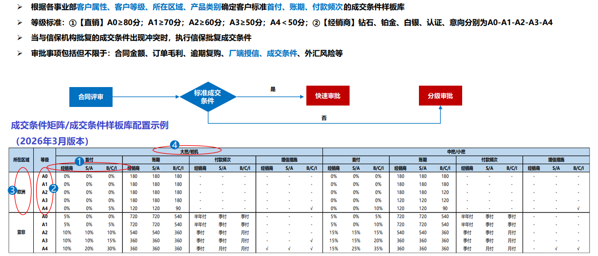

1.  

### **功能流程图**

2.  

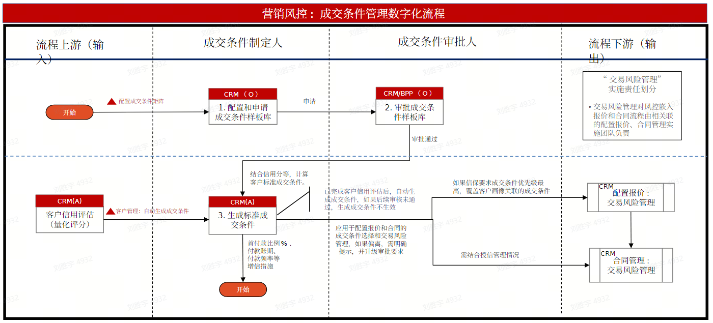

成交条件基线库（矩阵）配置审批发布流程图

1.  

### **成交条件基线库配置和成交条件计算**

2.  1.  

####   **关键界面原型及业务规则**

1.  

<!-- -->

1.  

> 成交条件基线库对【产品分类】维度采用新增特定分类，需要业务提前按事业部做好归类。该【成交条件产品分类】是基于现有【产品线】分类基础上向上归集分类。现有【产品线】和【产品】主数据关联，在配置报价和合同交易阶段，配置【产品】能关联到【产品线】。

2.  
3.  

> 需要先配置【成交条件产品分类】的编码和名称主数据，然后配置【产品线】和【成交条件产品分类】关系表【成交条件产品分类关系】数据。

4.  
5.  

> 产品配置管理的模块菜单导航：【产品】\> 【产品配置】\> 【成交条件产品分类】、【成交条件产品分类关系】。或者放 【风控】\> 【交易风险管理】 \> 【成交条件产品分类】、【成交条件产品分类关系】。

6.  

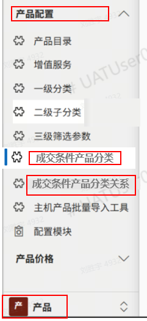

1.  

> 营销风控管理的模块菜单导航：【风控】\> 【交易风险管理】 \>【成交条件基线库】 。

2.  

<!-- -->

1.  

> 新增【成交条件产品分类】模块，支持相关产品分类编码和名称等信息维护。支持EXCEL模版导出和数据导入、新建、编辑、删除、查询等功能。该部分数据在上线前部署阶段需要配置完成。

2.  

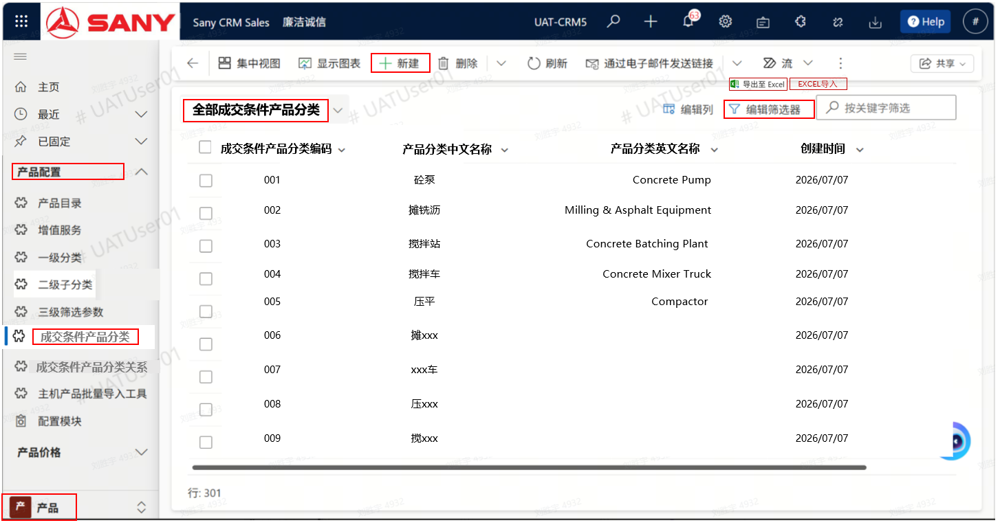

图1- 【成交条件产品分类】模块

1.  

> 新增【成交条件产品分类关系】模块，支持成交条件产品分类和产品线关系信息维护。支持EXCEL模版导出和数据导入、新建、编辑、删除、查询等功能。该部分数据在上线前部署阶段需要配置完成。

2.  

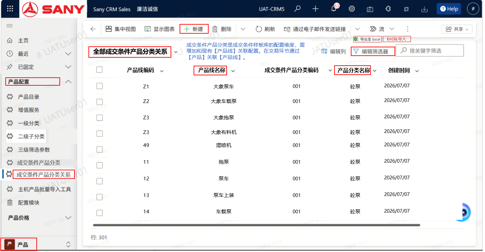

图2-【条件产品分类关系】模块，含部分示例数据

1.  

> 【成交条件基线库】配置功能，支持模板导出、导入，新增、编辑、删除记录基础功能，另对成交条件制定人角色（如事业部）和成交条件基线库审批人角色（如总部风控部门或事业部董事会）支持从申请到审批功能，由于基线库申请记录数非常多，直接采用D365设计的批量【申请】和【审批】功能。

2.  

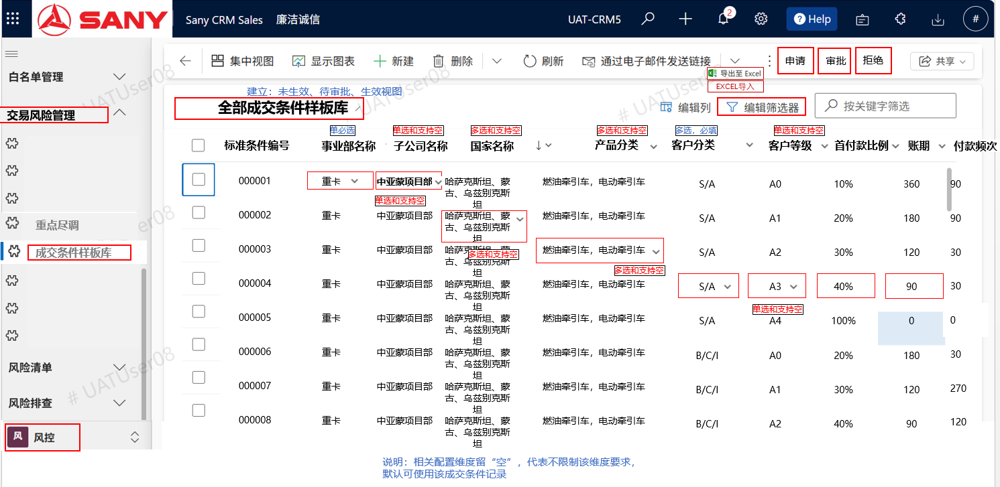

图3- 【成交条件基线库】

对初始化成交条件基线库配置数据，建议按模块提供的功能模板导出和数据导入，默认生效状态是“未生效”，只有审批通过后才生效使用。

| 维度 | 维度 | 维度 | 维度 | 维度 | 维度 | 交易基线 | 交易基线 | 交易基线 |
|---|---|---|---|---|---|---|---|---|
| 事业部（必填） | 子公司（如有） | 国家（如有） | 成交条件产品分类（如有） | 客户分类（必填） | 客户等级（如有） | 首付款比例 | 账期 | 付款频次 |
| 重卡 | 坦赞项目部 | 赞比亚、坦桑尼亚 | 燃油牵引车，电动牵引车 | S/A | A0 | 10% | 360 | 季付 90 |
| 重卡 | 坦赞项目部 | 赞比亚、坦桑尼亚 | 燃油牵引车，电动牵引车 | S/A | A1 | 20% | 240 | 季付 90 |
| 重卡 | 坦赞项目部 | 赞比亚、坦桑尼亚 | 燃油牵引车，电动牵引车 | S/A | A2 | 20% | 180 | 月付 30 |
| 重卡 | 坦赞项目部 | 赞比亚、坦桑尼亚 | 燃油牵引车，电动牵引车 | S/A | A3 | 30% | 90 | 月付 30 |
| 重卡 | 坦赞项目部 | 赞比亚、坦桑尼亚 | 燃油牵引车，电动牵引车 | S/A | A4 | 100% | 0 | 不涉及 0 |
| 重卡 | 坦赞项目部 | 赞比亚、坦桑尼亚 | 燃油牵引车，电动牵引车 | B/C/I | A0 | 20% | 360 | 月付 30 |
| 重卡 | 坦赞项目部 | 赞比亚、坦桑尼亚 | 燃油牵引车，电动牵引车 | B/C/I | A1 | 20% | 240 | 月付 30 |
| 重卡 | 坦赞项目部 | 赞比亚、坦桑尼亚 | 燃油牵引车，电动牵引车 | B/C/I | A2 | 30% | 180 | 月付 30 |
| 重卡 | 坦赞项目部 | 赞比亚、坦桑尼亚 | 燃油牵引车，电动牵引车 | B/C/I | A3 | 50% | 90 | 月付 30 |
| 重卡 | 坦赞项目部 | 赞比亚、坦桑尼亚 | 燃油牵引车，电动牵引车 | B/C/I | A4 | 100% | 0 | 不涉及 0 |

成交条件基线库配置示例数据

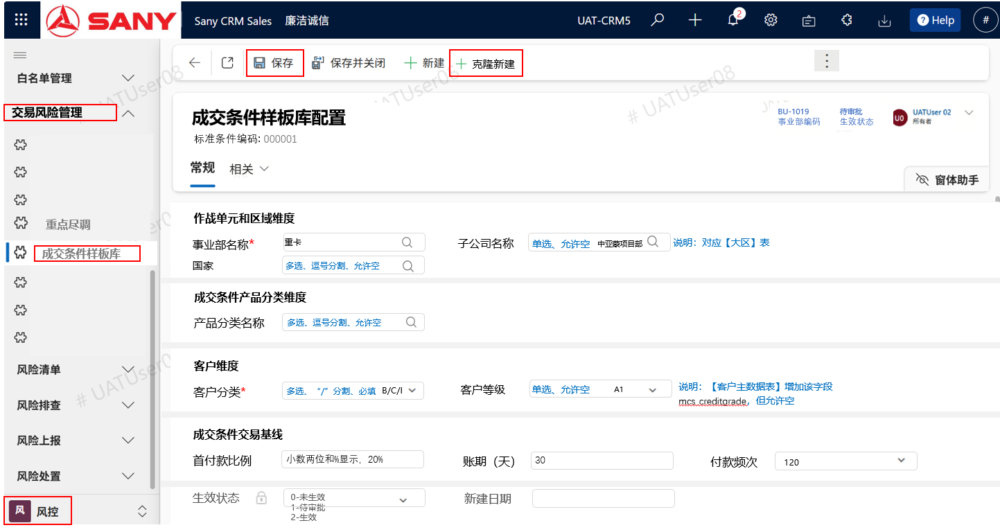

图4- 【成交条件基线库】提供单行记录的新增、编辑功能.

其中【克隆新增】对同关联维度的成交条件标准记录提供“少录”功能，可复制现有记录作为新增记录的默认值，在此基础上对少量不同字段值进行修改，比如成交条件交易基线的【首付款比例】、【账期】和【付款频次】。

1.  

####   **成交条件配置功能设计**

2.  

##### （1）功能按钮设计

| 功能点 | 逻辑说明 | 类型 | 备注 |
|---|---|---|---|
| 模块关联 | 1、供客户管理、线索、配置报价、合同等业务环节调用成交条件基线库查询 | 接口 | 内部接口 |
| 前置维护 | 完成【客户管理】模块新增字段的历史数据维护包括【客户等级】等。 完成【成交条件产品分类】编码配置和【成交条件产品分类关系】和产品线关联数据配置 | 功能 |  |
| 查询 | 【成交条件基线库查询】页面，支持成交条件基线库记录查询、新增、编辑和删除记录；模板导出和导入功能。 进入查询清单页面，可以通过【编辑筛选器】搜索找到相关申请记录。 对于查询视图，可以从“全部成交条件基线库”拓展到未生效、待审批、生效成交条件基线库视图。 | 功能 |  |
| 批处理导入 | 通过【成交条件基线库查询】页面，支持数据模板导出和批量导入功能 | 功能 |  |
| 申请 | 由于成交条件记录非常多，支持选择“未生效成交条件基线库视图”下所有记录，如果点击【申请】，发起相关审批要求，这些所有记录的状态更新为“待审批”。 |  |  |
| 审批/拒绝 | 基线库库审批人角色可选择“待审批成交条件基线库视图”下 所有记录 本事业部数据 ，如果点击【审批】，可以完成批处理审批操作。如点击【拒绝】会把相关记录状态返回为“未生效”状态，申请人可重新更新。 |  |  |
| 新建／编辑 | 支持【新建】或【编辑】客户信用评估记录信息部分，或查询记录详细。 支持【+克隆新建】功能。 | 按钮 |  |
| 保存 | 可点击【保存】按钮保存记录信息，在保存前进行规则校验。比如【账期】必须是30的倍数，可以是0；首付款比例不超过100%。 如果存在相同维度（事业部、子公司、国家、产品分类、客户分类、客户等级）的成交条件标准记录重复场景（考虑字段空情况），给出不予保存的阻断流程的警告信息提示”存在有重复记录，需核查！“。 | 按钮 | 数据有效性校验 |
| 生效状态 | 新建记录/编辑记录后保存：默认0-未生效 点击【申请】后：1-待审批 点击【审批】后：2-生效 点击【拒绝】后：0-未生效，事业部可以重新编辑修订 | 状态 | 状态数据字典、 未生效 待审批 生效 |

##### （2）表单字段设计

| 表单结构 | 表单区域分类 | 字段描述（同表结构中字段描述） | 可编辑 | 字段规则（参考“表设计”中规则，本处进行相关页面控制逻辑补充） |
|---|---|---|---|---|
| 成交条件基线库表 | 常规 | 标准条件编码 | 否 | 唯一码，系统自动生成唯一值，不可编辑 |
| 成交条件基线库表 | 常规 | 事业部编码 | 是 | 通过搜索获得 |
| 成交条件基线库表 | 常规 | 事业部名称 | 否 | 通过搜索事业部带入 |
| 成交条件基线库表 | 常规 | 子公司编码 | 是 | 通过搜索获得 |
| 成交条件基线库表 | 常规 | 子公司名称 | 否 | 通过搜索子公司带入 |
| 成交条件基线库表 | 常规 | 国家代码 | 是 | 通过搜索获得，多选 |
| 成交条件基线库表 | 常规 | 国家名称 | 否 | 通过搜索国家带入 |
| 成交条件基线库表 | 常规 | 产品分类编码 | 是 | 通过搜索获得，多选 |
| 成交条件基线库表 | 常规 | 产品分类名称 | 否 | 通过搜索产品分类带入 |
| 成交条件基线库表 | 常规 | 客户分类代码 | 是 | 下拉多选 |
| 成交条件基线库表 | 常规 | 客户等级 | 是 | 单选下拉 |
| 成交条件基线库表 | 常规 | 首付款比例 | 是 | 小数两位，显示0-100%，不超过1 |
| 成交条件基线库表 | 常规 | 账期（天） | 是 | 整数0或30倍数 |
| 成交条件基线库表 | 常规 | 付款频次（天） | 是 | 整数0或30倍数 |
| 成交条件基线库表 |  | 生效状态 | 否 | 显示数据字典 |
|  |  | 新建用户 | 否 | 取D365默认实体字段CreatedBy 、CreatedByName、ModifiedBy、ModifiedByName |
|  |  | 新建日期 | 否 | 取D365默认实体字段CreatedBy 、CreatedByName、ModifiedBy、ModifiedByName |

1.  

#### **成交条件计算（提供公共调用能力）**

2.  

<!-- -->

1.  

##### 业务环节公共调用能力

2.  

支持从【客户管理】、【线索】、【配置报价】到【合同】交易等业务环节，调用营销风控提供的成交条件基线库的公共接口能力，获得匹配的标准成交标准条件记录集。

1.  

##### 成交条件基线库接口入参

2.  

- 

> 对于【客户管理】环节，如果取得和【客户分类】（如S /A级）和【客户等级】相关的标准成交条件记录，应该会很多，不建议采用接口调用，而允许【客户管理】模块采用【相关】或提示方式到【成交条件基线库】模块查询。

- 
- 

> 对于【配置报价】、【合同】等交易环节，相关销售的出口产品已确定，通过入参字段：【事业部编码】、【子公司编码】、【国家代码】、【产品线编码】、【客户编码】，可以匹配到相关的标准成交条件基线库记录（接口入参字段如下）。

- 

| 序号 | 入参字段 | 数据类型/允许空 | 数据字典或参考数据表引用 （成交条件基线库配置中使用） | 业务环节取数字段 （现有CRM参考） |
|---|---|---|---|---|
| 1 | 事业部编码 | 文本/必传 示例：BU-1018 | 【用户设置】【用户中心管理】【事业部】表的事业部编码作为默认值，实际在交易环节（报价、合同）需要重新人工选择确认 | 配置报价环节：如有【事业部】字段优先取值，否则从配置报价记录Owner去找到【事业部】默认值 合同环节：【事业部】字段 |
| 2 | 子公司编码 | 文本/必传 示例：A000164 | 【用户设置】【用户中心管理】【大区】表的大区编码作为默认值（其中：区域分类有子公司、国区,取国区分类），实际在交易环节（报价、合同）需要重新人工选择确认 | 保留客户环节：可不必传 配置报价环节：如类似【客户所在作战单元】字段 合同环节：映射【作战组织】字段 |
| 3 | 国家代码 | 文本/必传 示例：CN | 【基础数据】【国家】表的两位编码，，实际在交易环节（报价、合同）需要重新人工选择确认 | 保留客户环节：可不必传 报价/合同环节：如有【销售目的国】字段，优先取，否则参考【客户】所在的【注册国家】（但不一定准确）。 |
| 4 | 产品线编码 | 文本/必传 示例：AK | 【基础数据】【产品线】表的产品线编码。传入成交条件基线库API接口后，由营销风控能力关联到【成交条件产品分类】作为正式搜索条件 | 客户环节：可不必传 报价/合同环节：如合同有【产品线】字段，否则参考【产品目录】表基于【产品】查找关联【产品线编码】 |
| 5 | 客户编码 | 文本/必传 示例：0214606764 | 【客户主数据】的客户编码。在交易环节通过线索上游环节带入，传入配置报价>合同>订单等确认。 客户编码作为传入成交条件基线库API接口后，由营销风控能力关联到【客户分类】和【客户等级】作为正式搜索条件 | 交易环节：线索、项目制、配置报价、合同、订单都关联【客户】 【客户分类】数据字典：直销客户分级包括S,A,B,C,I (S/A/B是大客户)，I是个人客户，C是其余的普通客户。D1-D5代表经销商客户，D1/D2/D3/D4/D5 - 经销商D1-钻石、D2-铂金、D3-白银、D4-认证、D5-意向。 【客户等级】数据字典：该标签主要用于成交条件基线库配置，客户等级标准采用A0-A4（A0最高）：①【经销商】1-钻石、2-铂金、3-白银、4-认证、5-意向分别为A0-A1-A2-A3-A4。②【评分卡】如有信用分，就用信用分覆：A0≥80分；A1≥70分；A2≥60分；A3≥50分；A4＜50分（此处评分阈值作为参考，实际以客户信用评分模块使用的为准）。 【泵路事业部】，对于泵路事业部，除了国家这个维度没有配置，和【客户等级】可能也不满足配置，其他维度都有配置。 具体接口设计参考“接口设计”章节。 |

1.  

##### 成交条件计算

2.  

成交条件基线库API在收到入参后，相关接口内部处理逻辑如下：

- 

> 对于传入参数是否必传需要校验，不满足条件下，接口返回入参校验错误信息（返回接口代码0：错误信息）。

- 
- 

> 【客户分类】不是一个物理字段，需要通过【客户类别】、【大客户级别】、【经销商分级】的三个字段组合判断和获取相关逻辑分类逻辑：

- 

| 字段 | CRM取数逻辑 | 补充说明 |
|---|---|---|
| 客户分类 | 关联选择的客户，通过【客户主数据】或【大客户管理】模块中【大客户级别】指直销客户包括S, A, B (S最大)。通过客户主数据的【客户类型】包括：公司客户、个人客户，可以判断是否为I是个人客户。排除经销商后，其余C为普通客户。 此外判断是否经销商：通过客户主数据中【客户类别】包括：三一终端客户、经销商终端客户，正式经销商、意向经销商、经销商大客户、三一大客户、政府、子公司、合资公司、国内子公司、待准入三一大客户等。经销商包括正式经销商、意向经销商，其余都是直销客户。如果是经销商，通过【经销商分级】字段获取钻石、铂金、白银、认证、意向，然后映射到D1-D5。 | 直销客户分S,A,B,C,I (S/A/B是大客户)、I个人客户，其余C为普通客户； 经销商分D1钻石、D2铂金、D3白银、D4认证、D5意向。 |

- 

> 通过传入【客户编码】、【产品线编码】查询相关产品和成交条件产品分类关系主数据表，取数【客户分类】、【客户等级】和【成交条件产品分类】值作为标准成交条件基线库记录查询的条件参数。

- 
- 

> 需根据【成交条件基线库】表的数据量，采用相关索引等加速搜索技术。

- 
- 

> D365开发备注：客户等级这种下拉类型数据字典对空可以加个ALL，但像国家、子公司、产品分类这些本身是关联到记录的，到时候在这些维度表需要加一个叫“ALL”的实际数据才行，其实还不如用空，D365的默认搜索条件里是有“不包含数据”这种标准查找条件的。

- 
- 

> 如果是【泵路事业部】，成交条件基线库配置是不用【国家】维度和假定所有泵路事业部的【客户主数据表】【客户等级】历史数据都上线前维护好，那要求查询标准成交条件记录时，不用【国家代码】参数。相关查询条件为【成交条件基线库】表的（2026/6/1 业务反馈都不用【客户等级】配置基线库，需在编程前再次确认以下条件应用---主要目的提升查询效率）：

- 

【事业部编码】=入参 AND

【子公司编码】=入参 AND

【产品分类编码】包含入参 AND

【客户分类代码】包含入参 AND

~~（【客户等级】=入参 OR 【客户等级】=ALL） AND~~

【生效状态】=2 （2是生效状态）

- 

> 如果是其他事业部，按成交条件样基线库中部分维度字段允许空，该部分需要业务逐步改进转为配置维度字段需必填（目前为空），来制定搜索条件：

- 

(【事业部编码】=入参) AND

(【子公司编码】=入参 OR 【子公司编码】= 空) AND

(【国家编码】包含入参 OR 【国家编码】= 空) AND

（【产品分类编码】包含入参 OR 【产品分类编码】=空） AND

（【客户分类代码】包含入参 ） AND

（【客户等级】=入参 OR 【客户等级】=ALL）AND

【生效状态】=2 （2是生效状态）

1.  

##### 成交条件基线库接口返回

2.  

具体参考“接口设计”部分。

1.  

### **角色权限设计**

2.  

| 角色 | 数据范围（本人/本部门/下级部门） | 可执行操作 |
|---|---|---|
| 成交条件制定人 角色名称：风控配置管理员 （大/国区相关管理人员、事业部海外风控人员/事业部海外营销管理部管理人员）对应岗位 | 本部门及下级部门 本人（需将角色配置到个人账户上 - 可变更）可以看到整个集团的数据 | 发起成交条件配置和申请审批 |
| 成交条件审批人 角色名称：事业部海外营销公司风控债权部部长 (总部相关交易风险管理部门/大/国区执委会/事业部董事会) | 全集团 仅可看到本事业部数据 | 审核成交条件配置数据 |
|  |  |  |

1.  

### **表设计**

2.  

（1）表清单

| 数据对象 | 表名 | 表名（英文名） | 类型 | 录入角色 | 使用场景 | 数据管理部门 |
|---|---|---|---|---|---|---|
| 客户 | 客户管理表和客户主数据表 | account, mcs_customermasterdata | 复用 | 子公司营销 | 客户信息管理，其中相关 | 事业部 |
| 成交条件基线库 | 成交条件产品分类表 | mcs_trade_pttype | 新增 | 总部风控人员 | 在系统上线部署前，配置产品分类表编码和名称 | 总部风控部门 |
| 成交条件基线库 | 成交条件产品分类关系表 | mcs_trade_ptgrouptype ER关系 N：1成交条件产品分类表 | 新增 | 总部风控人员 | 在系统上线部署前，配置成交条件产品分类关系表,其把产品线和成交条件产品分类关联配置 | 总部风控部门 |
| 成交条件基线库 | 成交条件基线库表 | mcs_trade_stpayterm ER关系 N：1成交条件产品分类关系表 | 新增 | 成交条件制定人 （事业部） | 在系统上线部署前，事业部需配置相关成交条件基线库数据 | 总部风控部门 |
|  |  |  |  |  |  |  |

（2）物理表设计

1.  

##### 复用客户表新增字段

2.  

复用客户表新增加新字段如下，这些字段在客户信用评估模块增加了。

| 字段名 | 字段描述 | 含义 | 产生方式/取数逻辑 | 字段类型 | 长度 | 必填 | 业务规则（含字典） | 数据示例 |
|---|---|---|---|---|---|---|---|---|
| mcs_creditgrade | 客户等级 |  | 在获得客户信用分计算结果审批后，会更新本字段值。 在上线前历史客户数据，建议业务线人工批量维护客户等级数据。 成交条件矩阵查询需要用到本参数。 | 文本 | 2 | 否 | 客户等级标签主要用于成交条件基线库配置，客户等级标准采用A0-A4（A0最高）：①【经销商】1-钻石、2-铂金、3-白银、4-认证、5-意向分别为A0-A1-A2-A3-A4。②【评分卡】如有信用分，就用信用分覆盖。A0≥80分；A1≥70分；A2≥60分；A3≥50分；A4＜50分 | A0-A4 |

1.  

##### 成交条件产品分类表

2.  

|  |  |  |  |  |  |  |  |  |
|:---|:---|:---|:---|:---|:---|:---|:---|:---|
| **字段名** | **字段描述** | **含义** | **产生方式/取数逻辑** | **字段类型** | **长度** | **必填** | **业务规则（含字典）** | **数据示例** |
| mcs_typeid | 产品分类编码 |  | Excel模板批量导入或人工录入 | 文本 | 10 | 是 | 关键字PK，业务唯一对其分类编码 |  |
| mcs_typename | 产品分类中文名称 |  | Excel模板批量导入或人工录入 | 文本 | 100 | 是 |  |  |
| mcs_typenameen | 产品分类英文名称 |  | Excel模板批量导入或人工录入 | 文本 | 150 | 否 |  |  |

1.  

##### 成交条件产品分类关系表

2.  

|  |  |  |  |  |  |  |  |  |
|:---|:---|:---|:---|:---|:---|:---|:---|:---|
| **字段名** | **字段描述** | **含义** | **产生方式/取数逻辑** | **字段类型** | **长度** | **必填** | **业务规则（含字典）** | **数据示例** |
| mcs_groupid | 产品线编码 |  | 根据【基础数据】【产品线】表选择产品线编码，Excel模板批量导入或人工按名称搜索选择 | 文本 | 10 | 是 | 组合关键字PK |  |
| ｍcs_groupname | 产品线名称 |  | 中文名称、由产品线编码查询带入 | 文本 | 100 | 是 |  |  |
| mcs_typeid | 产品分类编码 |  | 根据【基础数据】【成交条件产品分类】表选择产品分类编码，Excel模板批量导入或人工按名称搜索选择 | 文本 | 10 | 是 | 组合关键字PK |  |
| mcs_typename | 产品分类名称 |  | 中文名称、由产品分类编码查询带入 | 文本 | 100 | 是 |  |  |

1.  

##### 成交条件基线库表

2.  

| 字段名 | 字段描述 | 含义 | 产生方式/取数逻辑 | 字段类型 | 长度 | 必填 | 业务规则（含字典） | 数据示例 |
|---|---|---|---|---|---|---|---|---|
| mcs_tradetermid | 标准条件编码 |  | 系统产生唯一码 | 文本 | 10 | 是 | 唯一成交条件记录编码 |  |
| mcs_buid | 事业部编码 |  | 选择，必填，关联【用户设置】【用户中心管理】【事业部】表的事业部编码 | 文本 | 20 | 是 | 参考：合同环节映射【事业部】字段 | BU-1018 |
| mcs_buname | 事业部名称 |  | 从【事业部】表选择带入 | 文本 | 100 | 是 |  | 重能海外营销公司 |
| mcs_subid | 子公司编码 |  | 选择，关联【用户设置】【用户中心管理】【大区】表的大区编码 允许空，代表不限制子公司维度 | 文本 | 20 | 否 | 配置报价环节：映射【客户所在作战单元】字段 合同环节：映射【作战组织】字段。 如果未填，无法放“ALL”，只能留空，因实际关联了查询表 | A000164 |
| mcs_subname | 子公司名称 |  | 从【大区】表选择带入 | 文本 | 100 | 否 | 如果未填放“ALL” | 重能南非项目部 |
| mcs_countrycode | 国家代码 |  | 选择，关联【基础数据】【国家】表的国家代码（二位字母） 支持多选，用逗号分割 允许空，代表不限制国家维度 | 文本 | 300 | 否 | 交易环节：首选【销售目的国】字段，而后参考【客户】所在的【注册国家】 如果未填，无法放“ALL”，只能留空，因实际关联了查询表 | BR,US |
| mcs_countryname | 国家名称 |  | 通过多项选择带入，采用逗号分割 ，关联【基础数据】【国家】表的国家名称 | 文本 | 2000 | 否 | 如果未填，无法放“ALL”，只能留空，因实际关联了查询表 | 巴西,美国 |
| mcs_typeid | 产品分类编码 |  | 选择，根据【基础数据】【成交条件产品分类】表选择产品分类编码 支持多选，用逗号分割 允许空，代表不限制【成交条件产品分类】维度 | 文本 | 300 | 否 | 如果未填，无法放“ALL”，只能留空，因实际关联了查询表 | 12,13 |
| mcs_typename | 产品分类名称 |  | 多项选择中文名称，由产品分类编码查询带入，采用逗号分割 | 文本 | 2000 | 否 | 如果未填，无法放“ALL”，只能留空，因实际关联了查询表 | xxxx,yyyy |
| mcs_buyergrade | 客户分类代码 |  | 必填选择，直销客户分级包括S,A,B,C,I (S/A/B是大客户)，I是个人客户，C是其余的普通客户。D1-D5代表经销商客户，D1/D2/D3/D4/D5 - 经销商D1-钻石、D2-铂金、D3-白银、D4-认证、D5-意向。 支持多选，用“/”分割 | 文本 | 20 | 是 | S/A/B/C/I – 大客户/普通/个人 D1/D2/D3/D4/D5 - 经销商D1-钻石、D2-铂金、D3-白银、D4-认证、D5-意向 | S/A |
| mcs_creditgrade | 客户等级 |  | 单选，允许空=NA，数据字典：A0,A1,A2,A3, A4。 业务逻辑参考：客户等级标签主要用于成交条件基线库配置，客户等级标准采用A0-A4（A0最高）：①【经销商】1-钻石、2-铂金、3-白银、4-认证、5-意向分别为A0-A1-A2-A3-A4。②【评分卡】如有信用分，就用信用分覆盖。A0≥80分；A1≥70分；A2≥60分；A3≥50分；A4＜50分； | 文本 | 2 | 否 | 映射到【客户】【客户等级】字段，通过客户信用评估阶段会更新该值。但部分客户或历史普通等客户并非发起信用评。但该新增字段值为空存在，需要业务在上线前在【客户管理】设定默认值。 数据字典：如果未填放“ALL” | A0-A4 |
| mcs_downpay | 首付款比例 |  | 人工录入，保存0.21，显示21% | 小数 | 小数两位 | 是 | 小数两位，%显示格式。 如果首付款100%，那么账期=0，付款频次=0 | 0.21 |
| mcs_payterm | 账期（天） |  | 人工录入，指交货后到收到款的时间周期天数 | 整数 |  | 是 | 必须是30的倍数，可以为0（是首付款100%情况） | 60 |
| mcs_payfreq | 付款频次（天） |  | 人工录入，多少天付款一次 | 整数 |  | 是 | 必须是30的倍数，可以为0（是首付款100%情况） 1-月付 2-季付 3-半年付 4-年付 0-不涉及（如首付款100%） | 120 |
| mcs_status | 生效状态 |  | 新建记录：默认0-未生效 点击【申请】后：1-待审批 点击【审批】后：2-生效 点击【拒绝】后：0-未生效，事业部可以重新编辑修订 | 数字 | 1 | 是 | 0 未生效 1 待审批 2 生效 |  |
|  |  |  |  |  |  |  |  |  |

1.  

##### D365表技术元数据设计说明

2.  

- 

> D365建表默认会自带技术元数据字段，开发人员可结合业务需求，在系统页面是否显示相关字段。这些技术元数据字段包括：新建记录人员CreatedBy(默认赋值systemuser)、新建记录时间CreatedOn（默认赋值systemtime）、ModifiedBy修改记录人员 (默认赋值systemuser)、ModifiedOn修改记录时间（默认赋值systemtime）、表记录ownerid和owneridname等，另D365默认关键模型表都会自带字段：“记录有效状态”statecode(inactive, active)。

- 
- 

> 此外，客户主数据表mcs_customermasterdata 和客户表account的系统关联字段是account.mcs_customermasterdata = mcs_customermasterdata.new_customermasterdata_id， account.accountid是客户表的序列号，account.accountnumber是客户编码，另在客户主数据表同样有客户编码字段，其两者表结构和字段基本相同。在2026.5.28日前理解，如果增加客户字段，需要在客户表和客户主数据表同时增加，另数据录入在客户管理模块，需要把新字段增加到数据同步到客户主数据表的插件中。在2026.5.28理解，仅需在客户主数据表增加，未来客户管理会显示相关字段。开发团队需在D365代码开发层面和三一IT架构师牛同达老师确认相关现有CRM数据模型细节和客户主数据治理要求。

- 
- 

> PRD中表结构定义是在承接业务需求到业务分析阶段的转换成果，对D365技术设计阶段的数据库物理设计是主要输入之一，但需结合实际产品和业务功能进行交叉确认，以符合物理数据库设计模型正确性。

- 

1.  

### **接口设计**

2.  

##### （1）接口清单：

成交条件基线库记录数非常多，不建议采用BPP审批，采用在CRM/D365中按角色授权相关【申请】和【审批】按钮来支持，相关按钮支持所选择查询视图中所有成交条件标准记录进行申请和审批。

|  |  |  |  |
|:---|:---|:---|:---|
| **名称** | **发送方/调用方** | **接收方/API服务方** | **备注** |
| 成交条件基线库查询 | D365 | D365 | 内部接口 |
| ~~成交条件基线库申请　~~ | ~~D365~~ | ~~BPP~~ | ~~BPP提供API接口-申请审批（内部），D365调用BPP接口推进相关三一内部审批工作流~~ |
| ~~BPP审批状态更新~~ | ~~BPP~~ | ~~D365~~ | ~~D365提供API接口接收BPP审批节点状态和信息，包括审批状态、当前审批人、审批日期、拒绝原因等信息~~ |

##### （2）接口详细设计

###### 2.1.6.2 成交条件基线库查询API

|  |  |
|:---|:---|
| 接口名称 | 成交条件基线库查询 |
| 接口编号 | 　 |
| 消息协议 | HTTP/WebService/MQ/FTP/RFC |
| 消息格式 | XML/BLOB/TEXT/JSON |
| 请求方式 |  |
| 请求url |  |
| 接口功能描述 | 由各业务环节调用，通过入参作为查询条件，返回匹配的成交条件基线库记录 |
| 数据流向 | D365-\>D365内部接口 |
| 数据说明 | 成交条件基线库 |

**接口请求参数（入参）：**

> 具体入参及数据字典参考【成交条件计算】\>【2.1.3.3 成交条件基线库接口入参】前章节。
>
> 表结构参考：【成交条件基线库表】。

| 参数字段 | 参数字段描述 | 类型/必填/示例 | 字节长度 | 数据字典说明 |
|---|---|---|---|---|
| mcs_buid | 事业部编码 | 文本/必传 示例：BU-1018 | 20 | 【用户设置】【用户中心管理】【事业部】表的事业部编码作为默认值，实际在交易环节（报价、合同）需要重新人工选择确认 |
| mcs_subid | 子公司编码 | 文本/必传 示例：A000164 | 20 | 【用户设置】【用户中心管理】【大区】表的大区编码作为默认值（其中：区域分类有子公司、国区,取国区分类），实际在交易环节（报价、合同）需要重新人工选择确认 |
| mcs_countrycode | 国家代码 | 文本/必传 示例：CN | 20 | 【基础数据】【国家】表的两位编码，，实际在交易环节（报价、合同）需要重新人工选择确认 |
| mcs_prdgroupid | 产品线编码 | 文本/必传 示例：AK | 30 | 【基础数据】【产品线】表的产品线编码。在交易环节都有选择产品，通过产品找到产品线，传入成交条件基线库API接口后，由营销风控能力关联到【成交条件产品分类】作为对基线库搜索的正式搜索条件 |
| mcs_buyercode | 客户编码 | 文本/必传 示例：0214606764 | 20 | 【客户主数据】的客户编码。在交易环节通过线索上游环节带入，传入配置报价>合同>订单等确认。 客户编码作为传入成交条件基线库API接口后，由营销风控能力关联到【客户分类】和【客户等级】作为正式搜索条件 |
|  |  |  |  |  |

**接口返回响应参数（返回值）：**

| 参数字段 | 参数描述 | 类型、数据字典 | 字节长度 |
|---|---|---|---|
| - | 服务调用反馈 | Object |  |
| status | 调用标识,1-成功 0-错误 | 文本 | 20 |
| message | 调用结果，对0-错误情况，提供相关详细错误信息，比如传入参数不允许空等 | 文本 | 2000 |
| 匹配的成交条件基线库记录 | 记录集 | LIST |  |
| mcs_tradetermid | 标准条件编码 | 文本，唯一码 | 10 |
| mcs_buid | 事业部编码 | 文本，选择，必填，关联【用户设置】【用户中心管理】【事业部】表的事业部编码 | 20 |
| mcs_buname | 事业部名称 | 文本 | 100 |
| mcs_subid | 子公司编码 | 选择，关联【用户设置】【用户中心管理】【大区】表的大区编码 允许空，代表不限制子公司维度 | 20 |
| mcs_subname | 子公司名称 | 文本 | 100 |
| mcs_countrycode | 国家代码 | 选择，关联【基础数据】【国家】表的国家代码（二位字母） 支持多选，用逗号分割 允许空，代表不限制国家维度 | 300 |
| mcs_countryname | 国家名称 | 文本 | 2000 |
| mcs_typeid | 产品分类编码 | 选择，根据【基础数据】【成交条件产品分类】表选择产品分类编码 支持多选，用逗号分割 允许空，代表不限制【成交条件产品分类】维度 | 300 |
| mcs_typename | 产品分类名称 | 文本 | 2000 |
| mcs_buyergrade | 客户分类代码 | 文本，必选，直销客户分级包括S,A,B,C,I (S/A/B是大客户)，I是个人客户，C是其余的普通客户。D1-D5代表经销商客户，D1/D2/D3/D4/D5 - 经销商D1-钻石、D2-铂金、D3-白银、D4-认证、D5-意向。 支持多选，用“,”分割 | 20 |
| mcs_creditgrade | 客户等级 | 文本，A0-A4（A0最高），ALL：允许空=ALL，代表未设置客户等级维度 | 2 |
| mcs_downpay | 首付款比例 | 小数 | 小数两位 |
| mcs_payterm | 账期（天） | 整数（30的倍数） | 30 |
| mcs_payfreq | 付款频次（天数），表示间隔多少天付款一次 | 整数（30的倍数） | 120 |

BPP相关接口：

|              |                               |
|:-------------|:------------------------------|
| 接口名称     | BPP申请单－成交条件基线库申请 |
| 接口编号     | 　                            |
| 消息协议     | HTTP/WebService/MQ/FTP/RFC    |
| 消息格式     | XML/BLOB/TEXT/JSON            |
| 请求方式     | 　                            |
| 请求url      | 　                            |
| 接口功能描述 | 向BPP发起内部申请审批工作流   |
| 数据流向     | D365-\>BPP                    |
| 数据说明     | 申请表单数据                  |

请求参数列表：

以下是LIST

|              |      |      |          |
|:------------:|:----:|:----:|:--------:|
|   字段描述   | 类型 | 必填 | 字节长度 |
| 标准条件编码 | LISt |  是  |    10    |
|    申请人    | 文本 |  是  |    50    |
|   申请日期   | 日期 |  是  |          |

响应参数：

|         |              |        |          |
|:-------:|:------------:|:------:|:--------:|
|  参数   |     描述     |  类型  | 字节长度 |
|   \-    | 服务调用反馈 | Object |          |
| status  |   调用标识   |  文本  |    20    |
| message |   调用结果   |  文本  |   2000   |

|              |                            |
|:-------------|:---------------------------|
| 接口名称     | BPP审批状态更新            |
| 接口编号     | 　                         |
| 消息协议     | HTTP/WebService/MQ/FTP/RFC |
| 消息格式     | XML/BLOB/TEXT/JSON         |
| 请求方式     | 　                         |
| 请求url      | 　                         |
| 接口功能描述 | BPP发送审批流完成状态      |
| 数据流向     | BPP -＞ D365               |
| 数据说明     | 审批状态                   |

请求参数列表：

|                 |      |      |          |
|:---------------:|:----:|:----:|:--------:|
|    字段描述     | 类型 | 必填 | 字节长度 |
|  信用评估编码   | LIST |  是  |    10    |
|   BPP审批状态   | 文本 |  是  |    30    |
|   当前审批人    | 文本 |  是  |   100    |
|   BPP工作流ID   | 文本 |  是  |    50    |
|   BPP错误信息   | 文本 |  否  |   1000   |
|   BPP驳回原因   | 文本 |  否  |   1000   |
| BPP审批完成日期 | 日期 |  否  |          |

响应参数：

|         |              |        |          |
|:-------:|:------------:|:------:|:--------:|
|  参数   |     描述     |  类型  | 字节长度 |
|   \-    | 服务调用反馈 | Object |          |
| status  |   调用标识   |  文本  |    20    |
| message |   调用结果   |  文本  |   2000   |

1.  

# **附录（一）业务需求输入和集成文档**

2.  

|  |  |  |  |
|:---|:---|:---|:---|
| 序号 | 分类 | 文档说明 | 文档路径 |
| 1 | 业务详细需求 | LTC PMO项目管理共享目录，保存所有营销风控详细业务需求文档，由各业务负责人负责。如有变更，需修订变革记录和标记变更位置。 | <https://rs2flu7c17.work.sany.com.cn/drive/folder/THemfCklCl9p3SdiOVrkIElY5xf?from=space_personal_filelist&fromShareWithMeNew=1> |
| 2 | L3模块需求 | 成交条件基线库配置、成交条件计算 | <https://rs2flu7c17.work.sany.com.cn/drive/folder/KR3xfL5ArlYSjkdu2KEk36dI5Pg?from=space_personal_filelist> |

1.  

# **附录（二）RPM和CRM产品分类说明**

2.  

在成交条件基线库（成交条件矩阵）沟通，会设置成交条件需要归类的“产品分类”维度，需要对齐该分类的主数据编码和定义范围。用到的成交条件”产品分类”维度如下[示例](https://rs2flu7c17.work.sany.com.cn/drive/folder/KR3xfL5ArlYSjkdu2KEk36dI5Pg?from=space_personal_filelist)，这个分类是基于现有CRM的【产品线】基础上归类的新的分类，这个分类层次在现有RPM和CRM都不存在。

1.  

## **成交条件基线库示例**

2.  

| 事业部 | 子公司 | 国家 | 产品分类 | 客户分类 | 客户分级 | 首付款比例 | 账期 | 付款频次 |
|---|---|---|---|---|---|---|---|---|
| 重卡 | 坦赞项目部 | 赞比亚、坦桑尼亚 | 燃油牵引车，电动牵引车 | S/A | A0 | 10%-20% | 360 | 季付 -> 90 |
| 重卡 | 坦赞项目部 | 赞比亚、坦桑尼亚 | 燃油牵引车，电动牵引车 | S/A | A1 | 20% | 240 | 季付 -> 90 |
| 重卡 | 坦赞项目部 | 赞比亚、坦桑尼亚 | 燃油牵引车，电动牵引车 | S/A | A2 | 20% | 180 | 月付 -> 30 |
| 重卡 | 坦赞项目部 | 赞比亚、坦桑尼亚 | 燃油牵引车，电动牵引车 | S/A | A3 | 30% | 90 | 月付 -> 30 |
| 重卡 | 坦赞项目部 | 赞比亚、坦桑尼亚 | 燃油牵引车，电动牵引车 | S/A | A4 | 100% | 0 | 不涉及 -> 0 |

1.  

##   **字段映射**

2.  

CRM和RPM产品型谱管理系统的主数据映射关系：

|  |  |  |  |
|:---|:---|:---|:---|
| 字段映射 | **RPM主机型谱数据** | **现有CRM产品信息** | **“8/30”上线CRM产品信息** |
| **分类层次** | RPM主数据的【产品大类】 | CRM的【产品目录】数据维护中的【产品子类】或是【二级子分类】 | CRM的【产品目录】数据维护中的【产品线】 |
| **示例值** | 泵车 | 泵车 | 泵车 |

1.  

##   **RPM主机型谱数据维护**

2.  

下图中的【产品大类】（产品线）和CRM中的【二级子分类】的编码不同，【产品族群】和CRM中【产品线】的编码是不同的，相关分类范围也有变动。

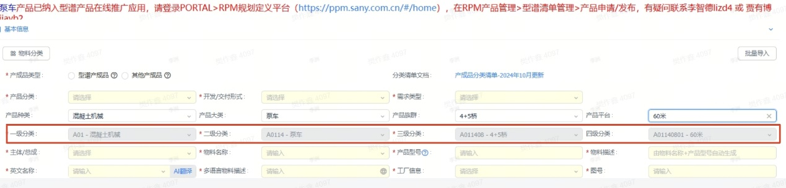

1.  

## **现有CRM的产品目录数据维护**

2.  

对应【产品目录】维护中的【产品子类别】，或者查询【二级子分类】菜单。

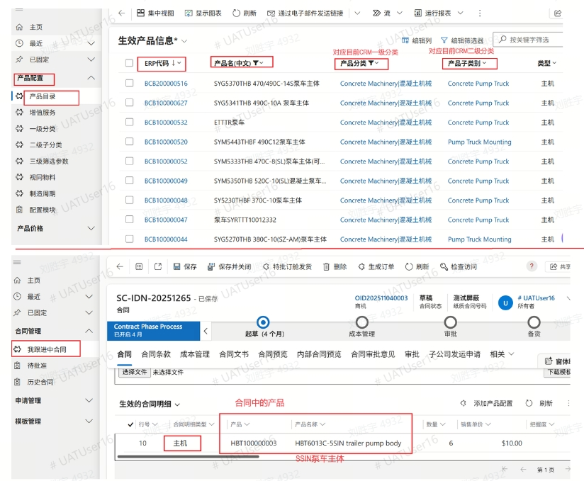

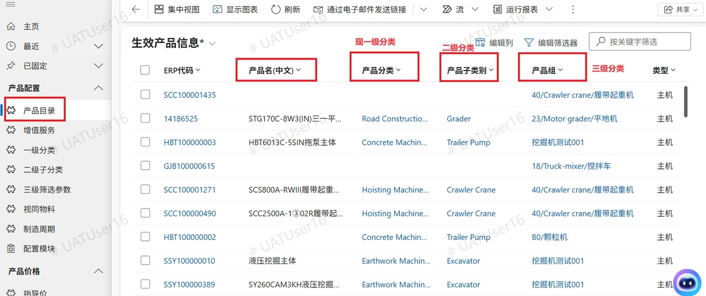

　　经和业务讨论，以RPM产品型谱的【产品线】字段（对应以上CRM的产品子类别）为标准，向各事业部搜集成交条件产品分类映射匹配关系。

1.  

##   **8/30上线CRM产品信息管理**

2.  

菜单路径“产品配置” \> “产品目录”，会拓展【产品线】字段，但原有【产品分类】、【产品子类别】和【产品组】字段及值会保留。

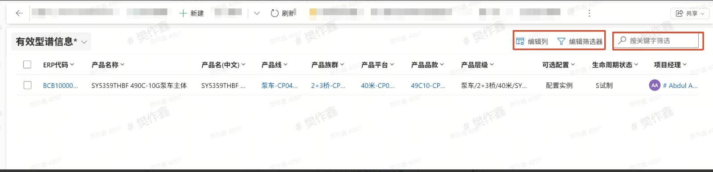

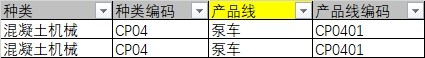
