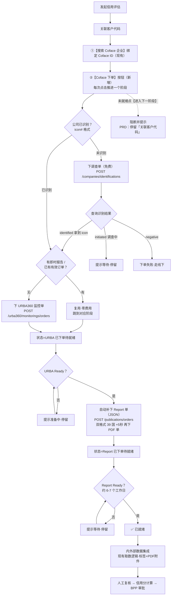

# Coface 系统内下单 完整方案

> **版本**：V2.0（完整版，替代 V1.0 实施设计稿）
> **日期**：2026-07-24
> **关联文档**：`Coface系统内下单功能评估方案.md/.xlsx`（业务确认用，7 问待回填）
> **输入**：评估结论（方向已确认）+ PRD 原文 + 2026-07-23 Coface 会议 3 条规则 + 仓库 Coface 接口文档

---

## 目录

1. 背景与目标
2. 现状与差距
3. 规则核验汇总（PRD / 会议 / 文档三方对照）
4. 产品依赖关系详解
5. 总体设计（分阶段状态机）
6. 下单决策树
7. 字段与状态机设计
8. 接口清单
9. 技术实现清单
10. 异常与边界处理
11. 测试计划
12. 发布计划
13. 待确认问题
14. 工作量与里程碑
15. 附录：关键事实速查

---

## 1. 背景与目标

**原 PRD 设计**：Coface Report 与 URBA360 监控的下单由业务在 Coface 平台线下人工完成，D365 只查询已有订单并拉取数据。

**新需求（已确认方向）**：在 D365 系统内完成下单，入口放在「关联客户代码」阶段（绑定 Coface ID 后），通过【Coface 下单】按钮手动触发。

**目标**：
1. 系统内完成 Coface 下单全链路（调查单 → URBA 监控单 → Report 单），替代线下人工下单；
2. 补齐 PRD 要求的"订单未就绪 → 阻断进入数据集成"（当前实现偏离 PRD）；
3. 防重复扣费（Coface 下单无幂等机制）。

---

## 2. 现状与差距

### 2.1 现状（事实）

| 项目 | 现状 |
|---|---|
| 下单调用 | 代码中**不存在任何下单调用**（无 POST 下单接口），全部依赖线下人工下单 |
| 系统取数 | 进入「内外部数据集成」阶段自动触发，仅查询已有 URBA360/Report 订单并取内容 |
| 无订单时行为 | 不报错、不阻断：评级类指标填 O、数值指标填 null，整体仍写 SUCCESS → 信用分基于残缺数据计算 ⚠️ **与 PRD 不符** |
| 绑定 Coface ID | 「发起信用评估」「关联客户代码」阶段可通过【搜索 Coface 企业】弹窗绑定；进入数据集成前强制校验 Coface ID 非空 |
| Report 产品选择 | 已配置化（`ms_systemconfiguration.CofaceCountryConfig`），下单可直接复用 |
| 可复用链路 | 【搜索 Coface 企业】= 按钮 → 弹窗/JS → Custom API → 后端 Plugin 调 Coface API，链路成熟可照搬 |

### 2.2 差距

| # | 差距 | 影响 |
|---|---|---|
| 1 | 系统无下单能力 | 走到「内外部数据集成」才发现没订单时无法闭环，需人工线下补单后重新触发 |
| 2 | 无订单时不阻断（**偏离 PRD**） | PRD 明确要求提醒并停留本状态；当前缺失值兜底继续，信用分失真 |
| 3 | 下单时机晚 | 报告需 6-7 个工作日，流程整体被拉长 |
| 4 | 无订单状态跟踪字段 | 无法知道是否已下单/已就绪，无法防重复下单 |

---

## 3. 规则核验汇总（PRD / 会议 / 文档三方对照）

### 3.1 PRD 原文依据（阻断要求）

| 出处 | 原文 |
|---|---|
| PRD 方案概述第 6 条 | "在获取Coface数据集成前，会判断如果订单不存在或订单还在准备中，会提醒相关业务人员需等待相关客户的采购订单完成后，才能完成外部数据集成。" |
| PRD 状态流转规则 | "如果Coface订单数据还未完成，会停留在本状态（关联客户代码）。" |
| PRD 数据集成环节说明 | "在本功能模块不会自动发起Coface订单商务采购……但会提供相关科法斯订单和数据准备状态查询，并提示给业务。" |
| PRD 接口设计说明 | "不支持通过本模块进行静默下单流程……从测试阶段发布需关闭掉任何相关下单代码。" |

> **结论**：PRD 明确要求"无订单/订单未就绪 → 提醒 + 停留本状态"的阻断行为。PRD 禁止的是**静默自动下单**；本次改为**按钮手动下单**不与之冲突，但属 PRD 需求变更，需业务书面确认。

### 3.2 Coface 会议规则（2026-07-23）与文档核验

| # | 会上规则 | 仓库文档依据 | 核验结论 |
|---|---|---|---|
| 1 | **可先下调查单（免费）** | `Mandatory` No.5：`POST /companies/identifications`；`Solutions Flow` 第 2 页：识别成功返回 identified+icon 号；未识别返回 initiated+companyIdentificationId，可用其直接下 Report 单 | ✅ 接口存在；"免费"需书面确认（C1） |
| 2 | **先下 URBA，Ready 后才能下 Report**（URBA 不 Ready 后续下单缺参数/缺数据基础） | 依赖原因有文档实锤：**301 = Full Report URBA，由 URBA 监控数据生成**（见第 4 章） | ✅ 原因已证实；受限国/RU 是否强制、URBA 就绪时长需书面确认（C2） |
| 3 | **JSON 和 PDF 要下两个单** | `双格式国家列表`：39 国（HK/IN/JP/BR 等）需两单，其余一单双格式 | ⚠️ 范围有出入：全国家还是仅 39 国，需书面确认（C3） |

### 3.3 CEE / 俄罗斯特例（已核实）

- CEE = Central & Eastern Europe（中东欧补充产品），Coface 定位"受限国家专用（如俄罗斯）"，**三一当前配置仅 RU 一国，实际效果 = 俄罗斯专用特例**；
- RU 同时在受限 39 国列表中，但代码优先级 `CEE > 受限 > 非受限`，RU 命中 `customized-report` + 21000 而非 full-report（有意设计）；
- `CeeCountries` 为配置化列表，未来扩展其他国家改配置即可；
- 沙盒开通邮件显示 **Full Report CEE 支持 JSON/HTML/PDF/XML 四种格式**，且双格式 39 国列表不含 RU → RU 大概率无双格式两单问题。

---

## 4. 产品依赖关系详解（规则 2 的技术解释）

| 国家类型 | Report 产品 | 对 URBA 的依赖 |
|---|---|---|
| 非受限国家 | `customized-report` + 301（**Full Report URBA**） | **强依赖**：该产品是"完整 URBA 报告"，由 URBA 监控数据生成；URBA 未 Ready 时下单缺乏数据基础（即会上所说"缺参数"） |
| 受限 39 国（除 RU） | `full-report`（独立调查报告） | 弱依赖：不从 URBA 生成，理论上可独立下单；会上口径为统一先 URBA，**是否强制待 C2 确认** |
| 俄罗斯 RU | `customized-report` + 21000（**Full Report CEE**，俄罗斯特例） | 待 C2 确认；CEE 支持四种格式，无双格式两单问题 |

> **设计口径（最严格）**：所有国家统一"URBA Ready → 再下 Report"。对受限国只是多等一步不会出错；若 Coface 确认受限国可并行，再简化为仅非受限国串行。

---

## 5. 总体设计（分阶段状态机）

规则 2 使"一键连下两单"不可行（URBA 就绪可能需数天），改为**点击推进式状态机**——每次点击只做一件事（查状态 或 下一个单），天然满足 5 秒限流，零新增基础设施。

```
【关联客户代码】阶段
  ①【搜索 Coface 企业】绑定 Coface ID（现有，不变）
  ②【Coface 下单】按钮（新增）——每次点击推进一个阶段：

  ┌─ 阶段 0：未下单
  │    ├─ 公司未识别（无 icon 号）→ 下调查单（免费）→ 状态=调查单已提交
  │    ├─ 有即时报告 → 复用，跳到「Report 已下单待就绪」
  │    ├─ 已有有效订单 → 复用，跳到对应阶段
  │    └─ 都不满足 → 下 URBA360 监控单 → 状态=URBA 已下单待就绪
  │
  ├─ 阶段 1：URBA 已下单待就绪 / 调查单已提交
  │    └─ 再次点击（或点【进入下一阶段】时自动触发）查询状态
  │          ├─ URBA Ready（/调查识别成功）
  │          │     → 自动补下 Report 单（JSON；双格式范围再下 PDF 单，间隔 5 秒）
  │          │     → 状态=Report 已下单待就绪
  │          └─ 未 Ready → 提示"准备中，请稍后再试"（停留）
  │
  └─ 阶段 2：Report 已下单待就绪
       └─ 再次点击（或点【进入下一阶段】时自动触发）查询状态
             ├─ Ready → 状态=已就绪 → 允许进入「内外部数据集成」
             └─ 未 Ready → 提示等待（约 6-7 个工作日）（停留）

【内外部数据集成】阶段（现有 CofaceDataSyncPlugin，逻辑不变，此时订单已就绪直接取数）
```

**为什么不用后台轮询**：D365 插件同步执行无法跨天等待；轮询需额外定时任务设施。后续如需自动化，可加每日定时任务扫描推进（复用 `CreditRecordExpiration` Console 模式），列为二期可选。

### 5.1 流程图（Mermaid 源码，渲染图见 `Coface系统内下单_流程图.png`）




**设计约束（沿用评估稿，已确认）**：

- 下单入口：「关联客户代码」阶段、已绑定 Coface ID 才可用
- 复用优先级：即时报告（免费）→ 已有有效订单 → 新下单
- 防重三层：按钮显隐 → JS 查服务端状态 → 插件查已有订单（每阶段先查再下，任何重试不重复扣费）
- 就绪校验：进入「内外部数据集成」前订单必须"已就绪"（按 PRD 硬阻断；是否留强制放行兜底待业务确认）

---

## 6. 下单决策树（插件内部逻辑）

```
点击【Coface 下单】
  │
  ├─ 0. 前置校验：状态=关联客户代码、Coface ID 非空、当前不处于"下单中"
  │
  ├─ 1. 按当前「下单状态」分支：
  │
  │  【未下单 / 下单失败】→ 首次下单流程：
  │    ├─ 1.1 Coface ID 是否 icon# 格式？
  │    │      └─ 否（公司未识别）→ POST /companies/identifications（免费调查单）
  │    │            → 状态=调查单已提交，结束
  │    ├─ 1.2 GET /urba360/monitorings/orders 查已有 URBA 监控单
  │    │      └─ 有（含在途）→ 复用，状态=URBA 已下单待就绪，结束
  │    ├─ 1.3 GET /companies/reports 查即时报告
  │    │      └─ 有 → 记录即时报告信息，状态=Report 已下单待就绪，结束
  │    └─ 1.4 POST /urba360/monitorings/orders 下 URBA 监控单
  │           （德国公司附带 legitimateInterest）
  │           → 状态=URBA 已下单待就绪，结束
  │
  │  【调查单已提交】→ GET /companies/identifications 查识别结果：
  │    ├─ identified（拿到 icon 号）→ 回写 Coface ID → 转 1.2~1.4 继续
  │    ├─ initiated（仍在调查）→ 提示等待，结束
  │    │      （或按 Solutions Flow：可用 companyIdentificationId 直接下 Report 单——C4 待确认）
  │    └─ negative（识别失败）→ 状态=下单失败，提示走线下，结束
  │
  │  【URBA 已下单待就绪】→ GET /urba360/monitorings/orders/{id} 查状态：
  │    ├─ 未 ready → 提示"URBA 准备中"，结束
  │    └─ ready → 下 Report 单：
  │          ├─ 查已有 Report 订单（复用现有 ExtractReportOrderInfo 逻辑）→ 有则复用
  │          ├─ POST /publications/orders（JSON，产品按 CofaceCountryConfig 选择）
  │          ├─ 双格式范围国家 → 间隔 5 秒 → 再 POST /publications/orders（PDF）
  │          └─ 状态=Report 已下单待就绪，结束
  │
  │  【Report 已下单待就绪】→ GET /publications/orders 查状态：
  │    ├─ 未 Ready → 提示等待（约 6-7 个工作日），结束
  │    └─ Ready（双格式国家需 JSON+PDF 两单均 Ready）→ 状态=已就绪，结束
  │
  │  【已就绪】→ 提示"订单已就绪，可进入下一阶段"，结束
  │
  └─ 2. 每一步结果写回「Coface 下单状态 / 下单信息 / 下单时间」三个字段
```

---

## 7. 字段与状态机设计

**`mcs_credit_record` 新增 3 个字段**：

| 字段 | 类型 | 说明 |
|---|---|---|
| `mcs_cofaceorderstatus`（Coface 下单状态） | 选项集 | 0 未下单 / 1 调查单已提交 / 2 URBA已下单待就绪 / 3 Report已下单待就绪 / 4 已就绪 / 5 下单失败 |
| `mcs_cofaceordermsg`（Coface 下单信息） | 文本(500) | 各阶段订单号、publicationId、companyIdentificationId、失败原因 |
| `mcs_cofaceorderdate`（Coface 下单时间） | 日期时间 | 最近一次下单/状态变更时间 |

**流转校验**：前端 `nextStep`（关联客户代码 → 内外部数据集成）增加校验：`mcs_cofaceorderstatus ≠ 4（已就绪）` 时先自动调一次状态查询推进，再按结果放行/阻断提示。后端 `CreditRecordStatusTransitionPlugin` 允许流转表**不改**（10→11 本就合法），是否加后端硬校验待业务确认兜底策略后决定。

---

## 8. 接口清单

**CofaceApiService 新增方法**：

| 方法 | 接口 | 用途 |
|---|---|---|
| `GetInstantReport(countryCode, externalId)` | GET /companies/reports | 即时报告检查（免费复用） |
| `PlaceIdentificationOrder(...)` | POST /companies/identifications | 下调查单（公司未识别时） |
| `GetIdentificationOrders()` | GET /companies/identifications | 查识别结果（identified/initiated/negative） |
| `PlaceUrbaMonitoringOrder(externalId, countryCode, legitimateInterest?)` | POST /urba360/monitorings/orders | 下 URBA 监控单 |
| `GetUrbaMonitoringOrderStatus(orderId)` | GET /urba360/monitorings/orders/{id} | 查 URBA 状态（**已封装，直接复用**） |
| `PlaceReportOrder(externalId, countryCode, productSlug, productCode, format)` | POST /publications/orders | 下 Report 单（JSON/PDF 分开） |

**Token 优化**：`CofaceTokenManager` 改为缓存 Token（有效期 60 分钟，现存 `ms_systemconfiguration.coface_idtoken/coface_token_expiry` 字段可直接用），避免单次点击内多次重复认证。

---

## 9. 技术实现清单

| 类型 | 新增/修改 | 内容 |
|---|---|---|
| Plugin（新） | 新增 | `CofacePlaceOrderPlugin`：Custom API `mcs_CofacePlaceOrder` 的实现，入参 `CreditRecordId`，出参 `status/message/orderStatus`。**按 07-17 规范归入 `SanyD365.D365ExtensionApi.Sales`** |
| Custom API | 新增 | `mcs_CofacePlaceOrder`（参照 `mcs_CofaceSearchCompany` 形态），加入 `McsCustomAPI` + 主清单 |
| CofaceApiService | 修改 | 新增第 8 章 5 个方法；Token 缓存化 |
| 配置 | 修改 | `ms_systemconfiguration.CofaceCountryConfig` JSON 增加 `DualFormatCountries`（双格式 39 国列表，待 C3 确认范围）+ 可选 `LegitimateInterest`（德国） |
| 前端 JS | 修改 | `mcs_credit_record.js`：`placeCofaceOrder`（点击 → retrieveRecord 查状态 → 调 Custom API → 提示结果并刷新）；`nextStep` 就绪校验（先推进一次状态查询再判定） |
| 按钮 | 新增 | App Action【Coface 下单】（DeployTool AppActionDeployer 扩展，显隐逻辑同【搜索 Coface 企业】模式） |
| 元数据 | 新增 | 3 个字段（中英双语标签）+ 实体发布 + 加入主清单 Solution |
| 翻译 | 新增 | 按钮/提示语中英语言 key（先本地 1033/2052.json 追加，再同步 DEV） |

---

## 10. 异常与边界处理

| 场景 | 处理 |
|---|---|
| 下单 POST 失败（限流/网络/参数） | catch 后状态=下单失败 + 原因写「下单信息」，**不静默成功**；重试走"查已有订单"分支防重复扣费 |
| URBA/Report 长时间不 Ready | 停留提示；超过 N 天（建议 15 个工作日，待确认）在「下单信息」追加超时警告，人工决定是否走线下 |
| 双格式国家只有 JSON 单 Ready | 视为未就绪，提示等待 PDF 单 |
| 重复点击/并发点击 | 插件入口校验"下单中"瞬时状态 + 每阶段先查已有订单，幂等推进 |
| 365 天失效后重新发起评估 | 走"查已有订单"分支：URBA 监控单长期有效（实测有效期到 2109）直接复用；Report 单过期则按阶段重下（**复用规则待 C5 确认**） |
| 未识别公司一期范围 | 调查单链路一期实现"提交 + 查结果 + 识别成功继续"；initiated 直接用 companyIdentificationId 下 Report 的分支待 C4 确认后决定是否启用，否则提示走线下 |

---

## 11. 测试计划（DEV1 + Coface 沙盒）

| # | 场景 | 预期 |
|---|---|---|
| 1 | 已识别公司首次下单 | URBA 单创建成功，状态=URBA 已下单待就绪 |
| 2 | 重复点击 | 不重复扣费，提示当前阶段 |
| 3 | URBA 未 Ready 推进 | 提示准备中，不下 Report 单 |
| 4 | URBA Ready 推进 | 自动补下 Report 单（双格式国家两单，间隔 5 秒） |
| 5 | 即时报告客户 | 不下单直接复用 |
| 6 | 已有有效订单客户 | 不下单直接复用到对应阶段 |
| 7 | 未识别公司 | 调查单提交 → 查询 → 识别成功继续/失败提示 |
| 8 | 未就绪进入数据集成 | 阻断并提示（按 PRD） |
| 9 | 就绪后进入数据集成 | 现有取数逻辑不变，标签/PDF 正常生成 |
| 10 | 限流验证 | 连续两次下单间隔 ≥ 5 秒 |

---

## 12. 发布计划

1. DEV1 独立 Assembly（`SanyD365.Plugins.CofaceIntegration.Api` 之类临时名）验证 → **测试结束立即注销**（红线）；
2. 归并远程主项目 `SanyD365.D365ExtensionApi.Sales`（Custom API 实现插件规范归属）→ PR → 合并 `uat` → 重编 → 更新 DEV1 主 Assembly → 重绑 Custom API → 回归；
3. 组件第一时间加入主清单 `AllComponent_Peter_NoUAT`：3 字段（随实体）/ Custom API 本体+参数+响应 / App Action / WebResource 变更；
4. 发版前 `check-solution-coverage` 核对 + 字段快照对比（防 80041A06）；
5. n8n 发布：`entity_XXX`（字段）+ `McsCustomAPI`（Custom API + 实现 Assembly）+ `McsWebResource`（JS + 语言包）。

---

## 13. 待确认问题

### 13.1 给 Coface（书面确认，阻塞开发细节）

| # | 问题 | 影响 |
|---|---|---|
| C1 | 调查单是否免费？识别结果（identified/initiated/negative）返回结构与时长 | 调查单链路设计 |
| C2 | "URBA Ready 后才能下 Report"是否对所有国家强制（含受限国 full-report、RU CEE）？URBA 未 Ready 强行下 Report 具体报什么错/缺什么参数？URBA 首次就绪平均时长？ | 状态机两阶段拆分、受限国是否可并行、异常提示文案 |
| C3 | JSON/PDF 两单是所有国家还是仅 39 国？两单是否两份费用？ | 下单次数与费用 |
| C4 | initiated 状态下能否用 companyIdentificationId 直接下 Report 单？ | 未识别公司是否闭环 |
| C5 | URBA 监控单/Report 单有效期与 365 天重评复用规则 | 重评逻辑 |

### 13.2 给业务（评估稿 7 问，见 Excel「待确认问题」表回填）

| # | 问题 | 推荐 |
|---|---|---|
| B1 | 未就绪进入数据集成：按 PRD 硬阻断，还是留强制放行兜底？ | 按 PRD 硬阻断 |
| B2 | 下单权限：所有业务员还是限定角色？ | 限定角色（下单=费用） |
| B3 | 复用优先级：即时报告→已有订单→新下单，是否认可？ | 认可 |
| B4 | 双格式国家是否接受两份订单费用？ | 随 C3 结论 |
| B5 | 未识别公司一期是否仅覆盖"调查单+识别成功继续"？ | 是 |
| B6 | 365 天重评复用规则 | 随 C5 结论 |
| B7 | DEV/UAT 联调环境（沙盒）与下单配额/计费 | — |

---

## 14. 工作量与里程碑

| 阶段 | 内容 | 预估 |
|---|---|---|
| 1. 本地开发 | ApiService 5 方法 + Token 缓存 + Custom API + Plugin + JS + 按钮 + 3 字段 | 2 ~ 2.5 天 |
| 2. DEV1 验证 | 独立 Assembly 注册，按第 11 章 10 场景验证（依赖沙盒就绪速度） | 1 ~ 2 天 |
| 3. 归并发布 | 归并主项目 → PR → 主 Assembly + 组件进主清单 → 发版核对 → n8n 发布 | 跟随发版窗口 |
| 4. UAT 联调 | 沙盒/生产实测（依赖 C1~C5 确认） | 0.5 ~ 1 天 |

**前置依赖**：C1~C5 书面确认（重点 C2/C3）；业务确认 B1~B7。

---

## 15. 附录：关键事实速查

| 事实 | 值 | 出处 |
|---|---|---|
| 下单限流 | 单用户 10-12 次/分钟，每次下单间隔 5 秒 | Coface 下单接口清单 |
| Report 就绪时长 | 约 6-7 个工作日（in-preparation → Ready） | Solutions Flow |
| URBA 监控单有效期 | 实测到 2109（长期监控） | Coface_API接口测试结果 |
| Token 有效期 | 60 分钟（OAuth2） | Coface 下单接口清单 |
| 双格式 39 国 | HK/IN/MY/JP/BR 等（不含 RU），需 JSON+PDF 两单 | 双格式国家列表 20260520 |
| 受限 39 国（制裁） | AF/CU/IR/RU/UA 等，Report 用 full-report（RU 除外走 CEE） | CofaceConfigDeployer |
| 产品代码 | 301=Full Report URBA（URBA 生成）；21000=Full Report CEE（俄罗斯特例，支持 JSON/HTML/PDF/XML） | Mandatory / 沙盒邮件 |
| 现有可复用封装 | 订单查询 GET×3、内容获取 GET×2、URBA 状态查询、PDF 平台上传 | CofaceApiService |

---

*本方案经评审确认后，按 `/skill:d365-dev` 第 9 章流程进入编码。*
